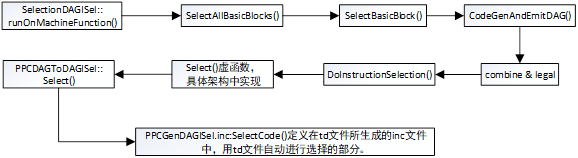

<h1 align="center">指令选择调用图</h1>





```c++
SelectionDAGISel::runOnMachineFunction() ->
SelectAllBasicBlocks() ->
SelectBasicBlock() ->
CodeGenAndEmitDAG() ->
combine & legal多次调用，见CodeGenAndEmitDAG
DoInstructionSelection() ->
Select()虚函数，具体架构中实现 ->
PPCDAGToDAGISel::Select()
PPCGenDAGISel.inc:SelectCode() // 定义在td文件所生成的inc文件中，用td文件自动进行选择的部分。
```


