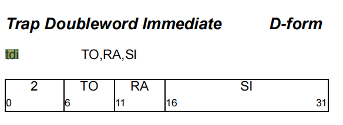

<h1 align="center">指令定义</h1>


# 指令定义

### 1. 定义指令格式

给不在本类中定义的变量赋值，使用let

```c++
class I<bits<6> opcode, dag OOL, dag IOL, string asmstr, InstrItinClass itin>
        : Instruction {
  field bits<32> Inst;
  field bits<32> SoftFail = 0;
  let Size = 4;

  bit PPC64 = 0;  // Default value, override with isPPC64

  let Namespace = "PPC";
  let Inst{0-5} = opcode;
  let OutOperandList = OOL;
  let InOperandList = IOL;
  let AsmString = asmstr;
  let Itinerary = itin;

  bits<1> PPC970_First = 0;
  bits<1> PPC970_Single = 0;
  bits<1> PPC970_Cracked = 0;
  bits<3> PPC970_Unit = 0;

  /// These fields correspond to the fields in PPCInstrInfo.h.  Any changes to
  /// these must be reflected there!  See comments there for what these are.
  let TSFlags{0}   = PPC970_First;
  let TSFlags{1}   = PPC970_Single;
  let TSFlags{2}   = PPC970_Cracked;
  let TSFlags{5-3} = PPC970_Unit;

  // Indicate that this instruction is of type X-Form Load or Store
  bits<1> XFormMemOp = 0;
  let TSFlags{6}  = XFormMemOp;

  // Indicate that this instruction is prefixed.
  bits<1> Prefixed = 0;
  let TSFlags{7}  = Prefixed;

  // Fields used for relation models.
  string BaseName = "";

  // For cases where multiple instruction definitions really represent the
  // same underlying instruction but with one definition for 64-bit arguments
  // and one for 32-bit arguments, this bit breaks the degeneracy between
  // the two forms and allows TableGen to generate mapping tables.
  bit Interpretation64Bit = 0;
}


// 1.7.4 D-Form
class DForm_base<bits<6> opcode, dag OOL, dag IOL, string asmstr,
                 InstrItinClass itin, list<dag> pattern>
  : I<opcode, OOL, IOL, asmstr, itin> {
  bits<5>  A;
  bits<5>  B;
  bits<16> C;

  let Pattern = pattern;

  let Inst{6-10}  = A;
  let Inst{11-15} = B;
  let Inst{16-31} = C;
}
```

`DForm_base`中A B C的定义顺序和定义指令中(ins & outs)是一致的，一个都不能少。

```asm
使用DFrom_base

def InstA: DFrom_base
```


```c++
 265 class DForm_2<bits<6> opcode, dag OOL, dag IOL, string asmstr,
 266               InstrItinClass itin, list<dag> pattern>
 267   : DForm_base<opcode, OOL, IOL, asmstr, itin, pattern> {
 268
 269   // Even though ADDIC_rec does not really have an RC bit, provide
 270   // the declaration of one here so that isRecordForm has something to set.
 271   bit RC = 0;
 272 }


2486 def SUBFIC : DForm_2< 8, (outs gprc:$rD), (ins gprc:$rA, s16imm:$imm),
2487                      "subfic $rD, $rA, $imm", IIC_IntGeneral,
2488                      [(set i32:$rD, (subc imm32SExt16:$imm, i32:$rA))]>;

必须有三个参数分别给A B C
 
```


下面这种情况，可以只有两个参数，也可以用三个参数。已试

```c++
// 1.7.4 D-Form
class DForm_base<bits<6> opcode, dag OOL, dag IOL, string asmstr,
                 InstrItinClass itin, list<dag> pattern>
  : I<opcode, OOL, IOL, asmstr, itin> {
  bits<5>  A;
  bits<5>  B;
  bits<16> C = 0;

  let Pattern = pattern;

  let Inst{6-10}  = A;
  let Inst{11-15} = B;
  let Inst{16-31} = C;
}

C已经有了默认值，默认是用0
2486 def SUBFIC : DForm_2< 8, (outs gprc:$rD), (ins gprc:$rA),
2487                      "subfic $rD, $rA, $imm", IIC_IntGeneral,
2488                      [(set i32:$rD, (subc imm32SExt16:$imm))]>;  


此种情况也是对的
2486 def SUBFIC : DForm_2< 8, (outs gprc:$rD), (ins gprc:$rA, s16imm:$imm),
2487                      "subfic $rD, $rA, $imm", IIC_IntGeneral,
2488                      [(set i32:$rD, (subc imm32SExt16:$imm, i32:$rA))]>;
```


Ins,outs中放的是变量，常量如操作码，应该放在ins outs之外。


### 2. 定义指令

```c++

def TWI : DForm_base<3, (outs), (ins u5imm:$to, gprc:$rA, s16imm:$imm),
                     "twi $to, $rA, $imm", IIC_IntTrapW, []>;

def TDI : DForm_base<2, (outs), (ins u5imm:$to, g8rc:$rA, s16imm:$imm),
                     "tdi $to, $rA, $imm", IIC_IntTrapD, []>;

```





引号中汇编使用的操作数都在`(outs)`和`(ins)`中。其它部分必须是常量 


`#`用于连接string。

```c++

    def : InstAlias<"mtibatu "#BATR#", $Rx",
                    (MTSPR !add(BATR, !add(BATR, 528)), gprc:$Rx)>,


    def : InstAlias<op#" string ", $Rx",
                    (MTSPR !add(BATR, !add(BATR, 528)), gprc:$Rx)>,
```


Predicates用来设置架构等条件，如

```asm
let Predicates = [HasFPU] in {

  deff STFIWX: ....

}

```

