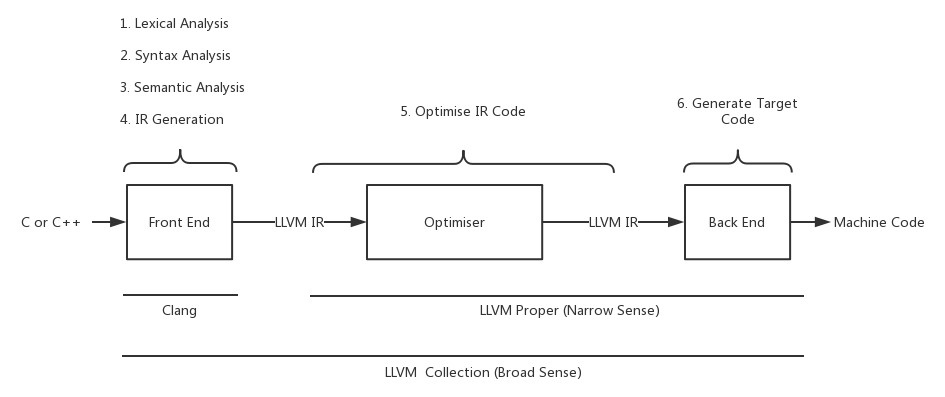
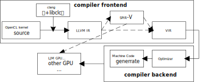

# 1. 项目介绍

## 1.1 clang/llvm架构简介

LLVM项目是模块化、可重用的编译器和工具链技术的集合，常特指其关键子项目之一的LLVM内核库——编译器基础库，支持许多CPU和目标文件格式。

Clang是一个基于LLVM内核库的编译器，可编译C语言系列（C，C ++，Objective C / C ++，OpenCL，CUDA和RenderScript），是LLVM的一个子项目。更进一步来说，Clang只是一个编译器前端，其将上述的类C语言编译成一种“汇编语言（中间语言-IR）”。接着，通过LLVM作为后端，将这种“汇编语言”编译成针对不同机器的二进制机器语言。可广泛应用于Windows、Linux、macOS、iOS、Android、ARM-Linux等平台。





##### Clang/LLVM的特性

Clang/LLVM是在类BSD许可证下发布的，可以比较自由地在商业软件中使用。

与Clang诞生之前广泛应用的GCC相比，Clang具有以下优点：

1. 编译速度块，内存占用小
2. 诊断信息可读性强
3. 模块化设计，易于扩展增强，易于 IDE 集成及其他用途的重用
4. 与GCC、MSVC兼容


## 1.2 项目需求

整个核函数编译器开发工作是准备开发一个基于llvm/clang的核函数编译器。以下是整个项目的流程示意图。

<center></center>

核心思路是复用clang的前端实现对OpenCL核函数的编译，输出LLVM IR或者SPIR-V的标准中间格式，然后使用现有编译器的后端解析SPIR-V或者将SPIR-V转换为VIR，最终生成可供凌久GPU执行的二进制代码。  

目前clang在命令行(driver模式)是支持对OpenCL核函数的编译，但项目要求的编译器是一个运行时的代码，故需要通过调用clang内部接口的方式来完成整个前端的操作，整个编译器前端的实现会综合参考clang driver mode和mesa 编译器前端的实现流程，并在此基础上进行流程的精简和代码裁剪。


在原有的clang/llvm中有13个`libclang*.a`和66个`libLLVM*.a`库。其中有很多库和代码是我们并不需要的，所以第一步就是对这些关不需要的代码进行裁剪。另外，我们的编译器后期可能会运行在嵌入式设备上，此种设备有比较小的内存，也需要我们的编译器项目需要有较小的尺寸。


## 1.3 项目目标

模仿clang driver的实现，根据要编译的语言和输出目标进行流程的精简和不相关代码的裁剪。只支持x86, arm架构，linux系统，C语言前端。

将核函数编译器所需要的库编译成libCLC.so库，然后使用clang driver的模式进行使用。

逾期目标：

1. 目标库libCLC.so大小小于25M。

2. 构建回归测试集，目标库通过所有的回归测试。

   

----


# 2. 代码裁剪

由于clang/llvm支持C/C++/Swift等编程语言，macOS/inux/windows等操作系统，x86/amd/ppc等各种架构，而核函数编译器项目只需要支持C语言，linux系统，为了测试方便，只保留了X86和ARM架构。

另外，核函数编译器项目较少用到llvm的后端，所以，在不报错的情况下，应该尽量对后端代码进行精简。总结成以下两个精简方向：

1. 除C语言，linux系统，X86/ARM架构外的代码。
2. 未使用的不影响clang/llvm系统运行的后端代码。


## 2.1 clang代码裁剪

以下代码将被删去：

- 删去ObjeC, C++, swift语言支持
- 删除windows
- 删除 OpenMP, cuda等代码。


下面是clang裁剪后的大小。

| 库名(libclang*.a) | 大小变化     | 功能                                                         |
| ----------------- | ------------ | ------------------------------------------------------------ |
| Analysis          | 3M(删除)     | 供clang使用的一些分析工具，如静态分析                        |
| AST               | 11M -> 7.8M  | 构建、操作和遍历抽象语法树                                   |
| ASTMatchers       | 1.8M(删除)   | 用于匹配抽象语法树结点                                       |
| Basic             | 8.2M -> 1.8M | 提供一组实用程序，包括文件系统，内存分配等，源代码位置与诊断信息 |
| CodeGen           | 12M -> 5.6M  | 接收AST生成LLVM IR                                           |
| Driver            | 4.6M -> 2M   | 用于与GCC兼容的一些选项支持                                  |
| Edit              | 108K -> 66K  | 记录一些源代码commit等信息                                   |
| Frontend          | 3.7M -> 3.1M | 实现前端的各种action，依赖，诊断等                           |
| Lex               | 1.6M         | 用于预处理和词法分析，处理宏，token和pargma                  |
| Parse             | 2M -> 951K   | 用于使用词法分析阶段的结果进行逻辑解析，语法分析             |
| Sema              | 18M -> 8,4M  | 用于语义分析，语义分析为AST验证提供操作。                    |
| Serialization     | 3.3M -> 2.9M | AST的读写序列化相关                                          |


## 2.2 llvm代码裁剪

以下代码将被删去：

- 除X86/ARM外的其它架构
- Debug相关信息
- 比较后端的流程如MIRParser, MCParser
- 和CodeGen相关的代码
- ObjC相关的代码


以下库被解除依赖和使用后，被直接删除

| 库名(libLLVM*.a)      | 原始大小 | 功能                                   |
| --------------------- | -------- | -------------------------------------- |
| AggressiveInstCombine | 90K      | 激进的combine优化                      |
| AsmPrinter            | 1.8M     | 输出ASM                                |
| CodeGen               | 12M      | 用于LL到指令的生成                     |
| Coroutines            | 298K     | Coroutines使用的能用架代码             |
| Coverage              | 344K     | 测试代码的覆盖率                       |
| DebugInfoCodeView     | 2.3M     | Debug信息相关                          |
| DebugInfoDWARF        | 1.4M     | Debug信息相关                          |
| DebugInfoGSYM         | 20K      | Debug信息相关                          |
| DebugInfoMSF          | 166K     | Debug信息相关                          |
| DebugInfoPDB          | 2.4M     | Debug信息相关                          |
| Demangle              | 553K     | C++用的Demangel                        |
| DlltoolDriver         | 26K      | dll工具                                |
| ExecutionEngine       | 252K     | 执行引擎用接口                         |
| GlobalISel            | 1.3M     | 全局指令选择                           |
| InstCombine           | 2.4M     | 指令合并优化                           |
| Instrumentation       | 2.4M     | 用于PGO                                |
| Interpreter           | 264K     | 执行引擎用接口，翻译                   |
| JITLink               | 506K     | 执行引擎用接口，JIT LINK               |
| LibDriver             | 60K      | 与lib.exe兼容的驱动                    |
| LTO                   | 846K     | LTO相关的优化                          |
| MCDissassembler       | 48K      | Machine code反汇编                     |
| MCJIT                 | 99K      | MC JIT                                 |
| MCParser              | 705K     | 解析Machine code                       |
| MIRParser             | 413K     | 解析MIR                                |
| ObjCARCOpts           | 347K     | OBJC使用                               |
| OrcJIT                | 2.3M     | JIT相关                                |
| Remarks               | 132K     | 用于提示代码中发现的问题或优化详细信息 |
| RuntimeDyld           | 1.1M     | 执行引擎用接口，运行时动态库           |
| SelectionDAG          | 5M       | 指令选择用的DAG                        |
| Symbolize             | 141K     | 反汇编使用的符号库                     |
| TestingSupport        | 68K      | 用于支持测试                           |
| WindowsManifest       | 19K      | 给windows使用的库                      |
| XRay                  | 490K     | 用于追踪和分析程序执行的工具集         |


以下是目标库使用的库

| 库名(libLLVM*.a) | 原始大小     | 功能                                            |
| ---------------- | ------------ | ----------------------------------------------- |
| Analysis         | 8.2M -> 8.1M | LLVM使用的分析pass                              |
| AsmParser        | 855K         | 对LL文件进行解析                                |
| BinaryFormat     | 303K -> 169K | 和DWARF MAGIC等想着，有些函数被LLParser.cpp使用 |
| BitReader        | 842K         | 读取bit code                                    |
| BitstreamReader  | 57K          | 读取bit code                                    |
| BitWriter        | 453K -> 449K | 将bit code写入                                  |
| Core             | 6.2M -> 5.6M | 和LLVM IR相关的核心库                           |
| ipo              | 3.3M ->267K  | IPO想着优化                                     |
| IRReader         | 38K          | 读取IR文件                                      |
| Linker           | 227K         | 模块间Linker                                    |
| MC               | 1.9M -> 1.2M | Machine code想着                                |
| Object           | 2.6M -> 1.6M | 各种ELF Object想着                              |
| Option           | 115K         | 和parser arg想着                                |
| Passes           | 3.1M -> 2.1M | 和PASS框架相关                                  |
| ProfileData      | 863K -> 333K | 和PGO Profile相关                               |
| ScalarOpts       | 7.3M -> 24K  | 和Scalar相关的优化                              |
| SPIRVLib         | 7.4M         | SPIRV需要使用的库                               |
| Support          | 4.2M -> 3.8M | 各种工具，MD5，YAML，JSON等                     |
| TableGen         | 809K         | td文件产生inc文件的工具库                       |
| Target           | 95K          | 和Target相关                                    |
| TransformUtils   | 3.9M -> 1.8M | 用于其它优化的辅助函数                          |
| Vectorize        | 1.8M -> 1.3K | 和vector相关的优化                              |


------

# 3. 裁剪结果

## 3.1 所使用的编译优化选项

编译中间库时所使用的选项

```shell
-Os -DNDEBUG -ffunction-sections -fdata-sections -flto=auto -fno-fat-lto-objects -fuse-linker-plugin
```


编译最终`libCLC.so`所使用的选项

```shell
-Os -s -DNDEBUG -ffunction-sections -fdata-sections -fvisibility=hidden -flto=auto -fno-fat-lto-objects -fuse-linker-plugin 
```

选项说明：

- `-Os`: 该优化会启用优化使目标库尺寸变小。 

- `-s -DNDEBUG -ffunction-sections -fdata-sections -fvisibility=hidden` : 删除非必要的Symbol。

- `-flto=auto -fno-fat-lto-objects -fuse-linker-plugin`: 启用lto优化，并尽量不增加目标库尺寸。中间库编译开启lto优化后，中间库大小会变大几倍。但目标库size会减少1M，目标库编译速度会变慢。

  

## 3.2 目标库大小

`libCLC.so`库原始尺寸在55M左右。

精简后，

使用`-Os`选项后，大小为24.6M，

使用`-Os -flto`后大小为23.2M，

使用`-s -Os -flto`后为17.1M。


