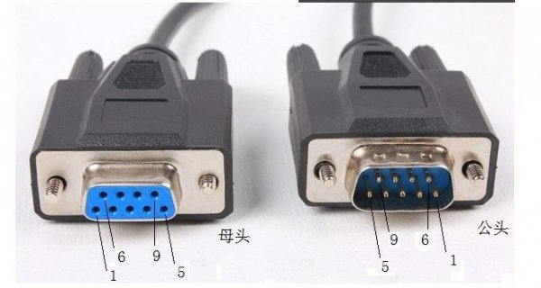

# 串口连接


## 1. 接口介绍

### 1.1 DB-9

PIN10 串口实际上指的是 DB-9 接口，它只有 9 根针。

DB-9 接口是 RS-232 接口的一种简化形式。RS-232 标准最初定义的是 25 针的 DB-25 连接器，但随着计算机技术的发展，设备制造商倾向于体积更小、成本更低的接口，因此将 DB-25 中未使用的和支持同步模式的引脚去掉，形成了 DB-9 接口，它只提供异步通信所需的 9 个信号，常用的引脚包括 RXD（接收数据）、TXD（发送数据）、GND（逻辑地）等。

### 1.2 接口编号

DB-9 接口的引脚编号规则是：公头的引脚号是从左往右定义，母头是从右往左定义，这样公头母头对接时，相同的引脚号才能对应。

具体来说，DB-9 接口的 9 个引脚分 2 排排列，上排 5 针，下排 4 针，左上角为 1 号脚，右下角为 9 号脚。各引脚的编号及对应的信号名称如下：


| 引脚编号 | 信号名称       | 英文缩写 |
| -------- | -------------- | -------- |
| 1        | 载波检测       | DCD      |
| 2        | 接收数据       | RXD      |
| 3        | 发送数据       | TXD      |
| 4        | 数据终端准备好 | DTR      |
| 5        | 信号地         | GND      |
| 6        | 数据准备好     | DSR      |
| 7        | 请求发送       | RTS      |
| 8        | 清除发送       | CTS      |
| 9        | 振铃提示       | RI       |


### 1.3 杜邦线颜色

杜邦线的颜色含义并没有严格的标准，以下是根据电子工程领域的常见用法整理的表格：


| 颜色                     | 常见含义        | 说明                                                         |
| ------------------------ | --------------- | ------------------------------------------------------------ |
| 红色                     | 电源正极（VCC） | 通常连接开发板或电源模块的 5V/3.3V 输出口，在数据手册中常标注为 “VCC”“VIN” 或 “+”。 |
| 黑色或棕色               | 电源负极（GND） | 连接至电路板或模块的 GND 引脚，提供参考零电位。              |
| 黄色、白色、绿色、蓝色等 | 信号线（SIG）   | 具体功能取决于设备，如在传感器中可传输数据信号（DATA、SDA、SCL），在执行器中可传输控制信号（PWM、IN），在通信模块中可作为串口线（TX/RX）等。 |


## 2. 连接RS232，9针

- 一般来说，无论是 RS232、RS422 还是 RS485 串口，都包含一些基本引脚，其中 2 脚通常为 RXD（接收数据，绿），3 脚通常为 TXD（发送数据，蓝），5 脚通常为 GND（接地）。

```shell

           1        3（蓝）   5（黑）   7   9
主板接口    2（绿）   4        6        8  (缺口)

           
           
           
           1  2（绿）   3（蓝）  4   5（黑）           
串口线        6   7  8  9

           
           
           
主板5连接串口线5，主板3连接串口线2，主板2连接串口线3


主板也是串口线的话，使用下面方式，不过2 3反一下。
           1  2（绿）   3（蓝）  4   5（黑）
主板串口线    6   7  8  9


           1  2（绿）   3（蓝）  4   5（黑）           
串口线        6   7  8  9

```


## 3. 还有一种UART是3针的

**UART 是 “处理数据转换的硬件核心”（相当于 “工厂”），RS232 是 “规定数据如何对外传输的物理标准”（相当于 “工厂的运输路线和货车规格”）**—— 没有 UART，RS232 就没有数据可传；没有 RS232，UART 的信号只能在短距离内以 TTL 电平传输，无法适配工业级、远距离的外部设备。

也就是说RS232其实封装了UART，功能比UART更强大。




