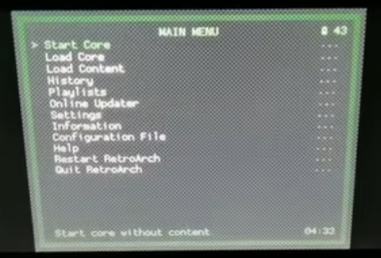
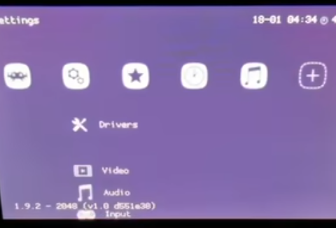

# RetroArch安装和使用


https://www.youtube.com/watch?v=kg8-BT4Ukas

https://www.bilibili.com/video/BV1CV4y1W7Tz/?vd_source=d08e560079f40cdcbcd81c7f269f55e3


## 1. 安装

### 1.1 下载

在以下官网下载对应的版本`RetroArch_cia.7z`。2025年10月，最新版是v1.21.0。

```shell
https://www.retroarch.com/?page=platforms
```


### 1.2 解压

解压后是这样的

```shell
$ tree -L 2
.
├── cia
│   └── retroarch_3ds.cia
└── retroarch
    ├── assets
    ├── cheats
    ├── cores
    ├── database
    ├── filters
    ├── overlays
    └── remaps
```


### 1.3 安装

先拷贝`retroarch`到根目录，即`retroarch`和`Nintendo 3DS`在同一级目录。再通过远程安装，或者将cia传到机器中用FBI进行安装。


## 2. 一些使用的设置

### 2.1 设置界面

以下将界面设置成PSP风格，而不是默认的风格。上图是默认风格，下午是PSP风格。



`setting -> drivers -> menu - > rgui`

然后按B进行返回退出到界面，并选择`Restart RetroArch`。




### 2.2 全屏设置

`Setting -> Video -> Scaling -> Integer Scale` 勾选。

调整比例

`Setting -> Video -> Scaling -> Aspect Ratio -> 16:10`  默认的比例是core provided。


## 3. 安装游戏

游戏rom最好是放在`/retroarch/downloads`目录下，因为RetroArch默认已会看到此目录，如果是其它目录通过浏览也可以找到。


