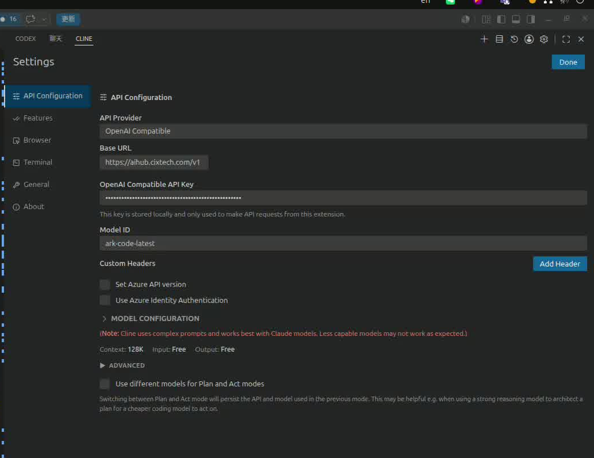

# 在 Cline 中切换模型的几种方式

## 方式一：在对话输入框直接切换（最常用、最快）

1. 打开 VS Code 左侧的 **Cline** 面板。
2. 看对话输入框的 **下方/上方**，会有一行小字显示当前模型，例如：
   `API Provider: OpenAI Compatible · Model: ark-code-latest`
3. 直接点击那行模型名（它是可点击的链接 / 下拉），就会弹出当前 Provider 下可选的模型列表，选一个即可立即生效。
   - 如果是 OpenRouter / OpenAI Compatible 这种"自由填模型 ID"的 Provider，会直接弹出一个输入框让你输入新的 model id（比如 `ark-code-latest`、`deepseek-chat`、`claude-3-5-sonnet` 等）。

> 这种切换是"当前会话级"的，不会影响 Provider 和 API Key，只换模型。

---

## 方式二：在 Cline 的设置面板里切换（持久化默认值）

1. 打开 Cline 面板。
2. 点右上角的 **⚙ 齿轮图标**，进入 Cline Settings。
3. 在 **API Provider** 里选你要的提供商（OpenAI Compatible / OpenRouter / Anthropic / DeepSeek / Ollama / LM Studio 等）。
4. 在下面的 **Model ID** / **Model** 框里填或选要用的模型，比如：
   - `ark-code-latest`
   - `deepseek-coder`
   - `anthropic/claude-3.5-sonnet`（OpenRouter 写法）
5. 点 **Done / Save**，下次新对话就会用这个模型作为默认。

---

## 方式三：Plan / Act 双模型（Cline 的新特性）

Cline 现在支持给 **Plan 模式**（规划）和 **Act 模式**（执行）分别配不同模型，常见用法是：
- Plan 模式 → 用更聪明、贵一点的模型（如 `claude-3.5-sonnet`、`o1`）
- Act 模式 → 用便宜、快的模型（如 `ark-code-latest`、`deepseek-chat`）

切换入口：
1. 打开 Cline Settings（齿轮）。
2. 找到 **"Use different models for Plan and Act modes"** 开关，打开它。
3. 分别给 Plan / Act 选 Provider 和 Model。

平时使用时，对话框下方有一个 **PLAN / ACT** 切换按钮（或快捷键 `Cmd/Ctrl+Shift+A`），切到哪个模式就自动用对应的模型。

---

## 方式四：多 Provider 配置 / 快速切换 Provider

如果你同时有多个 API（比如公司内部的 `aihub.cixtech.com` 和 OpenRouter），可以：
- 在 Cline Settings 里点 **"+ Add Provider"** / **"Manage Providers"** 把每个 Provider（含 baseURL、API Key、默认模型）都存好；
- 之后通过对话框上方的 Provider 下拉一键切换。

---

## 常见小问题

| 问题                       | 处理办法                                                     |
| -------------------------- | ------------------------------------------------------------ |
| 切换后报 `model not found` | 该 model id 在你这个 baseURL 后端没注册，确认拼写或换一个    |
| 切换后还在用旧模型回答     | Cline 是按"新消息"生效的，老对话历史的回复不会重写。开 **+ New Task** 起个新对话再试 |
| 模型列表是空的             | OpenAI Compatible 端点一般不会自动拉模型列表，需要手动输入 model id |
| 想给项目单独配模型         | 目前 Cline 没有 workspace-level model 配置，模型切换是全局的（按 Provider 配置） |

---

## 针对你当前的环境（aihub.cixtech.com）

你的 Provider 应该选 **OpenAI Compatible**，然后：
- Base URL：`https://aihub.cixtech.com/v1`
- API Key：你的 `sk-...` key
- Model ID 框里直接填你要的模型名，比如：
  - `ark-code-latest`
  - 或者后端支持的其他名字（可以问运维/管理员要可用模型列表）

要换模型时，最快就是**点输入框上方那行模型名 → 输入新 model id → 回车**，立刻生效。


```
minimax-m3                                                                                                                                                                               
     glm-5.2                                                                                                                                                                                  
     glm-5.1                                                                                                                                                                                  
     minimax-m2.7                                                                                                                                                                             
     ark-code-latest (current)                                                                                                                                                                
     doubao-seed-2.0-code                                                                                                                                                                     
      kimi-k2.6                                                                                                                                                                                
     deepseek-v4-pro                                                                                                                                                                          
     deepseek-v4-flash                                                                                                                                                                        
     doubao-seed-2.0-pro 
```


