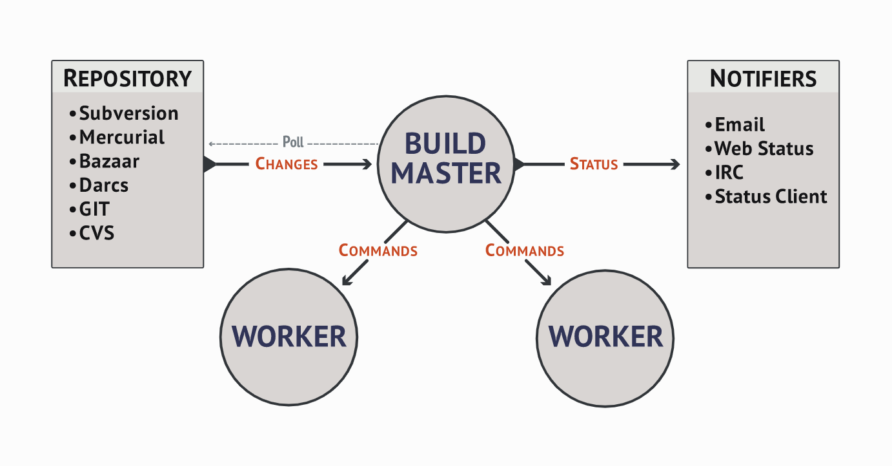
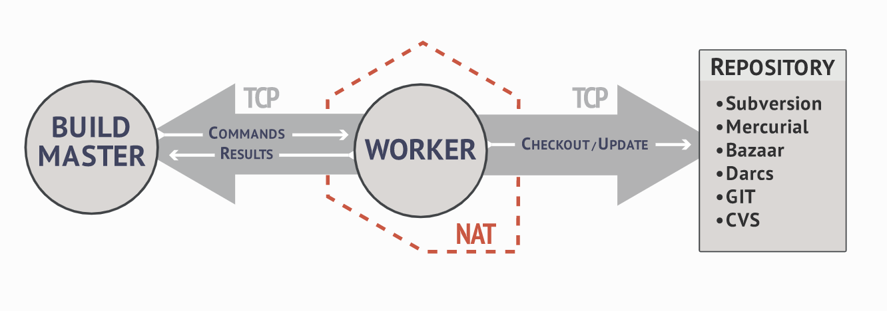
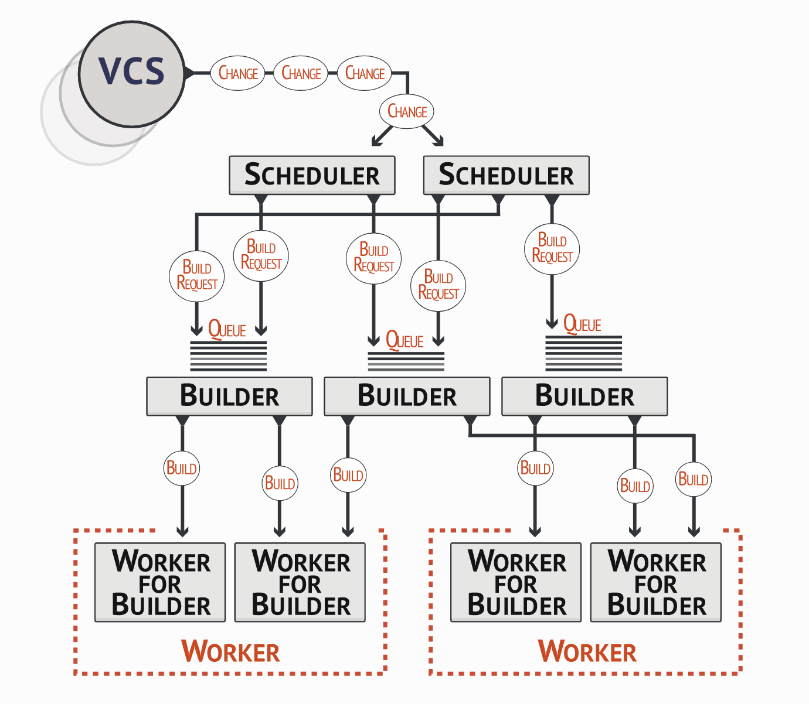

<h1 align="center">2.1 Instruction arch</h1>
http://docs.buildbot.net/latest/manual/introduction.html

# System Architecture

master负责一切，worker负责执行master分发的cmd并返回结果。

targer可以贡献机器作为workers,来运行本平台的测试。

TCP连接，命令从master到worker，结果从worker到master，worker负责Git

### Buildmaster

