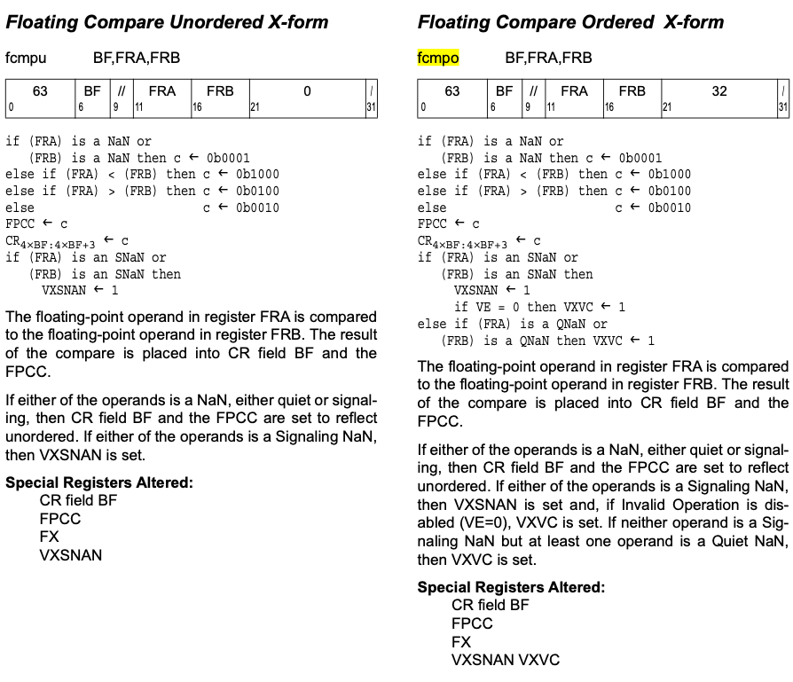

<h1 align="center">FCMP</h1>
http://llvm.org/docs/LangRef.html#fcmp-instruction


# [llvm IR `fcmp` Instruction](http://llvm.org/docs/LangRef.html#id1606)

##### [Syntax:](http://llvm.org/docs/LangRef.html#id1607)

```
<result> = fcmp [fast-math flags]* <cond> <ty> <op1>, <op2>     ; yields i1 or <N x i1>:result
```

##### [Overview:](http://llvm.org/docs/LangRef.html#id1608)

The ‘`fcmp`’ instruction returns a boolean value or vector of boolean values based on comparison of its operands.

If the operands are floating-point scalars, then the result type is a boolean ([i1](http://llvm.org/docs/LangRef.html#t-integer)).

If the operands are floating-point vectors, then the result type is a vector of boolean with the same number of elements as the operands being compared.

##### [Arguments:](http://llvm.org/docs/LangRef.html#id1609)

The ‘`fcmp`’ instruction takes three operands. The first operand is the condition code indicating the kind of comparison to perform. It is not a value, just a keyword. The possible condition codes are:

1. `false`: no comparison, always returns false
2. `oeq`: ordered and equal
3. `ogt`: ordered and greater than
4. `oge`: ordered and greater than or equal
5. `olt`: ordered and less than
6. `ole`: ordered and less than or equal
7. `one`: ordered and not equal
8. `ord`: ordered (no nans)
9. `ueq`: unordered or equal
10. `ugt`: unordered or greater than
11. `uge`: unordered or greater than or equal
12. `ult`: unordered or less than
13. `ule`: unordered or less than or equal
14. `une`: unordered or not equal
15. `uno`: unordered (either nans)
16. `true`: no comparison, always returns true

*Unordered* means  that either operand may be a QNAN, *ordered* means that neither operand is a QNAN.

order没有QNAN, undered有QNAN

有QNAN XSCMPEQDP FALSE

Each of `val1` and `val2` arguments must be either a [floating-point](http://llvm.org/docs/LangRef.html#t-floating) type or a [vector](http://llvm.org/docs/LangRef.html#t-vector) of floating-point type. They must have identical types.


### PowerPC（MI）

ABI可对比FCMPU/FCMPO，注意FCMPO/XSCMPODP未使用。

给CR的结果一一样的：任一个是NaN(QNaN/SNaN)时，返回的结果是 `0b0001`到所用的CR。

```
小于:  0b1000
大于:  0b0100
等于:  0b0010
有NAN: 0B0001
```


标志寄存器修改是不同的：

FCMPU: 其中一个Op是`SNaN`时会设置`VXSNAN`。

FCMPO: 其中一个Op是`SNaN`时会设置`VXSNAN`，并且如果`VE`是0时，会设`VXVC`。

​                  其中一个Op是`QNaN`，另一个不是`SNaN`时会设置`VXSNAN`，并且会设`VXVC`。





##### [Semantics:](http://llvm.org/docs/LangRef.html#id1610)

The ‘`fcmp`’ instruction compares `op1` and `op2` according to the condition code given as `cond`. If the operands are vectors, then the vectors are compared element by element. Each comparison performed always yields an [i1](http://llvm.org/docs/LangRef.html#t-integer) result, as follows:

1. `false`: always yields `false`, regardless of operands.
2. `oeq`: yields `true` if both operands are not a QNAN and `op1` is equal to `op2`.
3. `ogt`: yields `true` if both operands are not a QNAN and `op1` is greater than `op2`.
4. `oge`: yields `true` if both operands are not a QNAN and `op1` is greater than or equal to `op2`.
5. `olt`: yields `true` if both operands are not a QNAN and `op1` is less than `op2`.
6. `ole`: yields `true` if both operands are not a QNAN and `op1` is less than or equal to `op2`.
7. `one`: yields `true` if both operands are not a QNAN and `op1` is not equal to `op2`.
8. `ord`: yields `true` if both operands are not a QNAN.
9. `ueq`: yields `true` if either operand is a QNAN or `op1` is equal to `op2`.
10. `ugt`: yields `true` if either operand is a QNAN or `op1` is greater than `op2`.
11. `uge`: yields `true` if either operand is a QNAN or `op1` is greater than or equal to `op2`.
12. `ult`: yields `true` if either operand is a QNAN or `op1` is less than `op2`.
13. `ule`: yields `true` if either operand is a QNAN or `op1` is less than or equal to `op2`.
14. `une`: yields `true` if either operand is a QNAN or `op1` is not equal to `op2`.
15. `uno`: yields `true` if either operand is a QNAN.
16. `true`: always yields `true`, regardless of operands.

The `fcmp` instruction can also optionally take any number of [fast-math flags](http://llvm.org/docs/LangRef.html#fastmath), which are optimization hints to enable otherwise unsafe floating-point optimizations.

Any set of fast-math flags are legal on an `fcmp` instruction, but the only flags that have any effect on its semantics are those that allow assumptions to be made about the values of input arguments; namely `nnan`, `ninf`, and `reassoc`. See [Fast-Math Flags](http://llvm.org/docs/LangRef.html#fastmath) for more information.

##### [Example:](http://llvm.org/docs/LangRef.html#id1611)

```
<result> = fcmp oeq float 4.0, 5.0    ; yields: result=false
<result> = fcmp one float 4.0, 5.0    ; yields: result=true
<result> = fcmp olt float 4.0, 5.0    ; yields: result=true
<result> = fcmp ueq double 1.0, 2.0   ; yields: result=false
```


# [Fast-Math Flags](http://llvm.org/docs/LangRef.html#id1109)

LLVM IR floating-point operations ([fneg](http://llvm.org/docs/LangRef.html#i-fneg), [fadd](http://llvm.org/docs/LangRef.html#i-fadd), [fsub](http://llvm.org/docs/LangRef.html#i-fsub), [fmul](http://llvm.org/docs/LangRef.html#i-fmul), [fdiv](http://llvm.org/docs/LangRef.html#i-fdiv), [frem](http://llvm.org/docs/LangRef.html#i-frem), [fcmp](http://llvm.org/docs/LangRef.html#i-fcmp)), [phi](http://llvm.org/docs/LangRef.html#i-phi), [select](http://llvm.org/docs/LangRef.html#i-select) and [call](http://llvm.org/docs/LangRef.html#i-call) may use the following flags to enable otherwise unsafe floating-point transformations.

- `nnan`

  No NaNs - Allow optimizations to assume the arguments and result are not NaN. If an argument is a nan, or the result would be a nan, it produces a [poison value](http://llvm.org/docs/LangRef.html#poisonvalues) instead.

- `ninf`

  No Infs - Allow optimizations to assume the arguments and result are not +/-Inf. If an argument is +/-Inf, or the result would be +/-Inf, it produces a [poison value](http://llvm.org/docs/LangRef.html#poisonvalues) instead.

- `nsz`

  No Signed Zeros - Allow optimizations to treat the sign of a zero argument or result as insignificant.

- `arcp`

  Allow Reciprocal - Allow optimizations to use the reciprocal of an argument rather than perform division.

- `contract`

  Allow floating-point contraction (e.g. fusing a multiply followed by an addition into a fused multiply-and-add).

- `afn`

  Approximate functions - Allow substitution of approximate calculations for functions (sin, log, sqrt, etc). See floating-point intrinsic definitions for places where this can apply to LLVM’s intrinsic math functions.

- `reassoc`

  Allow reassociation transformations for floating-point instructions. This may dramatically change results in floating-point.

- `fast`

  This flag implies all of the others.


# UnsafeFPMath

https://llvm.org/doxygen/classllvm_1_1TargetOptions.html#a0544e2966374684ff74255e5a4290fa7

UnsafeFPMath - This flag is enabled when the -enable-unsafe-fp-math flag is specified on the command line.

When this flag is off (the default), the code generator is not allowed to produce results that are "less precise" than IEEE allows. This includes use of [X86](https://llvm.org/doxygen/namespacellvm_1_1X86.html) instructions like FSIN and FCOS instead of libcalls.


# NoNaNsFPMath

https://llvm.org/doxygen/classllvm_1_1TargetOptions.html#aaf9cc05758a26e784f7cfa554e76f175

This flag is enabled when the -enable-no-nans-fp-math flag is specified on the command line.

When this flag is off (the default), the code generator is not allowed to assume the FP arithmetic arguments and results are never NaNs.


