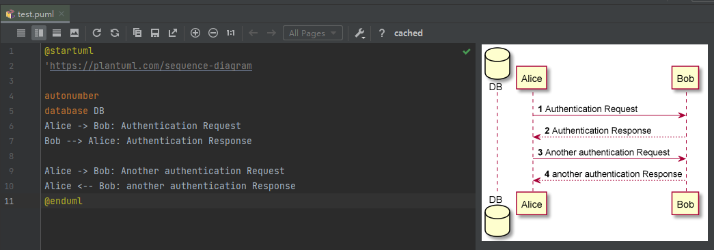
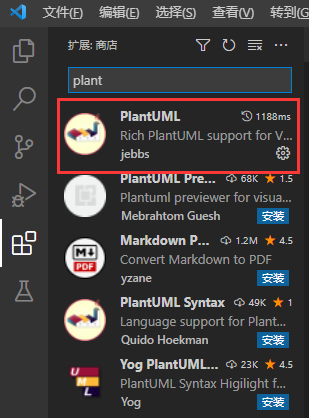
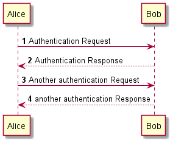
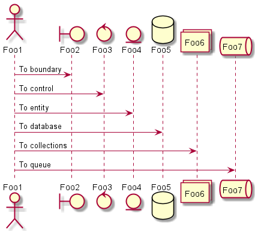
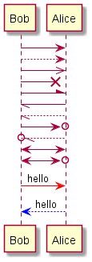
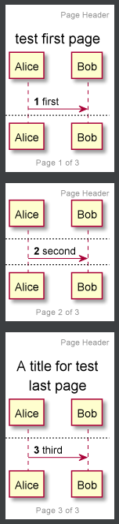
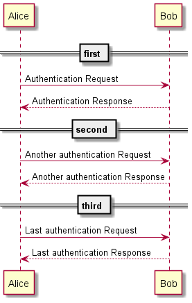
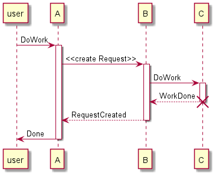
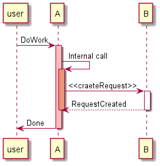
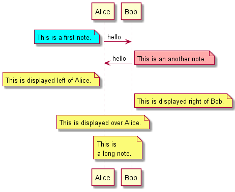

<h1 align="center">PlantUML</h1>


# 1. 快速使用

在线的plantuml，本地版是依赖于java和graphviz的。

```shell
https://plantuml.com/zh/class-diagram

https://plantuml.com/zh/guide 用户指南PDF


https://crashedmind.github.io/PlantUMLHitchhikersGuide/layout/layout.html 各种剪头的使用
```


VSCode中使用PlantUML，安装以下的软件该`PlantUML`才能正常使用

```shell
brew install --cask temurin      
brew install graphviz
```


安装 java

```shell
java --version 看是否已安装

// 以下是ubuntu安装openjdk 11
sudo apt-get install openjdk-11-jdk
```


这里下载plantmul提供的jar包，可以打一UML文件，不过不能编辑，不推荐。不如给VS装插件方便。不依赖VS，使用普通文本编译，再库该库查看的方式 

在ubuntu上测试时，需要将以下jar文件放到与puml文件相同的目录，VSCode才能预览，在mac上没有这个问题。VSCODE的插件中有内置一个，不能用的话，则需要自己下一个。

```shell

https://plantuml.com/zh/gui
https://plantuml.com/zh/download

```


https://www.cnblogs.com/werr370/p/15776497.html

### 1. 背景

随着工作时间的增长，越发觉得用专业的图形（用例图，时序图，ER图等等）去准确表达想法是很重要的。比如针对某个需求绘制的的用例图，比一段乏味的文字来的更加有意义，也便于别人理解。加之最近在学习源码的时候，发现很多书籍中都会使用类图，时序图等UML语言来描述逻辑关系。于是就在网上找了找绘制*UML*语言时，业界主流的一些工具都用什么，找了半天，大部分都用了下面的工具*Visio*，*StartUML*，*PlantUML*。最终经过比较选择了*PlantUML*。官网：https://plantuml.com/zh/

### 2. 选择*PlatnUML*原因

- *PlantUML*是开源的，有一个相对比较成熟的网站，通过简单的UML语言来实现想要的效果，有点极客范
- *PlantUML*有比较详细的各类语言的guide文档
- *PlantUML*做了很多的适配，比如常用的编译器*eclipse*，*IDEA intelliJ*都有对应的插件，同时还和*Maven*和*JQuery*都做了集成，还提供了*war*包形式，可以在本地的*JavaEE*容器（比如*Tomcat*）中运行起来
- *PlantUML*语言简单直接易学，就好像Markdown语法一样，简单高效

### 3. *PlantUML*语言编写环境

本文简单介绍3种使用方法，其它方法读者可以自行研究

1.在线通过*PlantUML*语言绘制对应的*UML*图，*plantUML*官网提供了免费的在线编辑服务，通过在左侧输入对应的UML语言来生成对应的UML图

地址如下：[online-site](https://links.jianshu.com/go?to=http%3A%2F%2Fwww.plantuml.com%2Fplantuml%2Fuml%2FSyfFKj2rKt3CoKnELR1Io4ZDoSa70000)


2.使用IDEA intelliJ插件绘制

使用之前请安装*PlantUML integration*插件，然后就可以愉快的书写*UML*语言，右侧会生成对应的预览图片，可以复制或保存生成的图片到指定的目录


 


3.使用Visual Studio Code插件绘制

使用之前请安装*PlantUML*插件，然后就可以愉快的书写*UML*语言，右侧会生成对应的预览图片(alt+D显示)

再安装PlantUML Simple Viewer 和 PlantUML Syntax



### 4. *PlantUML常用语法* 

1.基本用法

用 -> 来绘制参与者之间传递的消息

关键字 `autonumber` 用于自动对消息编号

[](javascript:void(0);)

```shell
@startuml

autonumber
Alice -> Bob: Authentication Request
Bob --> Alice: Authentication Response

Alice -> Bob: Another authentication Request
Alice <-- Bob: another authentication Response

@enduml
```

[](javascript:void(0);)



 2.声明参与者

- `actor`（角色）
- `boundary`（边界）
- `control`（控制）
- `entity`（实体）
- `database`（数据库）
- `collections`（集合）
- `queue`（队列）

[](javascript:void(0);)

```shell
@startuml

actor Foo1
boundary Foo2
control Foo3
entity Foo4
database Foo5
collections Foo6
queue Foo7

Foo1 -> Foo2: To boundary
Foo1 -> Foo3: To control
Foo1 -> Foo4: To entity
Foo1 -> Foo5: To database
Foo1 -> Foo6: To collections
Foo1 -> Foo7: To queue

@enduml
```

[](javascript:void(0);)



 3.不同的箭头样式

[](javascript:void(0);)

```shell
@startuml

Bob -> Alice
Bob --> Alice
Bob ->> Alice
Bob ->x Alice
Bob -\ Alice
Bob \\- Alice
Bob \\-- Alice

Bob ->o Alice
Bob o\\-- Alice

Bob <-> Alice
Bob <->o Alice

Bob -[#red]> Alice: hello
Bob <[#0000FF]-- Alice: hello

@enduml
```

[](javascript:void(0);)



 4.页面标题、分页、页眉、页脚

`title` 关键字用于为页面添加标题。

页面可以使用`header` 和`footer` 显示页眉和页脚。

关键字 `newpage` 用于把一张图分割成多张。

在 `newpage` 之后添加文字，作为新的示意图的标题。

通过手动在文本中添加`\n`使长文本换行。

[](javascript:void(0);)

```shell
@startuml

autonumber
header Page Header
footer Page %page% of %lastpage%
title test first page
Alice -> Bob: first

newpage
Alice -> Bob: second

newpage A title for test\nlast page
Alice -> Bob: third

@enduml
```

[](javascript:void(0);)



 5.分段

你可以通过使用  `==`关键词来将你的图表分割成多个逻辑步骤。

[](javascript:void(0);)

```shell
@startuml

== first ==
Alice -> Bob: Authentication Request
Bob --> Alice: Authentication Response

== second ==
Alice -> Bob: Another authentication Request
Alice <-- Bob: Another authentication Response

== third ==
Alice -> Bob: Last authentication Request
Alice <-- Bob: Last authentication Response

@enduml
```

[](javascript:void(0);)



 6.生命线

关键字`activate`和`deactivate`用来表示参与者的生命活动。

一旦参与者被激活，它的生命线就会显示出来。

`activate`和`deactivate`适用于以上情形。

`destroy`表示一个参与者的生命线的终结。

[](javascript:void(0);)

```shell
@startuml

participant user
user -> A: DoWork
activate A
A -> B: <<create Request>>
activate B
B -> C: DoWork
activate C
C --> B: WorkDone
destroy C
B --> A: RequestCreated
deactivate B
A -> user: Done
deactivate A

@enduml
```

[](javascript:void(0);)



 还可以使用嵌套的生命线，并且运行给生命线添加颜色。

[](javascript:void(0);)

```shell
@startuml

participant user

user -> A: DoWork
activate A #FFBBBB
A -> A: Internal call
activate A #DarkSalmon
A -> B: <<craeteRequest>>
activate B
B --> A: RequestCreated
deactivate B
deactivate A
A -> user: Done
deactivate A

@enduml
```

[](javascript:void(0);)



 7.注释

可以使用`note left` 或`note right` 关键字*在信息后面*加上注释。

可以使用`end note` 关键字有一个多行注释。

可以使用`note left of`，`note right of`或`note over`在节点(participant)的相对位置放置注释。

还可以通过修改[背景色](https://plantuml.com/zh/color)来高亮显示注释。

[](javascript:void(0);)

```shell
@startuml

Alice -> Bob: hello
note left #aqua: This is a first note.
Bob -> Alice: hello
note right #FFAAAA: This is an another note.
note left of Alice: This is displayed left of Alice.
note right of Bob: This is displayed right of Bob.
note over Alice: This is displayed over Alice.
note over Alice, Bob
This is
a long note.
end note

@enduml
```

[](javascript:void(0);)



 

其他细节请参考中文官网教程：http://plantuml.com/zh/sequence-diagram


### VSCode导出uml文件

右击文件，选择 导出工作区图表，然后选择所需要的格式，一般选择SVG格式即可。


```c++
void main() {


}
```

