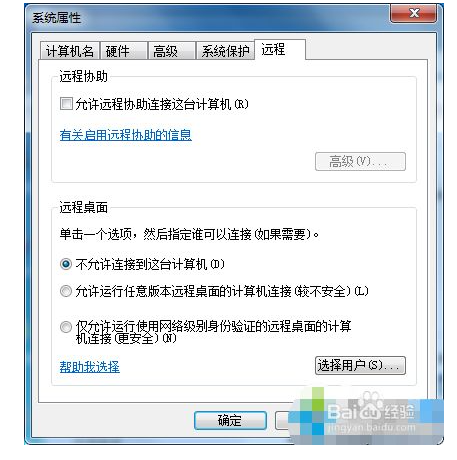
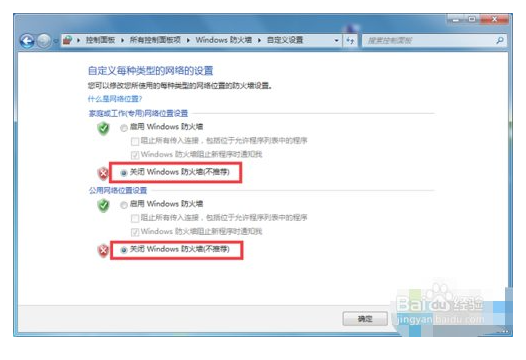
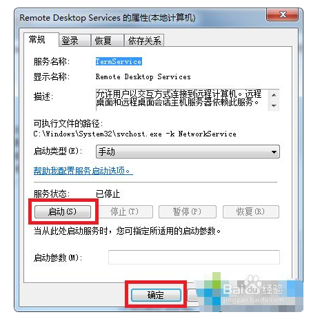

<h1 align="center">windows远程桌面连接</h1>
https://jingyan.baidu.com/article/14bd256e138323fa6c26127f.html

## 方法/步骤

1. 

   　1、在被连接的电脑上，打开计算机属性，点击“远程设置”，查看“允许远程协助连接这台计算机”有没有勾选，没有就勾选上;

   

   

   

   2、然后看看防火墙是否关闭，从“开始”菜单进入控制面板，打开“Windows防火墙”，然后点击左侧的“打开或关闭Windows防火墙”，在自定义设置中，选择“关闭Windows防火墙”，点击保存;

   

2. 

   3、然后再看看远程连接服务服务有没有开启，在运行中输入“services.msc”并点击确定进服务窗口，找到“remote desktop services”服务，双击打开，然后点击“启动”;

   

   4、重置网络，在运行中输入cmd按下回车打开命令提示符，输入“netsh winsock reset”命令，按下回车键，之后根据提示重启电脑即可。

   ![image-20220508104304623](windows远程桌面连接.assets/image-2022050810

## 结论

1. 1

   1、点击“远程设置”，查看“允许远程协助连接这台计算机

   2、看防火墙是否关闭

   3、然后再看看远程连接服务服务有没有开启，重置网络即可。

   