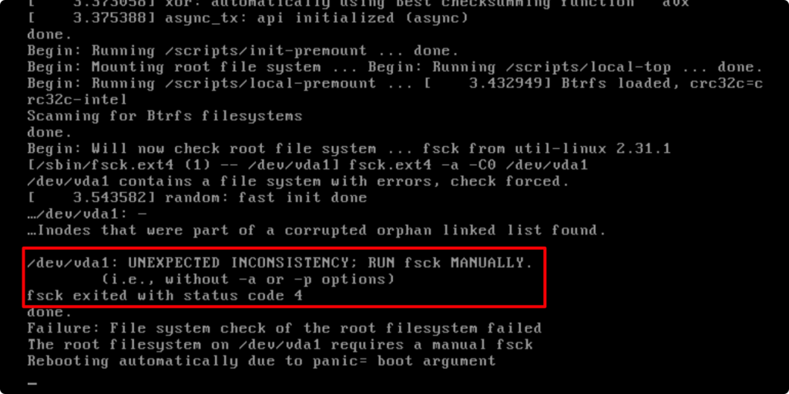
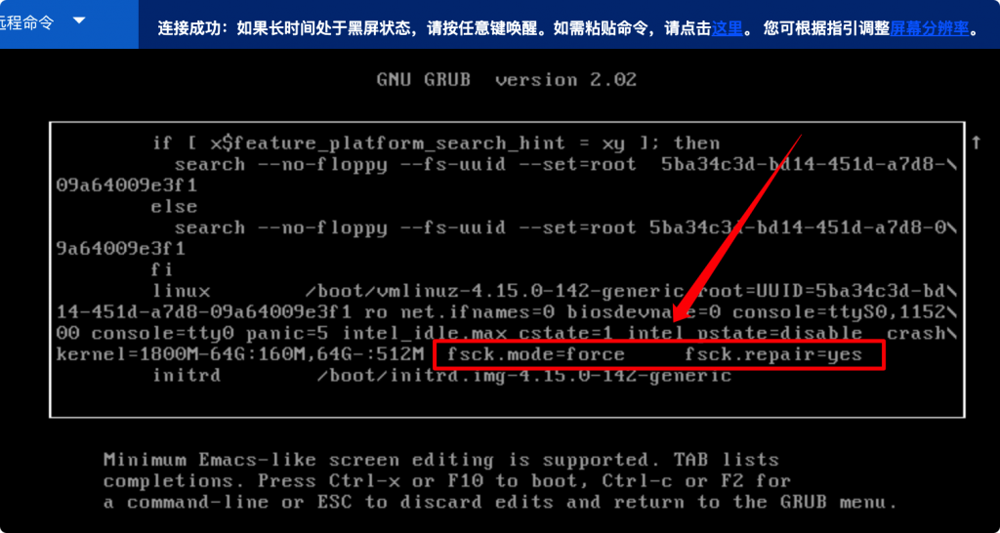
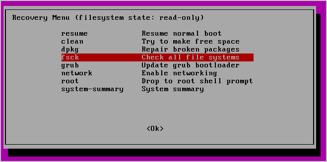

<h1 align="center">重启失败</h1>
https://zgao.top/%E8%85%BE%E8%AE%AF%E4%BA%91cvm%E5%AE%9E%E4%BE%8B%E7%B3%BB%E7%BB%9F%E5%90%AF%E5%8A%A8%E5%A4%B1%E8%B4%A5%E6%8A%A5%E9%94%99unexpected-inconsistency-run-fsck-manually-fsck-exited-with-status-cod/


# UNEXPECTED INCONSISTENCY; RUN fsck MANUALLY.fsck exited with status code 4” 解决方案





### 问题原因

网上提到主要原因是由于断电等情况导致。内存数据丢失引发文件系统错误，比如无效的inode等。而操作系统启动时一般会做fsck检查。如果检查到异常，系统默认自动修复；如果出现如下情况，系统不会自动修复，而是停留在上述报错页面，并提示需要手动运行fsck工具。自动修复可能会删除部分异常关机导致的无效inode。

### 解决方案


## 1. 救援模式(ubuntu22亲测成功)

CVM进入救援模式，在新挂载的操作系统中对原本挂载系统的磁盘进行fsck检测修复，但是普通人没有这种权限操作。

#### GRUB修改启动参数

在GRUB选择页面选择目标Kernel。输入 **e** 进行编辑。选择要编辑的Kernel GRUB参数，在尾部加入如下参数。

```
fsck.mode=force     fsck.repair=yes
```




按 **Ctrl** + **X** 或 F10 键启动系统会自动进行修复，即可正常进入系统。


#### 补充：急救模式

如果当前系统支持急救模式，则进入急救模式运行fsck检查并修复文件系统。由于我的系统不支持，就没有尝试。

