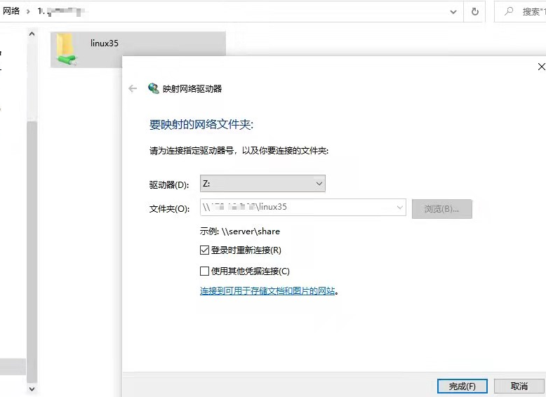

<h1 align="center">samba</h1>


https://zhuanlan.zhihu.com/p/462724410


## 1、安装 samba 服务器

```shell
sudo apt update
sudo apt install samba smbclient
```

通过如下命令可以看到已经安装成功

```shell
$ whereis samba

output:
samba: /usr/sbin/samba /usr/lib/x86_64-linux-gnu/samba /etc/samba /usr/share/samba /usr/share/man/man7/samba.7.gz /usr/share/man/man8/samba.8.gz
```

## 2、**配置 samba 服务器文件**

现在选择一个目录 Samba 共享目录，比如 `/home/ubuntu` 。

使用 vim 打开 smb.conf 文件

```shell
sudo vim /etc/samba/smb.conf
```


```shell
[Ubuntu_Share]
  path = /home/ken
  browseable = yes
  writeable = yes
  # 关闭匿名访问
  guest ok = no
  # 仅允许 ken 用户访问
  valid users = ken
  force user = ken
  # 权限匹配可写需求
  create mask = 0664
  directory mask = 0775
```


设置密码

```
sudo smbpasswd -a ken
```


文件权限设置

```
# 检查目录权限
ls -ld /home/ken
# 输出示例：drwxr-xr-x 20 ken ken 4096 Apr 30 10:00 /home/ken

# 如果权限不对，修正为可读写权限
chmod 755 /home/ken
chown ken:ken /home/ken
```


设置防火墙

```
sudo ufw allow samba
sudo ufw reload
```


重启服务并开机启动

```
sudo systemctl restart smbd nmbd 或者 sudo /etc/init.d/smbd restart
sudo systemctl enable smbd nmbd
```


## 3、windows映射到本地磁盘

服务器上的设置完成了，接下来进行 Windows 上的设置。

在windows下 `win + R` 组合键打开运行窗口，输入 `\\ubuntu_ip`，并按回车。

你会看到设置名字的文件夹，这就是 Linux 下的共享目录。

你也可以将远程目录映射为本地的磁盘，右键文件夹，选择 `映射网络驱动器`，

如下图所示，点击完成：

 


### 4. linux映射到本地磁盘

```shell
smb://172.1.8.8.108  映射根目录/,  或者  smb://172.1.8.8.108/ken 映射ken目录
```


### 5. 问题解决

win10/11上有samba兼容问题

##### 5.1 临时在 Windows 上禁用 SMB 客户端签名（仅测试用）

以管理员身份打开 PowerShell，

```shell
Set-SmbClientConfiguration -RequireSecuritySignature $false
Set-SmbServerConfiguration -RequireSecuritySignature $false
```


##### 5.2 设置samba（推荐）

修改 /etc/samba/smb.conf
在 [global] 段添加以下配置：

```shell
[global]
  server min protocol = SMB2
  server max protocol = SMB3
  server signing = mandatory
  client signing = mandatory
```


重启服务

```
sudo systemctl restart smbd nmbd
```


