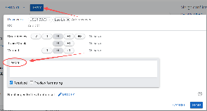
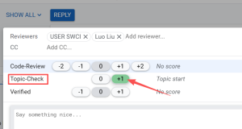

# Gerrit CI

## 1. 处理依赖

多个patch, 应该使用同一个TOPIC名字，不要有空格。（交完代码后，在网页上操作即可）。


## 2.触发编译

### 单个change触发Jenkins编译

1. 自动触发：推荐WIP提交change，参考[Gerrit WIP 提交以及Ready](https://confluence.cixtech.com/spaces/SW/pages/80741572/Gerrit+WIP+提交以及Ready)，wip 状态不会触发编译，ready 才会触发编译（相当于页面转换active状态）

2. 手工触发：回复 PMBCI 或者 FULL PMBCI

   

### Topic 触发Jenkins 编译

1. 推荐带topic name 推送，参考[Linux_repo Topic 编译指南](https://confluence.cixtech.com/spaces/SW/pages/63615458/Linux_repo+Topic+编译指南)

2. Topic-Check Label 全部 +1 

   

3. 手工回复 PMBCI 或者 FULL PMBCI （manifest 仓库第一优先级，build-scripts 仓库第二优先级，其他仓库顺序不论）

### 多Cherry-Pick 场景

1. 页面执行Cherry-pick（多个），建立WIP 状态的Change；
2. 设置同一个topic name；
3. 转换WIP 状态到Active 状态；
4. 所有的Patch都 Topic-Check Label +1；
5. 手工回复PMBCI 或者FULL PMBCI （manifest 仓库第一优先级，build-scripts 仓库第二优先级，其他仓库顺序不论);


**注意：topic 场景和多Cherry-pick 编辑topic 的情况，需要尽量保障在一个项目中，跨项目的topic编译有可能会merge 不全**


如果有3个修改，你更新了最早的两个修改。

还是用原来的方式进行代码提交，这样三个可以一次全部更新。只要changed-id没发生变化，TOPIC没变，gerrit可以全部对比三个提交进行更新。

```
git push origin HEAD:refs/for/cix_master%ready
```


