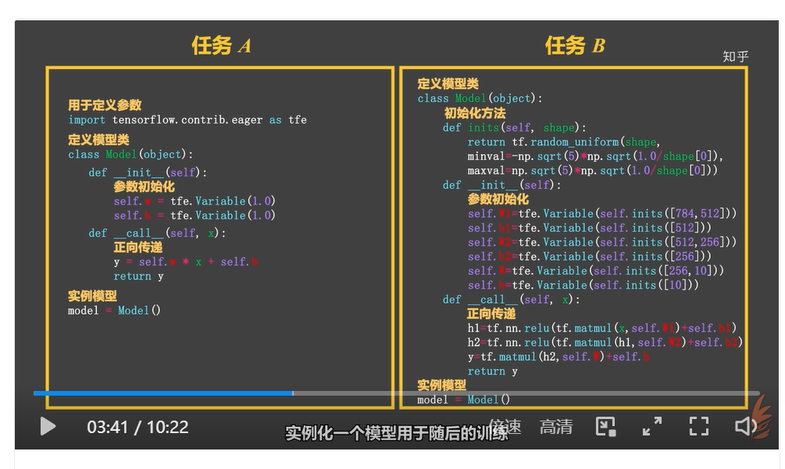

<h1 align="center">case</h1>

https://www.zhihu.com/question/22553761

这里的`I`就是ReLU。s为softmax。

如上图所示，神经网络中的每个神经元节点接受上一层神经元的输出值作为本神经元的输入值，并将输入值传递给下一层，输入层神经元节点会将输入属性值直接传递给下一层（隐层或输出层）。在多层神经网络中，上层节点的输出和下层节点的输入之间具有一个函数关系，这个函数称为激活函数。
**简单来说，激活函数，并不是去激活什么，而是指如何把“激活的神经元的特征”通过函数把特征保留并映射出来，即负责将神经元的输入映射到输出端。**

##### 如何保留得到的值的特征才是激活函数要做的

行数为输入模型，列数为输出模型。

