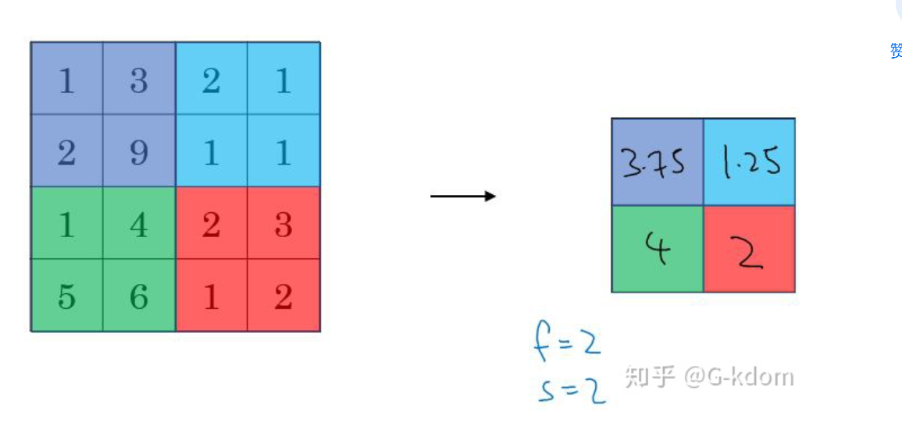

<h1 align="center">pooling</h1>

# 池化（pooling）

池化过程在一般卷积过程后。池化（pooling） 的本质，其实就是采样。Pooling 对于输入的 Feature Map，选择某种方式对其进行降维压缩，以加快运算速度。

采用较多的一种池化过程叫**最大池化（Max Pooling）**，其具体操作过程如下：

池化过程类似于卷积过程，如上图所示，表示的就是对一个 4×4 feature map邻域内的值，用一个 2×2 的filter，步长为2进行‘扫描’，选择最大值输出到下一层，这叫做 Max Pooling。

max pooling常用的 s=2 ， f=2 的效果：特征图高度、宽度减半，通道数不变。

还有一种叫**平均池化（Average Pooling）**,就是从以上取某个区域的最大值改为求这个区域的平均值，其具体操作过程如下：

如上图所示，表示的就是对一个 4×4 feature map邻域内的值，用一个 2×2 的filter，步长为2进行‘扫描’，计算平均值输出到下一层，这叫做 Mean Pooling。

**【池化层没有参数、池化层没有参数、池化层没有参数】** （重要的事情说三遍）

**池化的作用：**

（1）保留主要特征的同时减少参数和计算量，防止过拟合。

（2）invariance(不变性)，这种不变性包括translation(平移)，rotation(旋转)，scale(尺度)。

Pooling 层说到底还是一个特征选择，信息过滤的过程。也就是说我们损失了一部分信息，这是一个和计算性能的一个妥协，随着运算速度的不断提高，我认为这个妥协会越来越小。

现在有些网络都开始少用或者不用pooling层了。