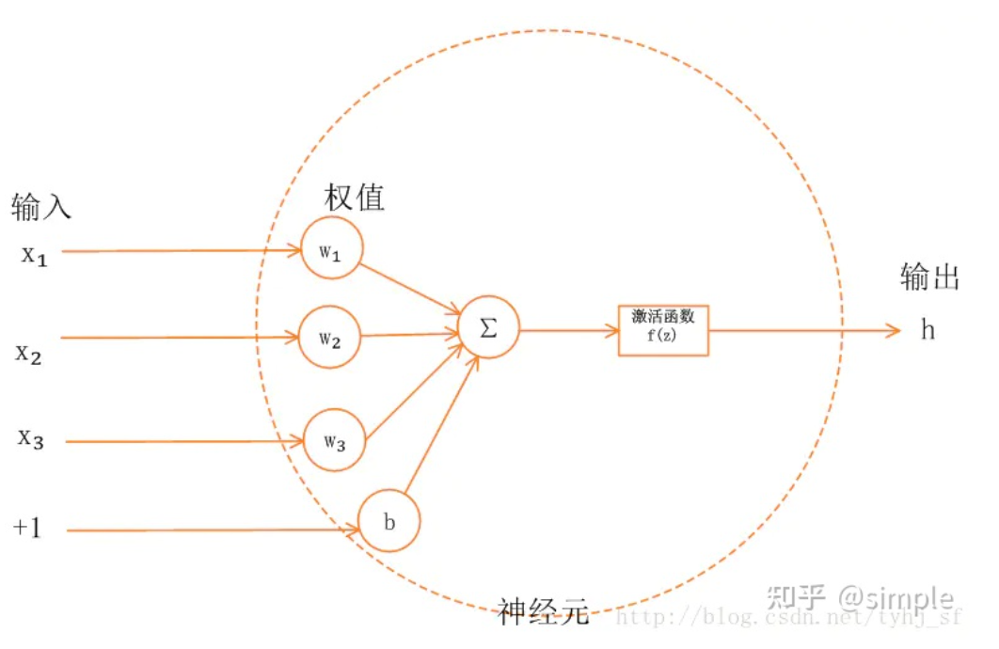
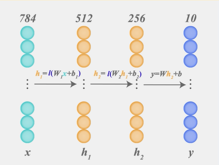
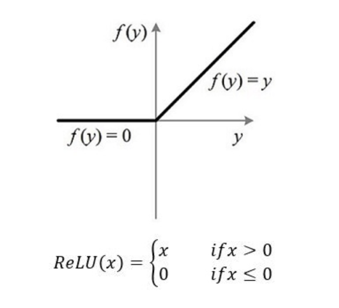
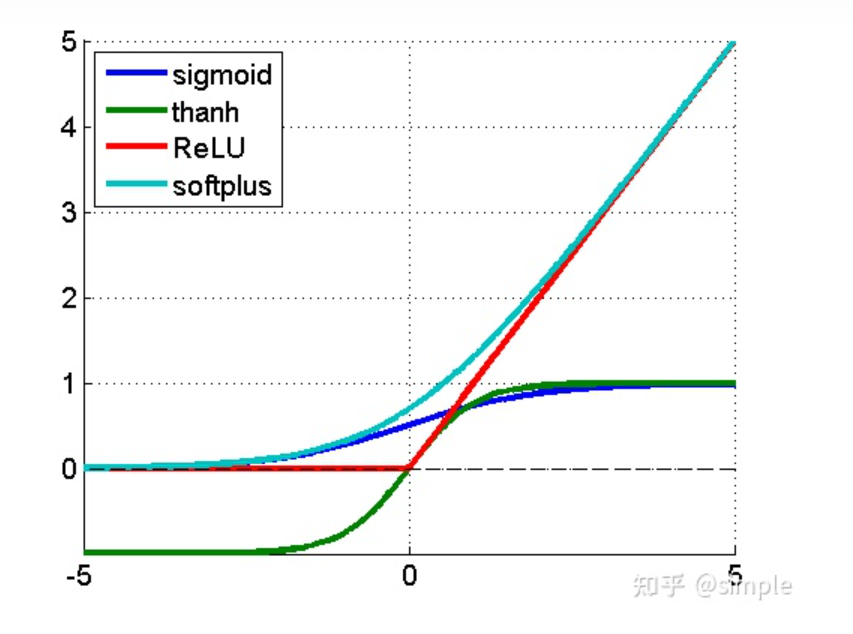
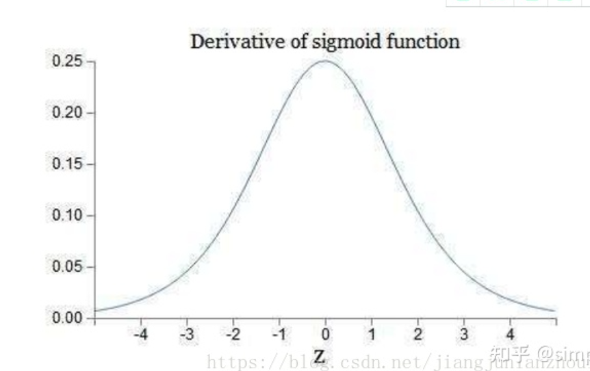
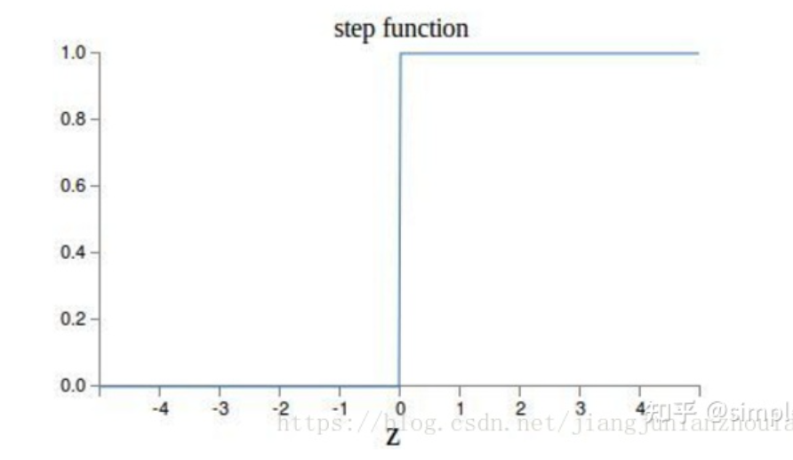

<h1 align="center">激活函数relu</h1>
https://zhuanlan.zhihu.com/p/428448728


### 一、什么是激活函数?

首先了解一下神经网络的基本模型






这里的`I`就是ReLU。


如上图所示，神经网络中的每个神经元节点接受上一层神经元的输出值作为本神经元的输入值，并将输入值传递给下一层，输入层神经元节点会将输入属性值直接传递给下一层（隐层或输出层）。在多层神经网络中，上层节点的输出和下层节点的输入之间具有一个函数关系，这个函数称为激活函数。
**简单来说，激活函数，并不是去激活什么，而是指如何把“激活的神经元的特征”通过函数把特征保留并映射出来，即负责将神经元的输入映射到输出端。**

##### 如何保留得到的值的特征才是激活函数要做的


**二、为何引入非线性的激活函数？**

如果不用激活函数，在这种情况下每一层输出都是上层输入的线性函数。容易验证，无论神经网络有多少层，输出都是输入的线性组合，与没有隐藏层效果相当，这种情况就是最原始的感知机（Perceptron）了。因此引入非线性函数作为激活函数，这样深层神经网络就有意义了（不再是输入的线性组合，可以逼近任意函数）。最早的想法是sigmoid函数或者tanh函数，输出有界，很容易充当下一层输入。

**三、引入ReLu的原因**

第一，采用sigmoid等函数，算激活函数时（指数运算），**计算量大**，反向传播求误差梯度时，求导涉及除法，计算量相对大，而采用Relu激活函数，整个过程的计算量节省很多。

第二，对于深层网络，sigmoid函数反向传播时，很容易就会出现 **梯度消失** 的情况（在sigmoid接近饱和区时，变换太缓慢，导数趋于0，这种情况会造成信息丢失），从而无法完成深层网络的训练。

第三，ReLu会使一部分[神经元](https://link.zhihu.com/?target=https%3A//www.baidu.com/s%3Fwd%3D%E7%A5%9E%E7%BB%8F%E5%85%83%26tn%3D24004469_oem_dg%26rsv_dl%3Dgh_pl_sl_csd)的输出为0，这样就造成了 **网络的稀疏性**，并且减少了参数的相互依存关系，**缓解了过拟合**问题的发生。

*当然现在也有一些对relu的改进，比如prelu，random relu等，在不同的数据集上会有一些训练速度上或者准确率上的改进，具体的大家可以找相关的paper看。*

*多加一句，现在主流的做法，会在做完relu之后，加一步batch normalization，尽可能保证每一层网络的输入具有相同的分布[1]。而最新的paper[2]，他们在加入bypass connection之后，发现改变batch normalization的位置会有更好的效果。大家有兴趣可以看下。*

**四、Relu非处处可导（在0不可导），为什么作为激活函数？**

relu函数是常见的激活函数中的一种，表达形式如下：

```python
f(x) = max(0, x)
```




从表达式可以明显地看出：**Relu其实就是个取最大值的函数。**

**relu、sigmoid、tanh函数曲线**




**sigmoid的导数**




**relu的导数**




结论：

第一，sigmoid的导数只有在0附近的时候有比较好的激活性，在正负饱和区的梯度都接近于0，所以这会造成梯度弥散，而relu函数在大于0的部分梯度为常数，所以不会产生梯度弥散现象。

第二，relu函数在负半区的导数为0 ，所以一旦神经元激活值进入负半区，那么梯度就会为0，而正值不变，这种操作被成为单侧抑制。（也就是说：**在输入是负值的情况下，它会输出0，那么神经元就不会被激活。这意味着同一时间只有部分神经元会被激活，从而使得网络很稀疏，进而对计算来说是非常有效率的。**）正因为有了这单侧抑制，才使得神经网络中的神经元也具有了稀疏激活性。尤其体现在深度神经网络模型(如CNN)中，当模型增加N层之后，理论上ReLU神经元的激活率将降低2的N次方倍。

那么问题来了：这种稀疏性有何作用？换句话说，我们为什么需要让神经元稀疏？不妨举栗子来说明。当看名侦探柯南的时候，我们可以根据故事情节进行思考和推理，这时用到的是我们的大脑左半球；而当看蒙面唱将时，我们可以跟着歌手一起哼唱，这时用到的则是我们的右半球。左半球侧重理性思维，而右半球侧重感性思维。也就是说，当我们在进行运算或者欣赏时，都会有一部分神经元处于激活或是抑制状态，可以说是各司其职。再比如，生病了去医院看病，检查报告里面上百项指标，但跟病情相关的通常只有那么几个。与之类似，当训练一个深度分类模型的时候，和目标相关的特征往往也就那么几个，因此通过**ReLU实现稀疏后的模型能够更好地挖掘相关特征，拟合训练数据**。

此外，相比于其它激活函数来说，ReLU有以下优势：**对于线性函数而言，ReLU的表达能力更强**，尤其体现在深度网络中；而对于非线性函数而言，ReLU由于非负区间的梯度为常数，因此**不存在梯度消失问题(Vanishing Gradient Problem)**，使得**模型的收敛速度维持在一个稳定状态**。这里稍微描述一下什么是梯度消失问题：当梯度小于1时，预测值与真实值之间的误差每传播一层会衰减一次，如果在深层模型中使用sigmoid作为激活函数，这种现象尤为明显，将导致模型收敛停滞不前。


第三，relu函数的导数计算更快，程序实现就是一个if-else语句，而sigmoid函数要进行浮点四则运算。

综上，relu是一个非常优秀的激活函数。

**五、Relu函数的优势**

1、没有饱和区，不存在梯度消失问题，防止梯度弥散；

2、稀疏性；

3、没有复杂的指数运算，计算简单、效率提高；

4、实际收敛速度较快，比 Sigmoid/tanh 快很多；

5、比 Sigmoid 更符合生物学神经激活机制。

**六、relu也存在不足**

就是训练的时候很”脆弱”，很容易就”die”了。举个例子：一个非常大的梯度流过一个 ReLU 神经元，更新过参数之后，这个神经元再也不会对任何数据有激活现象了。如果这个情况发生了，那么这个神经元的梯度就永远都会是0。实际操作中，如果你的learning rate 很大，那么很有可能你网络中的40%的神经元都”dead”了。 当然，如果你设置了一个合适的较小的learning rate，这个问题发生的情况其实也不会太频繁。

**七、为什么通常Relu比sigmoid和tanh强，有什么不同？**

主要是因为它们gradient特性不同。sigmoid和tanh的gradient在饱和区域非常平缓，接近于0，很容易造成vanishing gradient的问题，减缓收敛速度。vanishing gradient在网络层数多的时候尤其明显，是加深网络结构的主要障碍之一。相反，Relu的gradient大多数情况下是常数，有助于解决深层网络的收敛问题。Relu的另一个优势是在生物上的合理性，它是单边的，相比sigmoid和tanh，更符合生物神经元的特征。

而提出sigmoid和tanh，主要是因为它们全程可导。还有表达区间问题，sigmoid和tanh区间是0到1，或着-1到1，在表达上，尤其是输出层的表达上有优势。

ReLU更容易学习优化。因为其分段线性性质，导致其前传，后传，求导都是分段线性。而传统的sigmoid函数，由于两端饱和，在传播过程中容易丢弃信息：