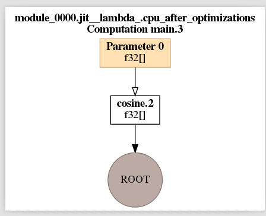
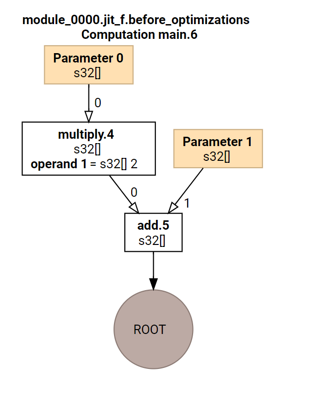
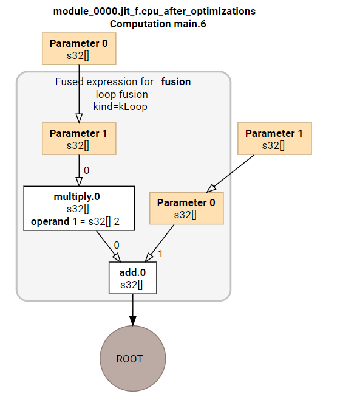

<h1 align="center">2. 调试用选项</h1>


下述选项会在当前目录产生`tmp/foo`文件夹，下面会有ll txt html dot等文件。

以下设置不能有函数调用，否则报段错误

```shell
export XLA_FLAGS="--xla_hlo_profile" 不要设置，否则可能会有段错误，该选项用于收集性能 


产生PB中间文件中下面的选项
xla_dump_hlo_as_proto

# 将MLIR导出到ir文件夹，该文件夹需要事先建好，tmp文件夹不必提前建
export JAX_DUMP_IR_TO=ir

export TF_CPP_MIN_VLOG_LEVEL=1

export TF_CPP_MIN_VLOG_LEVEL=0 

export XLA_FLAGS="--xla_dump_to=tmp/foo --xla_dump_hlo_as_text --xla_dump_hlo_as_dot --xla_dump_hlo_as_html --xla_dump_hlo_as_proto"

export TF_XLA_FLAGS="--tf_xla_clustering_debug"

export TF_DUMP_GRAPH_PREFIX="tmp/tf_dump_graph/"  

#在当前目录下生成tmp/tf_dump_graph
```


### 输出jaxpr

`192.168.53.138:/home/ken/workspace/test/jax/test2/jaxpr`

```python
import jax

def f(x):
    return jax.numpy.sin(jax.numpy.cos(x))

print(jax.make_jaxpr(f)(3.0)) 
#{ lambda ; a:f32[]. let b:f32[] = cos a; c:f32[] = sin b in (c,) }
```


### 输出各种log

`192.168.53.138:/home/ken/workspace/test/jax/test2/log`

```python
import jax

def f(x):
    return jax.numpy.sin(jax.numpy.cos(x))

print(f(3.0))   #这里要有输出，并设置env，才会得到log，但设置env后，会有seg fault。
```

可以得到以下Log:

```python
├── ir
│   └── jax_ir0_jit__lambda_.mlir
├── test.py
└── tmp
    └── foo
        ├── module_0000.jit__lambda_.before_optimizations.dot
        ├── module_0000.jit__lambda_.before_optimizations.hlo.pb
        ├── module_0000.jit__lambda_.before_optimizations.html
        ├── module_0000.jit__lambda_.before_optimizations.txt
        ├── module_0000.jit__lambda_.cpu_after_optimizations-buffer-assignment.txt
        ├── module_0000.jit__lambda_.cpu_after_optimizations.dot
        ├── module_0000.jit__lambda_.cpu_after_optimizations.hlo.pb
        ├── module_0000.jit__lambda_.cpu_after_optimizations.html
        ├── module_0000.jit__lambda_.cpu_after_optimizations.txt
        ├── module_0000.jit__lambda_.ir-no-opt.ll
        ├── module_0000.jit__lambda_.ir-no-opt-noconst.ll
        ├── module_0000.jit__lambda_.ir-with-opt.ll
        ├── module_0000.jit__lambda_.ir-with-opt-noconst.ll
        └── module_0000.jit__lambda_.o

```


after.png




### case

https://jax.readthedocs.io/en/latest/jax.stages.html#module-jax.stages

```python
import jax
import jax.numpy as jnp
import numpy as np

def f(x, y): return 2 * x + y
x, y = 3, 4

lowered = jax.jit(f).lower(x, y)

# Print lowered MHLO
print(lowered.as_text()) # print(lowered.as_text("mhlo"))
'''
# 输出的mhlo
module @jit_f {
  func.func public @main(%arg0: tensor<i32>, %arg1: tensor<i32>) -> tensor<i32> {
    %0 = mhlo.constant dense<2> : tensor<i32>
    %1 = mhlo.multiply %0, %arg0 : tensor<i32>
    %2 = mhlo.add %1, %arg1 : tensor<i32>
    return %2 : tensor<i32>
  }
}
'''

print(lowered.as_text("hlo")) 
'''
# 输出的hlo
HloModule jit_f, entry_computation_layout={(s32[],s32[])->s32[]}

ENTRY main.6 {
  Arg_0.1 = s32[] parameter(0)
  constant.3 = s32[] constant(2)
  multiply.4 = s32[] multiply(Arg_0.1, constant.3)
  Arg_1.2 = s32[] parameter(1)
  ROOT add.5 = s32[] add(multiply.4, Arg_1.2)
}

'''


compiled = lowered.compile()

#compiled.cost_analysis()[0]['flops']

# 输出 hlo
print(compiled.as_text()) 
'''
不管24、26行是什么，下面的输出都是一样的
以下是 module_0000.jit_f.cpu_after_optimizations.txt的内容
也就是print(compiled.as_text()) 的内容
HloModule jit_f, entry_computation_layout={(s32[],s32[])->s32[]}

%fused_computation (param_0.1: s32[], param_1.1: s32[]) -> s32[] {
  %param_1.1 = s32[] parameter(1)
  %constant.0 = s32[] constant(2)
  %multiply.0 = s32[] multiply(s32[] %param_1.1, s32[] %constant.0), metadata={op_name="jit(f)/jit(main)/mul" source_file="as_text.py" source_line=5}
  %param_0.1 = s32[] parameter(0)
  ROOT %add.0 = s32[] add(s32[] %multiply.0, s32[] %param_0.1), metadata={op_name="jit(f)/jit(main)/add" source_file="as_text.py" source_line=5}
}

ENTRY %main.6 (Arg_0.1: s32[], Arg_1.2: s32[]) -> s32[] {
  %Arg_1.2 = s32[] parameter(1)
  %Arg_0.1 = s32[] parameter(0)
  ROOT %fusion = s32[] fusion(s32[] %Arg_1.2, s32[] %Arg_0.1), kind=kLoop, calls=%fused_computation, metadata={op_name="jit(f)/jit(main)/add" source_file="as_text.py" source_line=5}
}

'''

```


module_0000.jit__lambda_.cpu_after_optimizations.html




after.html




```asm
export JAX_DUMP_IR_TO=ir    # 必须在当前目录下有ir这个文件夹
否则会有下述错误


 File "/home/ken/virtualEnv/jaxEnv/lib/python3.7/site-packages/jax/_src/dispatch.py", line 1050, in _dump_ir_to_file
```


### case

```python

from jax import lax
from jax._src import api

def multiply_add_lax(x, y, z):
  """Implementation of multiply-add using the jax.lax primitives."""
  return lax.add(lax.mul(x, y), z)


def square_add_lax(a, b):
  """A square-add function using the newly defined multiply-add."""
  return multiply_add_lax(a, a, b)

print("square_add_lax = ", square_add_lax(2., 10.))
# Differentiate w.r.t. the first argument
print("grad(square_add_lax) = ", api.grad(square_add_lax, argnums=0)(2.0, 10.))

```


output

```asm
square_add_lax =  14.0
grad(square_add_lax) =  4.0

```


ir文件夹

```asm
jax_ir0_jit_prim_fun.mlir
jax_ir1_jit_prim_fun.mlir
jax_ir2_jit_prim_fun.mlir
```


```python
cat jax_ir0_jit_prim_fun.mlir
#loc0 = loc(unknown)
module @jit_prim_fun {
  func.func public @main(%arg0: tensor<f32> loc(unknown), %arg1: tensor<f32> loc(unknown)) -> tensor<f32> {
    %0 = mhlo.multiply %arg0, %arg1 : tensor<f32> loc(#loc1)  # multiply
    return %0 : tensor<f32> loc(#loc0)
  } loc(#loc0)
} loc(#loc0)
#loc1 = loc("jit(mul)/jit(main)/mul"("./trace_lax.py":7:1))


cat jax_ir1_jit_prim_fun.mlir
#loc0 = loc(unknown)
module @jit_prim_fun {
  func.func public @main(%arg0: tensor<f32> loc(unknown), %arg1: tensor<f32> loc(unknown)) -> tensor<f32> {
    %0 = mhlo.add %arg0, %arg1 : tensor<f32> loc(#loc1)   # add
    return %0 : tensor<f32> loc(#loc0)
  } loc(#loc0)
} loc(#loc0)
#loc1 = loc("jit(add)/jit(main)/add"("./trace_lax.py":7:1))

cat jax_ir2_jit_prim_fun.mlir
#loc0 = loc(unknown)
module @jit_prim_fun {
  func.func public @main(%arg0: tensor<f32> loc(unknown)) -> tensor<f32> {
    %0 = mhlo.convert %arg0 : tensor<f32> loc(#loc1)
    return %0 : tensor<f32> loc(#loc0)
  } loc(#loc0)
} loc(#loc0)
#loc1 = loc("jit(convert_element_type)/jit(main)/convert_element_type[new_dtype=float32 weak_type=True]"("./trace_lax.py":16:1))

```
