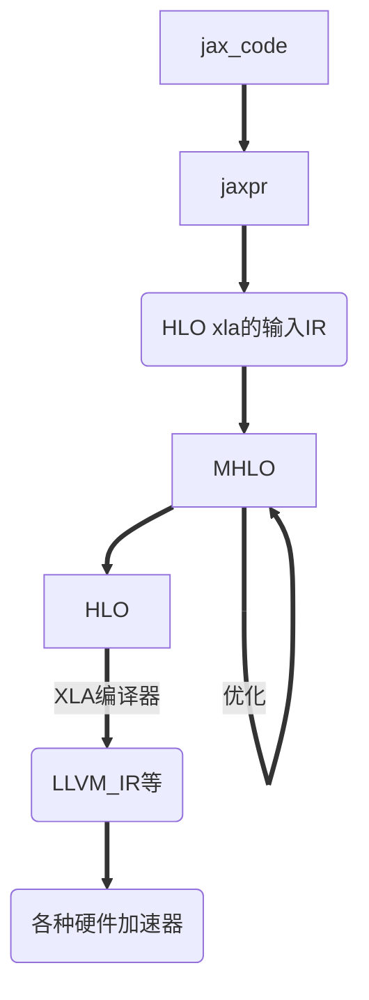

<h1 align="center">4. make_jaxpr</h1>





### JAXPR

JAX执行函数转换（JIT、自动微分、自动并行、向量化）时先将python代码转换成中间语言jaxpr，然后再对jaxpr进行转换。JAX使用进程“tracing”生成jaxpr时，JAX通过tracer对象对每一个函数参数进行包装（wrap），然后tracer记录函数运行过程中对这些参数进行的操作。然后依据记录，JAX生成jaxpr。某个函数fun对应的jaxpr可以通过JAX的接口jax.make_jaxpr(fun)进行查看。


jaxpr的语法和教程

https://jax.readthedocs.io/en/latest/jaxpr.html


https://jax.readthedocs.io/en/latest/notebooks/thinking_in_jax.html


```python
jaxpr ::= { lambda Var* ; Var+.
            let Eqn*
            in  [Expr+] }
```


## case1

```python
from jax import make_jaxpr
import jax.numpy as jnp
import numpy as np


def f(x, y):
  return jnp.dot(x + 1, y + 1)

x = np.random.randn(3, 4)
y = np.random.randn(4)
print(make_jaxpr(f)(x, y))
```


### result

```c++
{ lambda ; a:f32[3,4] b:f32[4]. let
    c:f32[3,4] = add a 1.0
    d:f32[4] = add b 1.0
    e:f32[3] = dot_general[
      dimension_numbers=(((1,), (0,)), ((), ()))
      precision=None
      preferred_element_type=None
    ] c d
  in (e,) }
```


## case2

```python
import jax

def f(x):
    return jax.numpy.sin(jax.numpy.cos(x))

print(f(3.0))
print(jax.make_jaxpr(f)(3.0))

```


### result

```asm
-0.83602184
{ lambda ; a:f32[]. let b:f32[] = cos a; c:f32[] = sin b in (c,) }

```

