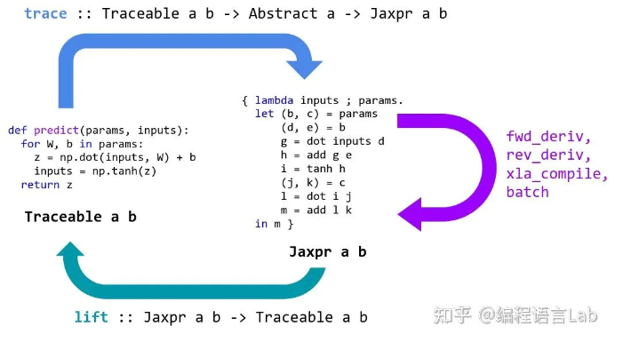
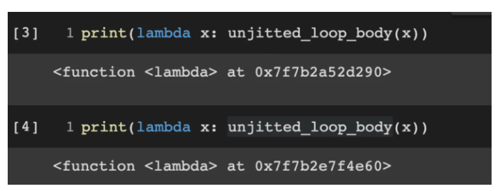

<h1 align="center">7. JIT原理和限制</h1>


# jax.jit避坑指南

https://zhuanlan.zhihu.com/p/474724292

JAX中JIT静态编译技术是重要的程序加速方式，但其中有非常多的坑，本文总结了官网文档中一些亟需注意的编程细节。方便后续回顾的排查代码使用。

## 1. JAX工作原理：




### 1.1 JAX transforms

`/home/ken/workspace/test/jax/global_list/global_test.py`

JIT transforms指的是JAX把python函数转成一种中间语言的形式的过程，有点类似于把函数进行翻译。这种中间语言的特点是把函数的步骤进行分解，从而可以追踪数值/变量的变换轨迹。在JAX中这个任务主要由**jax.make_jaxpr**完成。

(只要是在jax中要求输入是纯函数的，那一定是做了transforms，但jax.grad不会做这个事情。)

举个例子：

```python
import jax
import jax.numpy as jnp

global_list = []

#@jax.jit
def f(x):
    global_list.append(x)      # side-effect
    print(x)                   # side-effect
    return 2*x*x+3*x+3

jaxpr = jax.make_jaxpr(f)
print(jaxpr(3))
```

output：翻译后的“语言”是一个由lambda匿名函数表示，这函数的输入只有a，a的变量类型是32位的整数型。函数的计算流程被详细地记录下来，第一步是b = a * 2, 第二步是c = b * a，第三步是 d = a *3，第四步是e = c + d，第五步是 f = e + 3。这个流程本质上就是f(x) = 2*x*x + 3*x + 3。所以**make_jaxpr的任务就是把输入变量相关的操作过程分解成多个连续的简单的加减乘除等数学运算（所以jax为什么可以进行数值微分的原因），这个过程也叫做“tracing”。**

```python
# 副作用print函数打印x的变量类型:
Traced<ShapedArray(int32[], weak_type=True)>with<DynamicJaxprTrace(level=1/0)>

# make_jaxpr翻译(转换)后函数:
{ lambda ; a:i32[]. let
    b:i32[] = mul a 2
    c:i32[] = mul b a
    d:i32[] = mul a 3
    e:i32[] = add c d
    f:i32[] = add e 3
  in (f,) }
```

但是函数中有与global_list相关的一个append操作，在make_jaxpr翻译的函数中并不存在。这是由于JAX被设计为只能理解side-effect-free的代码，即它只能理解纯函数的操作步骤。


那什么是纯函数？**即所有输入数据都通过函数参数传递，所有结果都通过函数结果输出。如果使用相同的输入调用纯函数，它将始终返回相同的结果。**上述例子中，f(x)在运行过程中修改了外部变量global_list的值，因此这个步骤是存在副作用的，它无法被**make_jaxpr**翻译和记录下来，同时print(x)也是副作用的，因为它进行了系统的IO操作，尽管print是副作用的，但是在JAX第一次进行**tracing**时所有代码是会被严格地执行一次，一旦**make_jaxpr**翻译完毕后，**重复调用该函数时，只会运行那些纯函数的部分**。

Jax transform的特点是：

- 默认只记录变量的类型、shape；
- 通过tracing技术把函数分解成固定的简单数值变换；


## 1.2 加入jit

`/home/ken/workspace/test/jax/global_list/global_test_jit.py`

JIT(just-in-time)，即时编译操作是运算加速的重要手段，不同于python的动态解释，JAX编码的程序/函数在执行前全部被翻译为机器码。因此当重复多次执行同一个代码时，静态编译后的运行效率显著高于动态解释。在JAX中，静态编译由谷歌开发的XLA（加速线性代数）编译器完成。

jit的基本使用方法非常简单，直接调用jax.jit()或使用@jax.jit装饰函数即可：

```python
import jax
import jax.numpy as jnp

global_list = []

@jax.jit
def f(x):
    global_list.append(x)      # side-effect
    print(x)                   # side-effect
    return 2*x*x+3*x+3

jaxpr = jax.make_jaxpr(f)
print(jaxpr(3))
```


被jit编译后的函数其实就是在tracing函数后，最外层调用xla_call。

```c++
Traced<ShapedArray(int32[], weak_type=True)>with<DynamicJaxprTrace(level=1/1)>
{ lambda ; a:i32[]. let
    b:i32[] = xla_call[
      call_jaxpr={ lambda ; c:i32[]. let
          d:i32[] = mul 2 c
          e:i32[] = mul d c
          f:i32[] = mul 3 c
          g:i32[] = add e f
          h:i32[] = add g 3
        in (h,) }
      name=f
    ] a
  in (b,) }
```


----


### 1.3 JIT的缓存机制

jit还做了另外一件事情其实就是把编译好的函数缓存起来，方便下一次再次调用，但是当输入的shape或静态变量的值发生变化时，程序默认自动进行重新编译。

```python
def unjitted_loop_body(prev_i):
  return prev_i + 1

def g_inner_jitted_lambda(x):
  i = 0
  while i < 20:
    # Don't do this!, lambda will return
    # a function with a different hash
    i = jax.jit(lambda x: unjitted_loop_body(x))(i)
  return x + i

def g_inner_jitted_normal(x):
  i = 0
  while i < 20:
    # this is OK, since JAX can find the
    # cached, compiled function
    i = jax.jit(unjitted_loop_body)(i)
  return x + i

print("jit called in a loop with lambdas:")
%timeit -n 10 g_inner_jitted_lambda(10)

print("jit called in a loop with caching:")
%timeit -n 10 g_inner_jitted_normal(10)
```

output: 当使用匿名函数的时候，每次jit都等于是重新进行编译，而直接jit(函数)之后，jax会自动去找缓存，因此为什么jax.jit可以更快速进行运算的原因。

```asm
jit called in a loop with lambdas:
10 loops, best of 5: 203 ms per loop
jit called in a loop with caching:
10 loops, best of 5: 15.2 ms per loop
```

Jax找缓存依赖于function的hash， 所以尽量不要再循环里用匿名函数做jit，因为每次返回的函数都不是同一个地址，相当于没有做静态编译后的缓存重新利用。




## 2 JIT有哪些坑？

### **2.1 非纯函数导致的错误：**

**笔者浏览了JAX官方文档的资料，发现JIT 90%的bug来自于非纯函数式编程，总结来说JIT将一切外部引入/或未被传参声明的变量在编译后进行了缓存，因此更新这些外部变量时，已被编译的函数运行时用的依然是旧参数。**

```python
# 举一个调用全局变量的问题:
g = 0

def impure_uses_globals(x):
    return x + g

# JAX captures the value of the global during the first run
jit_f = jax.jit(impure_uses_globals)

print(jax.make_jaxpr(jit_f)(3))
print ("First call: ", jit_f(3.))
```

从jaxpr可见，global g = 0 的确被调用了：

```python
{ lambda ; a:i32[]. let
    b:f32[] = xla_call[
      call_jaxpr={ lambda ; c:i32[]. let
          d:f32[] = convert_element_type[new_dtype=float32 weak_type=True] c
          e:f32[] = add d 0.0   # 这里的0.0即是g
        in (e,) }
      name=impure_uses_globals
    ] a
  in (b,) }
```

输出：

```python
First call:  3.0
```

如果此时将外部变量g改为10，再次运行程序：

```python
g = 10.  # Update the global
jit_f(4.)
```

输出：

```python
DeviceArray(4., dtype=float32, weak_type=True)
```

程序运行的结果依然返回的是x=4，也就是说g=0并没更新，这是因为JAX被traced/编译之后，外部引入的变量已经被考虑为静态数值了。

但当输入x的shape发生了变化时，JAX是会进行重新地编译和tracing，因此前更新了g=10，所以程序输出结果是[14]。这也就是**shape依赖的即时编译特性**。

```python
g = 10.  # Update the global
jit_f(jnp.array([4.]))

output：DeviceArray([14.], dtype=float32)
```

官网的另外一些例子，traced变量shape不固定的非纯函数。

```python
# 非纯函数1
@jax.jit
def get_negatives(x):
    return x[x < 0]

x = jnp.array(np.random.randn(10))
get_negatives(x)

# 非纯函数2
@jax.jit
def example_fun(length):
  return jnp.ones((length,))

example_fun(5)
```

输出：

```text
jax._src.errors.NonConcreteBooleanIndexError: Array boolean indices must be concrete;
```

当然上面的那些函数其实不用jax.jit进行静态编译的话，完全是可以work的。总之用jit编译的函数不要有shape的不确定性、不要用外部的一切变量。大概率不会导致纯函数问题。


### 2.2 计算流控制

在定义分段函数时，通常会根据阈值进行编码函数的具体形式，如下：

```python
# 分段纯函数:
def f(x):
	if x < 3:
        return 3. * x ** 2
    else:
        return -4 * x
```

我们尝试进行tracing:

```python
jax.make_jaxpr(f)(2) 
```

报错内容：

```python
UnfilteredStackTrace: jax._src.errors.ConcretizationTypeError: Abstract tracer value encountered where concrete value is expected: Traced<ShapedArray(bool[], weak_type=True)>with<DynamicJaxprTrace(level=0/1)>
The problem arose with the `bool` function. 
While tracing the function f at <ipython-input-61-009281447d89>:1 for jit, this concrete value was not available in Python because it depends on the value of the argument 'x'.
```

出错的原因非常直接，因为默认地，JAX被设计为根据输入变量的shape和dtype，来地编译一个计算流，并缓存它，以实现高效地重复利用，但是当在make_jaxpr时当遇到x < 3等判断分支时，由于缺乏具体数值，因此不知道后续应该沿着哪个分支去编译计算流。

解决的办法十分直接，那就直接告诉JIT 判断时，x的具体数值（当静态参数处理）。因此在进行jit编译时，需要指定静态变量：

```python
static_f = jax.jit(f, static_argnums=(0,))
jax.make_jaxpr(static_f, static_argnums=(0,))(2)
jax.make_jaxpr(static_f, static_argnums=(0,))(4)
```

output: 可见需要原来需要被tracing的x变量直接被计算为具体的数值了。

```python
{ lambda ; . let
    a:f32[] = xla_call[call_jaxpr={ lambda ; . let  in (12.0,) } name=f] 
  in (a,) }
  
  { lambda ; . let
    a:i32[] = xla_call[call_jaxpr={ lambda ; . let  in (-16,) } name=f] 
  in (a,) }
```

除了使用python的迭代器、for等进行流程的控制，还可以选择使用jax内的while_loop、fori_loop或scan来控制，这将会更加地稳定。


### 2.3 原Static类型小心变Traced类型

只要记住：在jax.jit中函数默认输入的所有变量都会被设定为traced类型！

当你将这种jax类型的变量传递给了静态操作，比如numpy，python里面的运算，那你大概率会报错，因为这些运算决定了输入x的类型：

```python
import jax.numpy as jnp
from jax import jit

def f(x):
    shape_ = jnp.array(x.shape).prod()
    print(shape_)
    return x.reshape(shape_)

x = jnp.ones((2, 3))
print(x)
f(x)
```

在没有进行jit编译时，运算没问题:

```python
# x：
[[1. 1. 1.]
 [1. 1. 1.]]

# shape_ 的类型：
6

# 输出
DeviceArray([1., 1., 1., 1., 1., 1.], dtype=float32)
```

一旦加上jit时, 输出结果为：

```python
import jax.numpy as jnp
from jax import jit

@jax.jit
def f(x):
    shape_ = jnp.array(x.shape).prod()
    print(shape_)
    # return x.reshape(shape_)

x = jnp.ones((2, 3))
print(x)
f(x)
```

out: shape_中间变量的类型就变成了ShapedArray，此时你将它传递给numpy等静态操作肯定出事。

```python
# x:
[[1. 1. 1.]
 [1. 1. 1.]]

# shape_ 的类型：
Traced<ShapedArray(int32[])>with<DynamicJaxprTrace(level=0/1)>
```

正确用法：

```python
@jit
def f(x):
  return x.reshape((np.prod(x.shape),))
```

### **2.4 Jit中关于数值精度的问题：**

这是因为XLA编译器会对浮点数类型进行优化，使其程序的运算速度最大化。比如在jit中，表达式x + y -x， x和-x抵消，直接返回y的数值即0.001。而非jit编译的版本中，使用了float32，所以正常进行加减累计了浮点数算术错误。

```python
from jax import jit
def f(x, y):
  return x + y - x
x = jnp.array(1.0)
y = jnp.array(0.001)

print(f(x, y))
print(jit(f)(x, y))
```

out:

```python
0.0010000467
0.001
```

## 3. 经验总结：

**函数式编程注意点：**

- 函数编译一定要纯纯的函数，不要引入外部变量；
- 函数内的shape是要固定的；
- 注意Jit编译后变量类型会变化；
- 流控制注意定义静态变量；
- 尽量不要在jit的函数中使用大量的python loop语句，这会让你的编译速度大大下降！
- 循环里不要用匿名函数。

**什么时候用jax.jit？**

考察整个程序哪一个部分是计算密集型的，只对这部分进行jit就好。一定不要无脑静态编译，否则debug的难度将非常大。其次，静态编译也会消耗资源，一些小的函数，一次性使用的函数就不要加了，加了反而变慢。

## 资料参考来源：

1. [https://jax.readthedocs.io/en/latest/notebooks/thinking_in_jax.html](https://link.zhihu.com/?target=https%3A//jax.readthedocs.io/en/latest/notebooks/thinking_in_jax.html)
2. [https://jax.readthedocs.io/en/latest/jax-101/02-jitting.html?highlight=jit#how-jax-transforms-work](https://link.zhihu.com/?target=https%3A//jax.readthedocs.io/en/latest/jax-101/02-jitting.html%3Fhighlight%3Djit%23how-jax-transforms-work)
3. [https://jax.readthedocs.io/en/latest/notebooks/thinking_in_jax.html?highlight=jit#jit-mechanics-tracing-and-static-variables](https://link.zhihu.com/?target=https%3A//jax.readthedocs.io/en/latest/notebooks/thinking_in_jax.html%3Fhighlight%3Djit%23jit-mechanics-tracing-and-static-variables)
4. [https://jax.readthedocs.io/en/latest/faq.html?highlight=jit](https://link.zhihu.com/?target=https%3A//jax.readthedocs.io/en/latest/faq.html%3Fhighlight%3Djit)
5. [https://github.com/google/jax](https://link.zhihu.com/?target=https%3A//github.com/google/jax)