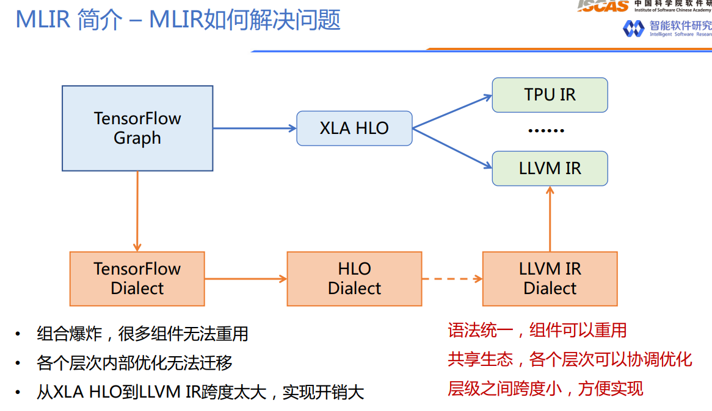

<h1 align="center">为什么引入MLIR</h1>
https://zhuanlan.zhihu.com/p/423824931

MLIR统一了各种层级的IR，通过（Dialect）方式，语法统一，各层dialect之间的跨度小，方便实现，组件可重用，各层可以协调优化。

目前深度学习领域的IR数量众多，很难有一个IR可以统一其它的IR，这种百花齐放的局面就造成了一些困境。这里说下我的理解，以TensorFlow Graph为例，它可以直接被转换到TensorRT的IR，nGraph IR，CoreML IR，TensorFlow Lite IR来直接进行部署。或者TensorFlow Graph可以被转为XLA HLO，然后用XLA编译器来对其进行Graph级别的优化得到优化后的XLA HLO，这个XLA HLO被喂给XLA编译器的后端进行硬件绑定式优化和Codegen。在这个过程中主要存在两个问题。

- 第一，IR的数量太多，开源要维护这么多套IR，每种IR都有自己的图优化Pass，这些Pass可能实现的功能是一样的，但无法在两种不同的IR中直接迁移。假设深度学习模型对应的DAG一共有10种图层优化Pass，要是为每种IR都实现10种图层优化Pass，那工作量是巨大的。
- 第二，如果出现了一种新的IR，开发者想把另外一种IR的图层优化Pass迁移过来，但由于这两种IR语法表示完全不同，除了借鉴优化Pass的思路之外，就丝毫不能从另外一种IR的Pass实现受益了，即互相迁移的难度比较大。此外，如果你想为一个IR添加一个Pass，难度也是不小的。举个例子你可以尝试为onnx添加一个图优化Pass，会发现这并不是一件简单的事，甚至需要我们去较为完整的学习ONNX源码。
- 第三，在上面的例子中优化后的XLA HLO直接被喂给XLA编译器后端产生LLVM IR然后Codegen，这个跨度是非常大的。这里怎么理解呢？我想到了一个例子。以优化GEMM来看，我们第一天学会三重for循环写一个naive的矩阵乘程序，然后第二天你就要求我用汇编做一个优化程度比较高的矩阵乘法程序？那我肯定是一脸懵逼的，只能git clone了，当然是学不会的。但如果你缓和一些，让我第二天去了解并行，第三天去了解分块，再给几天学习一下SIMD，再给几个月学习下汇编，没准一年下来我就可以真正的用汇编优化一个矩阵乘法了。所以跨度太大最大的问题在于，我们这种新手玩家很难参与。我之前分享过TVM的Codegen流程，虽然看起来理清了Codegen的调用链，但让我现在自己去实现一个完整的Codegen流程，那我是很难做到的。[【从零开始学深度学习编译器】九，TVM的CodeGen流程](https://link.zhihu.com/?target=https%3A//mp.weixin.qq.com/s/n7-ZTzCwFOvHrrzg4gFXQQ)

针对上面的问题，MLIR（Multi-Level Intermediate Representation）被提出。MLIR是由LLVM团队开发和维护的一套编译器基础设施，它强调工具链的可重用性和可扩展性。下面我们具体分析一下：

针对第一个问题和第二个问题，造成这些深度学习领域IR的优化Pass不能统一的原因就是因为它们没有一个统一的表示，互转的难度高。因此MLIR提出了Dialect，我们可以将其理解为各种IR需要学习的语言，一旦某种IR学会这种语言，就可以基于这种语言将其重写为MLIR。Dialect将所有IR都放在了同一个命名空间里面，分别对每个IR定义对应的产生式以及绑定对应的操作，从而生成MLIR模型。关于Dialect我们后面会细讲，这篇文章先提一下，它是MLIR的核心组件之一。

针对第三个问题，怎么解决IR跨度大的问题？MLIR通过Dialect抽象出了多种不同级别的MLIR，下面展示官方提供的一些MLIR IR抽象，我们可以看到Dialect是对某一类IR或者一些数据结构相关操作进行抽象，比如llvm dialect就是对LLVM IR的抽象，tensor dialect就是对Tensor这种数据结构和操作进行抽象：

官网提供的MLIR Dialect

除了这些，各种深度学习框架都在接入MLIR，比如TensorFlow，Pytorch，OneFlow以及ONNX等等，大家都能在github找到对应工程。

抽象了多个级别的IR好处是什么呢？这就要结合MLIR的编译流程来看，MLIR的编译流程大致如下：

图源法斯特豪斯，侵删

对于一个源程序，首先经过语法树分析，然后通过Dialect将其下降为MLIR表达式，再经MLIR分析器得到目标程序。注意这个目标程序不一定是可运行的程序。比如假设第一次的目标程序是C语言程序，那么它可以作为下一次编译流程的源程序，通过Dialect下降为LLVM MLIR。这个LLVM MLIR即可以被MLIR中的JIT执行，也可以通过Dialect继续下降，下降到三地址码IR对应的MLIR，再被MLIR分析器解析获得可执行的机器码。

因此MLIR这个多级别的下降过程就类似于我们刚才介绍的可以渐进式学习，解决了IR到之间跨度太大的问题。比如我们不熟悉LLVM IR之后的层次，没有关系，我们交给LLVM编译器，我们去完成前面那部分的Dialect实现就可以了。

