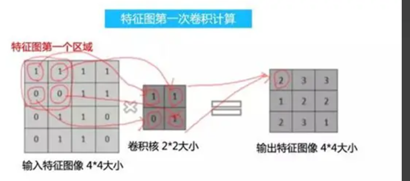

<h1 align="center">卷积和池化</h1>

https://my.oschina.net/u/778683/blog/3100331

在传统的神经网络中，比如多层感知机（MLP），其输入通常是一个特征向量，需要人工设计特征，然后将这些特征计算的值组成特征向量，在过去几十年的经验来看，人工找到的特征并不是怎么好用，有时多了，有时少了，有时选择的特征根本就不起作用（真正起作用的特征在浩瀚的未知里面）。这就是为什么在过去卷积神经网络一直被 SVM 等完虐的原因。

如果有人说，任何特征都是从图像中提取的，那如果把整副图像作为特征来训练神经网络不就行了，那肯定不会有任何信息丢失！那先不说一幅图像有多少冗余信息，单说着信息量就超级多。。。

假如有一幅 1000*1000 的图像，如果把整幅图像作为向量，则向量的长度为 1000000（10^6）。在假如隐含层神经元的个数和输入一样，也是 1000000；那么，输入层到隐含层的参数数据量有 10^12，什么样的机器能训练这样的网络呢。所以，我们还得降低维数，同时得以整幅图像为输入（人类实在找不到好的特征了）。于是，牛逼的卷积来了。接下来看看卷积都干了些啥。

1. **什么叫卷积？**

卷积层是用一个固定大小的矩形区去席卷原始数据，将原始数据分成一个个和卷积核大小相同的小块，然后将这些小块和卷积核相乘输出一个卷积值（注意这里是一个单独的值，不再是矩阵了）。

卷积的本质就是用卷积核的参数来提取原始数据的特征，通过矩阵点乘的运算，提取出和卷积核特征一致的值，如果卷积层有多个卷积核，则神经网络会自动学习卷积核的参数值，使得每个卷积核代表一个特征。

卷积首先要定义一个卷积核，卷积核通常是一个正方形，长宽就是卷积核的尺寸，比如 (2,2) 的卷积核，表示用:

   [w1,w2

   w3,w4]

大小的卷积核来对原始数据进行卷积。卷积核的权重参数 w1-w4 就是该卷积核的特征值，卷积结果是输入数据

首先我们需要知道什么是卷积计算，它其实是一种简单数学运算，有两个步骤：一个是矩阵内积乘法，另一个是将内积乘法的结果进行全加。

（1）矩阵内积乘法

矩阵的内积乘法非常简单，就是把两个相乘的矩阵，相同位置的元素进行乘法运算，这个时候会得到一个新的矩阵（在这里我们需要注意一下，卷积是在作矩阵内积乘法，而不是矩阵乘法）。

（2）全加计算

这个新矩阵的全部值会进行相加，然后会得到一个值，这个值才是卷积运算的结果。

2、**特征图像与卷积核**

对于实际的卷积过程中，它一方面有输入图像，这些图像被称作是特征图像（注：卷积神经网络中，原始的输入是真实的图像，经过卷积后会生成特征图像），另一方面还需要有卷积核。

卷积核的值是人为设定的，它是可以调节的，在实际的卷积神经网络中，卷积核的值就是网络的参数。对卷积网络进行训练，就是在调节这些卷积核心的参数。在实际中一般不会用太大的卷积核，常见的卷积核大小有 3*3，5*5，1*1 的大小。

特征图像和卷积核都是以矩阵的形式存在，因此它们可以进行卷积计算。卷积计算的输入不仅可以是图像，还可以是其它的二维矩阵信息（当然还有一维和三维的卷积，这里就不多介绍了）。卷积核首先会对特征图像的第一个区域进行卷积运算，这个卷积计算的结果，会作为输出特征图像上的一个点，如下图所示。

上图中在卷积之后，将像素图中相连的 4 个像素提取成了一个像素，通俗一点什么意思？读者可以好好体会一下：将一个小区域的图像中的特征提取成一个值来表示。

 

**3、什么是池化**

池化（Pooling）：也称为欠采样或下采样。主要用于特征降维，压缩数据和参数的数量，减小过拟合，同时提高模型的容错性。比如以（2,2）作为一个池化单位，其含义就是每次将 2*2=4 个特征值根据池化算法合并成一个特征值，常用的池化算法有以下几种：

1. 平均值：取 4 个特征值的平均值作为新的特征值。
2. 最大值：取 4 个特征值中最大值作为新的特征值。
3. 最小值：取 4 个特征值中最小值作为新的特征值。

通过池化层，使得原本 4*4 的特征图压缩成了 2*2，从而降低了特征维度。

最后小结一下：

（1）卷积是从一小块图像区域中提取出特征值来表示这一小块区域的内在特征（或者说内在含义）。

（2）池化是将相临的多个特征用一个特征来代替，压缩特征维度。

卷积和池化是图像人工智能应用场景中绕不过去的两种基本处理过程，所以我们还是先了解他俩的内在含义吧。