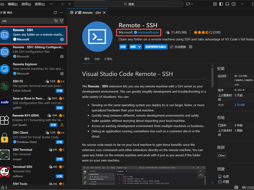
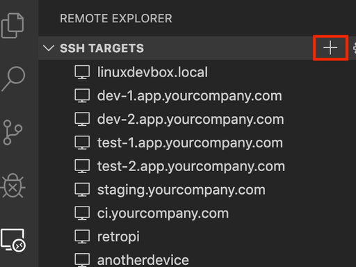
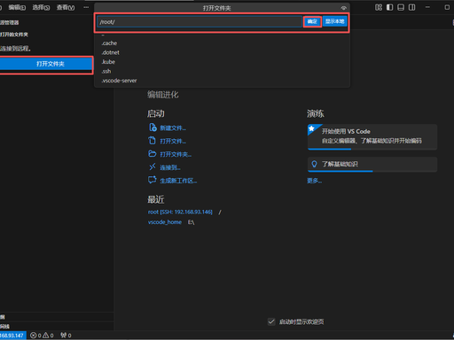
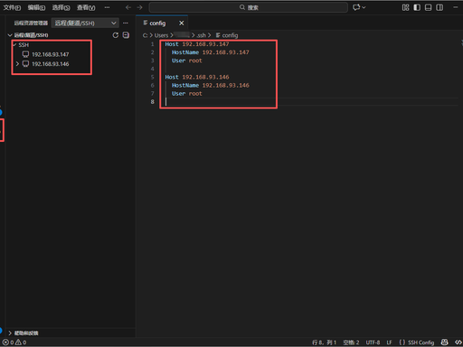
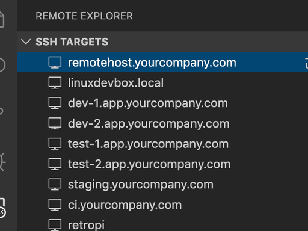
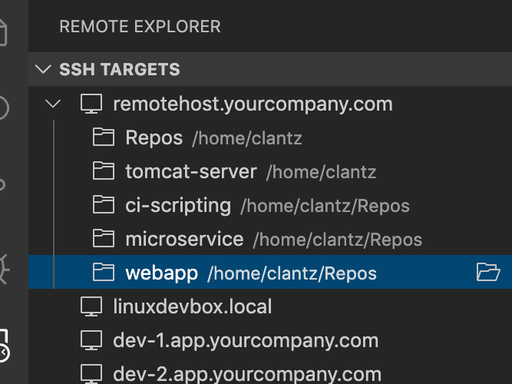

# 设置服务器


在 VS Code 中通过 SSH 打开远程文件夹，核心是使用官方的 **Remote - SSH** 插件，先建立 SSH 连接，再像本地一样打开远程目录。以下是完整、可直接操作的步骤：

### 一、准备工作

1. **安装 Remote - SSH 插件**

- 打开 VS Code，点击左侧扩展图标（或按 `Ctrl+Shift+X`）。

- 搜索 

  Remote - SSH

  （微软官方发布），点击 

  Install

   安装。

  

  

1. **本地安装 SSH 客户端（Windows 需额外操作）**

- **Windows 10/11**：设置 → 应用 → 可选功能 → 添加功能 → 搜索 **OpenSSH 客户端** → 安装。
- **macOS/Linux**：系统自带 SSH，无需额外安装。

### 二、配置 SSH 连接（推荐）

1. **打开 SSH 配置文件**

- 点击 VS Code 左下角

  绿色的 "><" 图标

  （远程连接按钮），或按 

  ```
  F1
  ```

   输入 

  ```
  Remote-SSH: Connect to Host...
  ```

  。

  

  

- 选择 

  Configure SSH Hosts...

   → 选择用户目录下的配置文件：

  - Windows：`C:\Users\你的用户名\.ssh\config`

  - macOS/Linux：

    ```
    ~/.ssh/config
    ```

    

    

  

1. 编辑配置文件

   

   填入以下内容（修改为你的服务器信息）：

ssh-config


可写多个server

```
Host my-remote-server    # 自定义连接别名（方便记忆）
  HostName 192.168.1.100 # 服务器IP或域名
  User root              # 远程登录用户名
  Port 22                # SSH端口（默认22，可省略）
  IdentityFile ~/.ssh/id_rsa # 私钥路径（免密登录用，密码登录可删）
  
 Host my-remote-server    # 自定义连接别名（方便记忆）
  HostName 192.168.1.101 # 服务器IP或域名
  User root              # 远程登录用户名
  Port 22                # SSH端口（默认22，可省略）
  IdentityFile ~/.ssh/id_rsa # 私钥路径（免密登录用，密码登录可删） 
```



### 三、连接远程服务器

1. **发起连接**

- 再次点击左下角绿色图标 → 选择 `Connect to Host...`。

- 在列表中点击你配置的别名（如 

  ```
  my-remote-server
  ```

  ），或直接输入 

  ```
  用户名@服务器IP
  ```

  。

  

  

1. **验证与初始化**

- 首次连接：选择服务器系统（通常选 **Linux**），等待 VS Code 自动在远程安装 **VS Code Server**。

- 身份验证：输入服务器密码，或使用已配置的 SSH 密钥免密登录。

- 连接成功：左下角状态栏显示 

  ```
  SSH: my-remote-server
  ```

  ，表示已接入远程主机。

  

  

### 四、打开远程文件夹

1. 连接成功后，点击菜单栏 **File → Open Folder...**（文件 → 打开文件夹）。

   

2. 在弹出的框中，**输入远程服务器上的文件夹绝对路径**（如 `/home/root/projects`），点击 **OK**。

   

3. 等待加载完成，即可在左侧资源管理器看到远程文件夹内容，**像本地一样编辑、运行、调试代码**。

   

### 五、常见问题与技巧

1. **连接失败 / 卡住**

- 检查服务器 SSH 服务是否正常、IP / 端口 / 用户名是否正确。
- 清理远程服务器的 `~/.vscode-server` 目录，重新连接。
- Windows 下检查 `.ssh` 文件夹权限，确保仅当前用户可访问。

1. **免密登录（推荐）**

- 本地生成密钥：`ssh-keygen`（一路回车）。
- 上传公钥到服务器：`ssh-copy-id root@192.168.1.100`，后续无需输密码。

1. **快速打开**

- 连接后可通过 **File → Open Recent** 快速打开最近访问的远程文件夹。
- 可保存远程工作区（`.code-workspace`），下次直接打开。

需要我帮你排查连接失败的常见问题（如权限错误、端口不通、VS Code Server 安装卡住）吗？