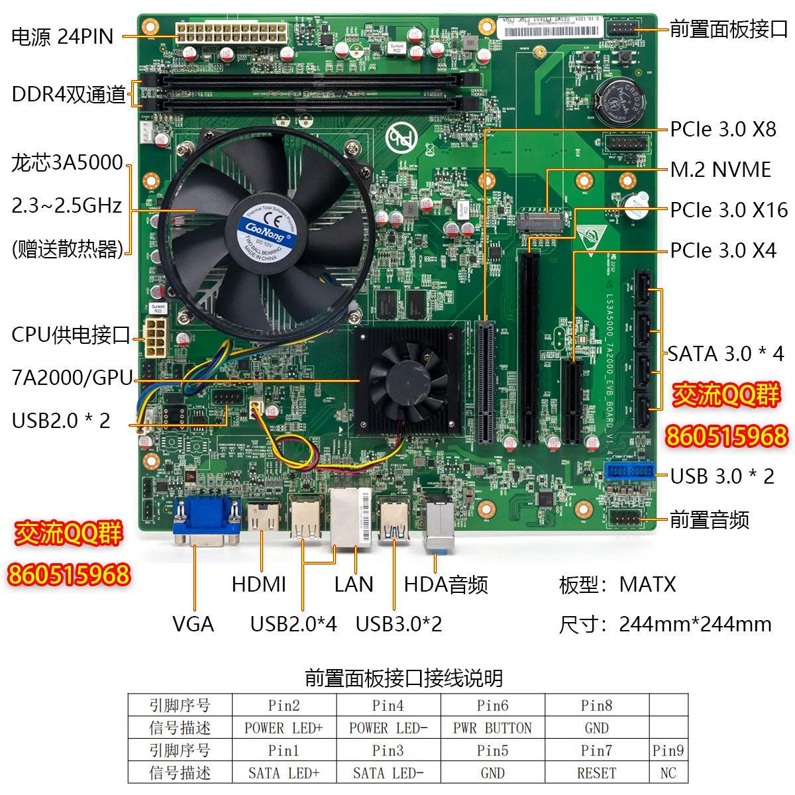

# 龙芯3A5000+7A2000串口连接

### 1. 主板接口图




### 2. 连接

- 一般来说，无论是 RS232、RS422 还是 RS485 串口，都包含一些基本引脚，其中 2 脚通常为 RXD（接收数据），3 脚通常为 TXD（发送数据），5 脚通常为 GND（接地）。

```
主板接口    2（红）   4   6   8
           1   3（橙）   5（黄）   7   9
           
串口线        6   7  8  9
           1  2（橙）   3（红）  4   5（黄）
           
主板5连接串口线5，主板3连接串口线2，主板2连接串口线3


主板也是串口线的话，使用下面方式，不过2 3反一下。
主板串口线    6   7  8  9
           1  2（红）   3（橙）  4   5（黄）
           
串口线        6   7  8  9
           1  2（橙）   3（红）  4   5（黄）
```


