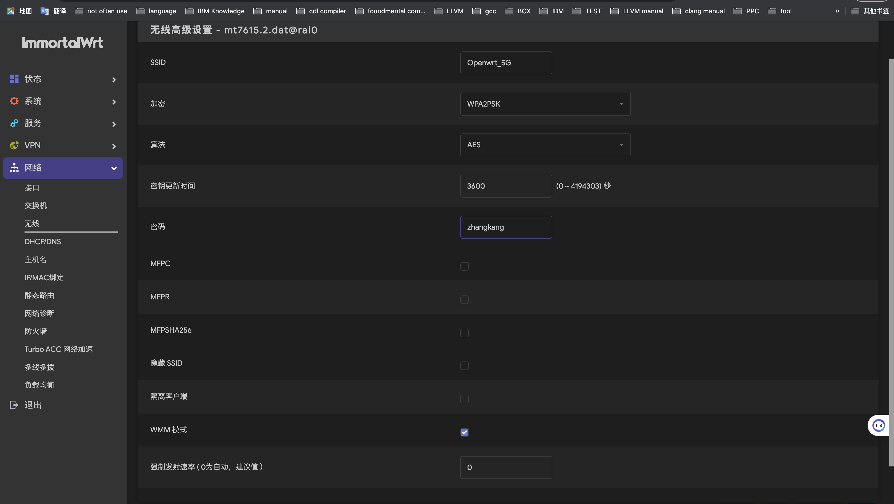

<h1 align="center">VPN设置</h1>

https://www.youtube.com/watch?v=3lFYRWFIlh4

### 输入ax6s-full.bin后

这里使用PassWall

结点列表中进行节点添加，如果是SS结点，可以使用通过链接添加结点，如果是VMESS，应该使用`添加`然后选择`v2ray/vmess`。

节点添加完成后回到首页，打开总开关。

记得在自动切换中设置自动切换

记得设置密码：

