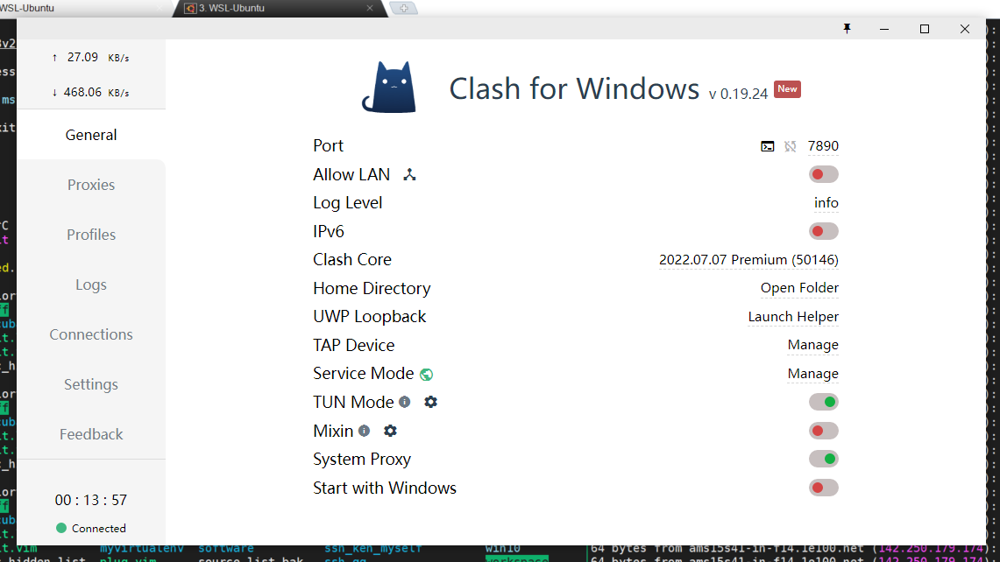
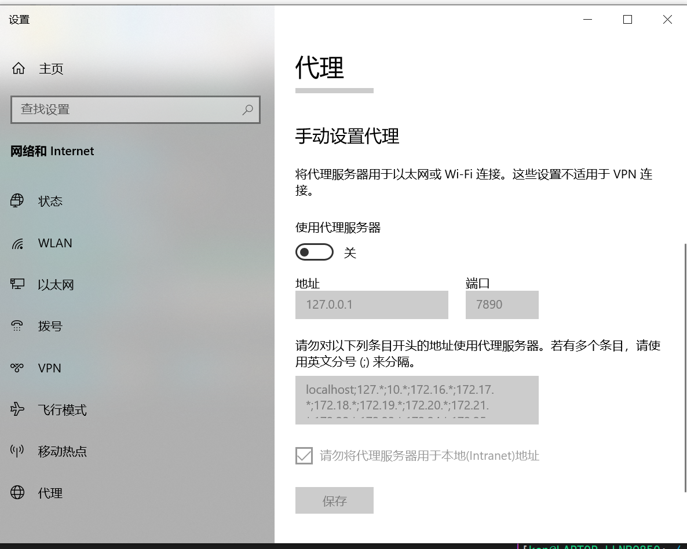

<h1 align="center">clash for windows</h1>


### 下载地址

https://github.com/Dreamacro/clash/releases


TAP/TUN 模式，建议安装TUN模式

https://uzbox.com/tech/clash-atp.html

https://dumuzhou.org/1083.html


https://docs.cfw.lbyczf.com/contents/tap.html#%E5%90%AF%E5%8A%A8-tap-%E6%A8%A1%E5%BC%8F


TUN模式我最后添加的内容如下：

```
dns:
  enable: true
  enhanced-mode: redir-host # 或 fake-ip
  listen: 0.0.0.0:53
  nameserver:
    - 223.5.5.5
```


也可不添加看是有什么问题





先点南 `Service Mode`的manage，再来打开`TUN MODE`


可以不用在浏览器中设置代理，直接在这里进行设置即可。

