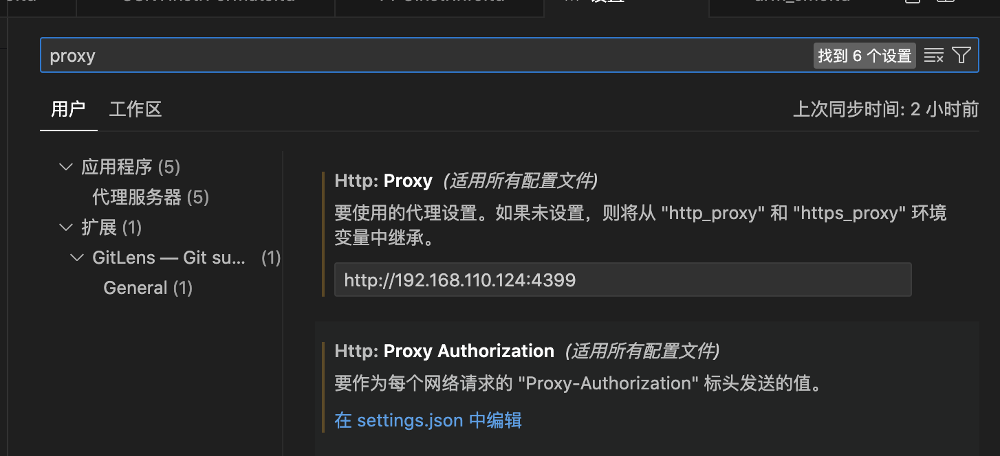

<h1 align="center">使用HTTP的</h1>


## 1. 浏览器使用代理

现在不需要输入任何命令，就可以在浏览器中设置http代理了。这里不能选择HTTPS


这里假设能上网的机器即安装squid的机器的ip是192.168.110.124。

如果squid设置了密码，可以点击右边的 锁 标志， 会提示输入用户名和密码。


## 2. 命令行使用代理(亲测)

### 2.1 wget使用代理 

```shell
这里网站中的http与http_proxy必须对应。
wget http://www.baidu.com -e "http_proxy=192.168.110.124:4399"
wget https://www.baidu.com -e "https_proxy=192.168.110.124:4399"
```


如果在命令行中已经设置了export，则使用wget时无需再使用`-e`参数。

```shell
export http_proxy=192.168.110.124:4399
export https_proxy=192.168.110.124:4399
```


##### 2.2 pip使用代理(亲测)

```shell
pip install 包名  --proxy=192.168.110.124:4399
```


也可以使用

```shell
export http_proxy=192.168.110.124:4399
export https_proxy=192.168.110.124:4399
```


##### 2.3 apt-get(亲测可用)

```
sudo apt-get -o Acquire::http::proxy="http://127.0.0.1:4399/" update
sudo apt-get -o Acquire::http::proxy="http://192.168.110.124:4399/" update
```


##### ### 2.4 VSCode使用

打开设置 -> 搜 proxy，只在Http:Proxy中输入即可




