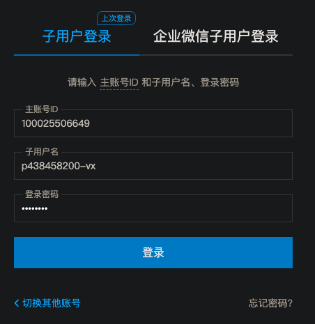
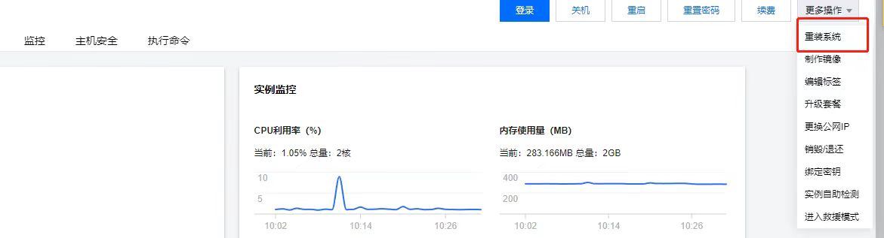
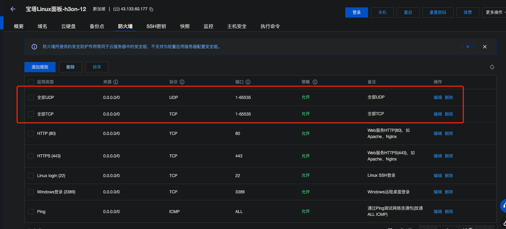

<h1 align="center">other</h1>


这里的用户是腾讯子账户：

下面是腾讯子账户的介绍和使用

http://www.cloudtool360.com/jiaocheng/2021/0106/16.html


##### 注意

- 不要对ip作任何修改。


### 管理信息

登陆地址：https://cloud.tencent.com/login/subAccount/100025506649?type=subAccount&username=p438458200-vx

密码：Aasd159#




打开网址，登录之后，打开这个链接：

控制地址： https://console.cloud.tencent.com/lighthouse/instance/detail?searchParams=rid%3D1&rid=9&id=lhins-1fh6ve2x         




如果重装系统选择的是ubuntu，没有设置root密码，但是ubuntu有sudo权限，所以可以通过以下命令设置root密码。
```shell
sudo passwd root
```


### 设置防火墙

必须添加以下两个规则，很简单，实在不知道的放，看视频。


此视频讲了如何设置防火墙。

https://www.youtube.com/watch?v=vY1Bb86vVpg



