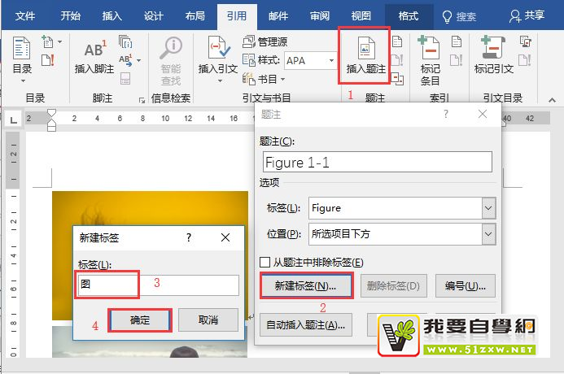
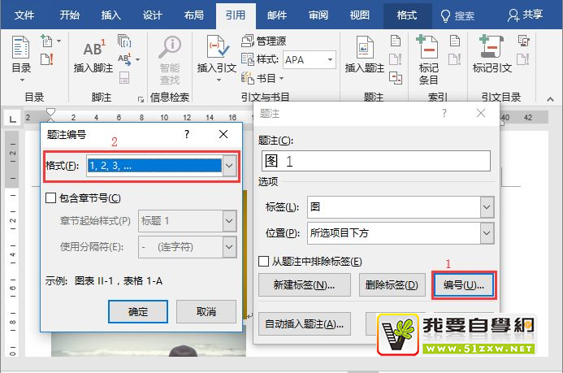
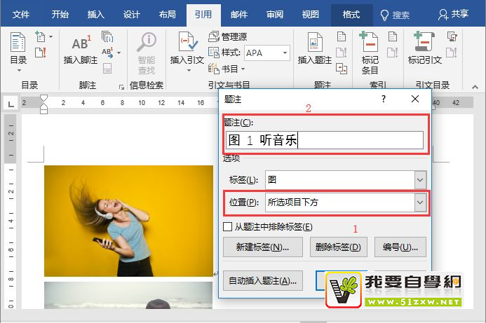
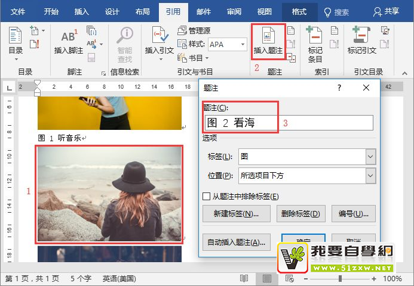
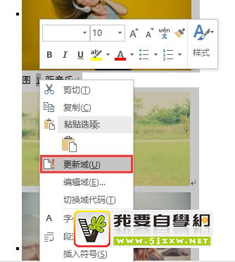

<h1 align="center">图片表格自动编号</h1>
https://www.51zxw.net/TechArticleDetails.aspx?zid=3&id=2026

## 怎样在Word中给图片自动编号呢

日常工作中，时常会编辑各类长篇的文档，可能包含几十个图片，或几十张表格。

默认情况下，插入的这些图片和表格都是没有编号的。但在文档中为了指明对应的图、表，通常会为图、表添加编号。这时候建议大家使用自动编号，避免给自己增加不必要的工作量。

**为什么呢？**

**原因一：**如果我们手动依次为图、表编号，领导审核时，万一发现编号顺序不对，会被误以为你工作不仔细。

**原因二：**假设文档中图、表编号都正确了，但若领导要求在文档中增加或删除一些图片或表格，那么，很可能通篇的表格或图片排序编号都要重新更改，这会导致工作量巨大。

因此，今天我们就来说说如何在插入图片和表格时自动添加编号。怎样在Word中给图片自动编号呢？只需通过插入“题注”的方法即可解决。

这里以为”图片自动编号“为例进行讲解，具体操作如下：

（1）选中要编号的表格或者图片，点击【引用】-【插入题注】按钮，打开“题注”对话框，点击“新建标签”按钮，然后新建一个名为“图”的标签，点击“确定”按钮。

（2）返回“题注”对话框，点击“编号”按钮，打开“编号”对话框。首先设置编号的格式，该格式即为图片的编号，这里我们选择阿拉伯数字”1,2,3......"。

**技巧提示：**选中“包含章节号”复选框，这里可设置图、表级别。如果文档中图、表编号为“图1.1”这类格式，则在“章节起始样式”设置为“标题1”；如果编号为“图1.2.1”格式，则设置为“标题2”即可。

（3）返回“题注”对话框，在“选项”栏中设置”位置“为”所选项目下方“。（注意：一般情况下，若是为表格设置题注，可设置为“所选项目上方”；若是图片设置题注，此处通常选择“所选项目下方”）。

（4）设置完成后，在最上方“题注”文本框中的题注编码后面输入图片名，然后单击”确定“，即完成第一张图片的自动编号。

 

（5）继续选中第二张图片，直接点击“插入题注”，然后在打开的”题注“对话框中，你会发现编号已经自动排序了，此时，只需在题注编码后面输入图片名，点击”确定“即可（注：后面的图片自动编号操作方法相同）。

**提示：**表格同样可以自动编号，操作方法相同，只需在“插入题注”的时候“标签”选择“表”即可。

**常见问题解答：****如果文档中增加或删除图片、图表，又该如何更新这些编号呢？**

**方法：**首先按【Ctrl+A 】键全选文档，然后在编号上单击鼠标右键，选择“更新域”命令这些编号即会自动更新了。

至此，本次的图片和表格自动编号知识已经介绍完毕了，你学会了吗？

其实，在实际操作中，会遇到很多其他的格式要求，但是其操作方法和思路是不变的，我们只要掌握了题注功能的应用方法，即可根据实际情况，适当的变通，以达到了我们需要的效果。