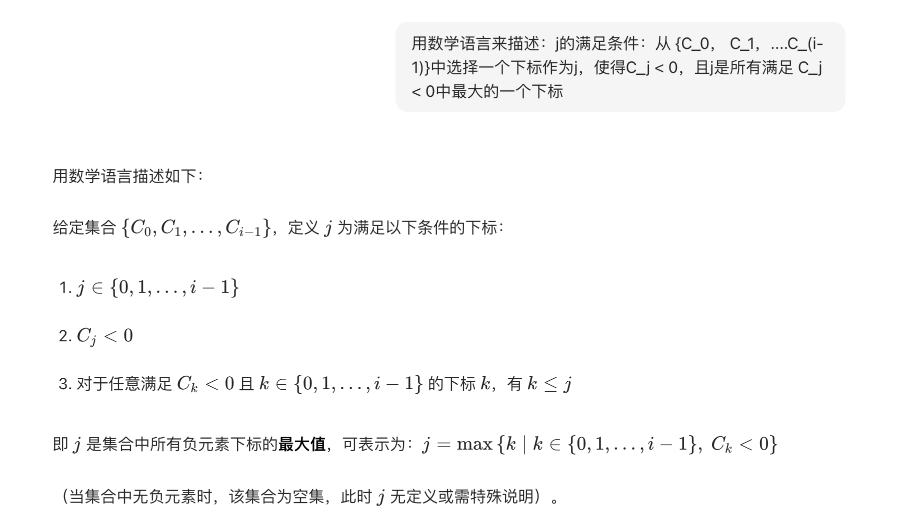
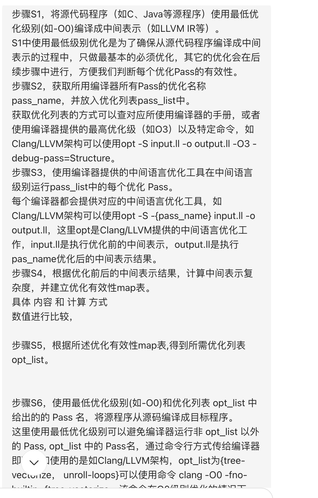
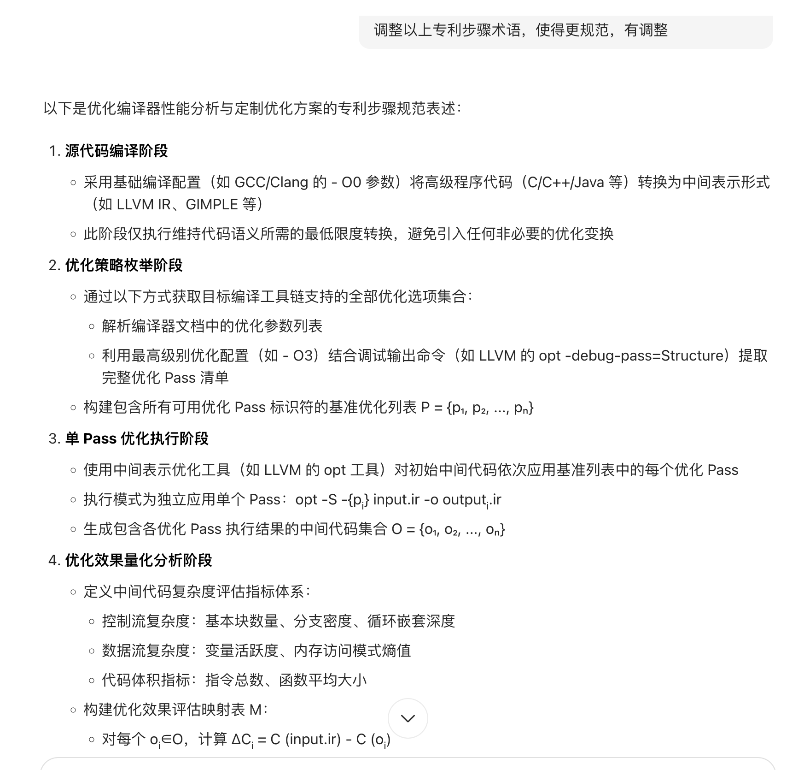

## 1. 专利通用性

专利权利要求和名字具有通用性是非常重要的，这有助于准确界定专利保护范围、便于公众理解以及利于专利的推广和应用等。以下是具体分析：

- 专利权利要求通用性的原因
  - **扩大保护范围**：更具通用性的权利要求能够涵盖更多的实施方式和变化形式，避免将保护范围局限于过于具体的技术特征，从而为专利权人提供更广泛的保护。例如，若权利要求中仅描述了某一特定结构的产品，而没有采用更通用的方式涵盖类似结构的变形，那么竞争对手可能很容易通过对该特定结构进行微小改动来规避侵权，而通用性强的权利要求可以减少这种情况的发生。
  - **适应技术发展**：技术领域不断发展变化，具有通用性的权利要求能够更好地适应未来技术的演进和创新。如果权利要求过于具体和狭窄，可能在新技术出现时，即使该新技术与专利的发明构思相似，也无法得到有效的保护。而通用性强的权利要求可以在一定程度上涵盖相关技术领域的未来发展方向，使专利权在较长时间内保持有效性和竞争力。
  - **便于侵权判断**：对于公众和司法机关来说，通用性强的权利要求更容易理解和判断是否构成侵权。清晰、概括的权利要求能够更明确地界定专利权的边界，减少因权利要求表述过于复杂或具体而导致的侵权判断困难，提高专利侵权诉讼的效率和公正性。
- 专利名字通用性的原因
  - **准确传达发明核心**：通用的专利名字能够更准确地反映发明的核心内容和本质特征，使专利审查员、公众以及其他相关人员能够迅速了解该专利的大致技术领域和主要创新点。例如，“一种高效节能 LED 照明系统” 这个名字，就清晰地表明了该专利与 LED 照明系统相关，且重点在于高效节能方面，便于他人快速把握发明的主旨。
  - **避免混淆和误解**：具有通用性的专利名字可以避免与其他专利名称产生混淆，减少因名称相似而导致的公众误解和法律纠纷。如果专利名字过于独特或个性化，可能会与其他领域的专利名称相似，从而引发不必要的争议。同时，通用的名字也更易于翻译和在国际上进行交流，有利于专利的国际化布局。
  - **符合审查规范**：根据相关规定，专利名称应采用所属技术领域通用的技术术语，最好采用国际专利分类表中的技术术语。这样可以确保专利名称的规范性和统一性，便于专利的分类、检索和管理，也有利于审查员对专利进行准确的审查和比对。

## 2. 专利修改

在专利审核过程中，代理把后面的内容往权 1（独立权利要求 1）中加，主要有以下原因：

- **克服创造性缺陷**：当审查员指出独立权利要求不具备创造性时，代理师通常会将从属权利要求和 / 或说明书中的技术内容补入至独立权利要求中，以增加独立权利要求的技术特征，使其与现有技术相比具有新颖性和创造性，从而克服审查意见中指出的创造性缺陷。
- **完善技术方案**：如果原独立权利要求所记载的技术方案存在漏洞或不够完整，无法清楚地表达发明的技术构思和解决的技术问题，代理可以将后面从属权利要求或说明书中相关的技术内容补充到权 1 中，以完善技术方案，使其更符合专利授权的要求。
- **缩小保护范围以满足审查要求**：在某些情况下，为了避免专利申请被驳回，代理可能会根据审查员的意见，将一些更具体的技术特征从后面的权利要求或说明书中加入到权 1 中，从而缩小权利要求的保护范围，使专利申请更有可能满足审查标准，尽快获得授权。
- **澄清权利要求的保护范围**：如果权 1 的表述不够清晰，可能导致审查员对其保护范围产生误解，代理可以将后面更详细的描述内容加入权 1，以澄清权利要求的保护范围，避免因不清楚而被驳回。
- **加强权利要求的稳定性**：通过将一些重要的、在说明书中详细描述但未在权 1 中体现的技术特征加入权 1，可以使权 1 的技术方案更加具体和明确，从而在后续的侵权诉讼等程序中，增强权利要求的稳定性，降低被无效的风险。

## 3. 利用AI写专利

在日常技术研发、产品优化或场景应用过程中，需重点记录以下高频出现且具备专利挖掘价值的难点，这些难点是专利创新的核心来源，也是专利写作的关键切入点。

 一种编译器性能优化方法  https://patents.google.com/patent/CN120491975B/zh?oq=CN120491975B

本发明提供一种编译器性能优化方法，包括：基于最低优化级别将源代码程序编译成初始中间代码；按顺序对初始中间代码执行完整优化列表集合中的每个优化，得到执行结果的中间代码；计算中间代码的中间表示复杂度；根据每一个中间代码的中间表示复杂度，筛选出具有正向优化效果的优化；基于正向优化，将源程序代码编译成目标程序。本发明提出了一种在中间代码层级上根据中间表示复杂度来判断优化有效性的方法，用以在编译过程中规避无效或负向优化；该方法不依赖具体硬件架构，具有良好的通用性，适用于多种目标平台；通过在中间语言层面对优化效果进行动态评估，不仅大大缩短了编译时间，还使得目标程序性能更优。

本申请通过计算中间代码的中间表示复杂度，来决定是否做某个优化。

https://grok.com/c/e30c1c61-a2df-46a1-9946-923fe2edb029

llvm的各种优化中有哪些cost model?

LLVM IR中的指令可以分成哪些类型，比如存储类指令，每类指令的权重应该是多少，耗时的指令，权重应该更大？

函数复杂度，LLVM IR中CFG的权重，比如循环？

润色公式

流程图，框图，最好有量化的公式。

豆包截图

