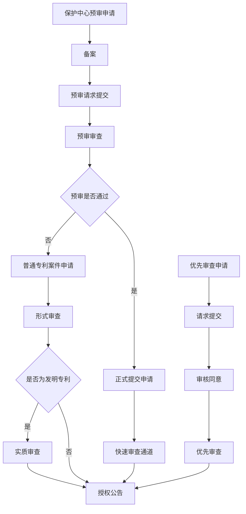

## 1. 基本知识

### 1.1 PCT专利和非PCT专利

| 对比维度   | PCT 专利                                                     | 非 PCT 专利（普通专利）                                      |
| ---------- | ------------------------------------------------------------ | ------------------------------------------------------------ |
| 定义       | 通过《专利合作条约》（PCT）提交的国际专利申请，不直接授权，需进入国家阶段才能获得专利权。 | 直接向某个国家或地区（如中国、美国、欧盟）专利局提交的专利申请，直接授权后获得专利权。 |
| 申请流程   | 国际阶段：提交 PCT 申请，进行国际检索、国际公布，可选国际初步审查。国家阶段：申请人需在 PCT 申请日后的 30 个月（部分国家 31 个月）内进入目标国，各国独立审查，决定是否授权。 | 直接向目标国专利局提交申请，按照该国专利审查程序进行审查，如中国发明专利需经过 “初审→公开→实审→授权”。 |
| 适用范围   | 适用于 PCT 成员国，目前有 150 多个。                         | 仅适用于提交申请的国家或地区。                               |
| 费用       | 较高，包括国际阶段费用和进入国家阶段的费用。                 | 较低，仅涉及单个国家或地区的申请和维护费用。                 |
| 授权时间   | 较长，通常需要 4-5 年，包括国际阶段和国家阶段的时间。        | 较短，不同国家审查时间不同，如中国约 2-4 年，美国约 1-3 年。 |
| 决策缓冲期 | 有 30/31 个月的时间决定是否进入目标国的国家阶段。            | 无，需立即决定申请国，进入该国审查程序。                     |
| 适用场景   | 计划在多个国家申请专利，但不确定具体市场；需要时间评估专利价值；希望统一国际检索报告，提高授权概率。 | 仅需在 1-2 个国家保护；预算有限，希望快速获得授权；技术生命周期短。 |

如果你申请了一个CN的专利，未申请PCT专利和US专利，在美国别人用你专利的技术方案不算违法。

如果你申请了一个CN的专利，未申请PCT专利和US专利，在美国有人申请了一个和你类似的专利，这个专利大概率不会被授权，即使授权了，你也可以申请让该专利无效。

### 1.2 角色

1. **代理是 “桥梁”**：申请人无需熟悉专利法和审查规则，由代理将技术方案转化为符合法律要求的申请文件，并作为唯一接口对接审查员，降低申请人操作成本和出错风险；
2. **审查员是 “裁判”**：仅依据专利法和现有技术，对申请文件的 “合法性”“创新性” 进行独立审查，不偏向申请人或代理；
3. **申请人是 “决策方”**：所有关键节点（文件确认、答复方案、是否上诉）的最终决策权在申请人，代理仅提供专业建议和执行服务。

| 核心维度        | 专利申请人 ↔ 专利代理                                        | 专利代理 ↔ 审查员                                            | 专利申请人 ↔ 审查员                                          |
| --------------- | ------------------------------------------------------------ | ------------------------------------------------------------ | ------------------------------------------------------------ |
| 核心职责边界    | 申请人：提供技术交底材料、确认申请方案、支付费用、最终决策；代理：撰写文件、提交申请、对接审查员、答复通知、反馈进展 | 代理：提交合规申请文件、答复审查意见、补充材料；审查员：形式 / 实质审查、发出官方通知（受理 / 审查意见 / 授权 / 驳回） | 有代理时：申请人无直接职责，审查员仅审查文件；无代理时：申请人直接履行代理沟通职责，审查员按规则审查 |
| 法律 / 业务性质 | 委托代理关系（基于《专利代理合同》）                         | 业务审查与沟通关系（基于专利法及审查规则）                   | 无直接法律 / 业务关系（有代理时）；无代理时为直接申请 - 审查关系 |
| 沟通方式        | 私下沟通（电话、邮件、面谈）                                 | 官方渠道沟通（专利业务系统、书面通知书）                     | 有代理时：无直接沟通（代理中转）；无代理时：官方渠道直接沟通 |
| 关键说明        | 代理需在申请人授权范围内工作，对申请人负责，保障其合法权益   | 沟通仅围绕案件技术 / 法律问题，符合专利局规定，无私下往来    | 审查员独立审查，不偏向申请人；有代理时申请人不参与直接对接，仅做最终决策 |

## 2. 中心预审、加快（优先审查）、普通专利案件

预审以前每年有十几个名额，现在名额不限。

保护中心预审、加快（优先审查）、普通专利案件的关系可以通过以下图表来表示：

|          |                                                              |                                                              |                                                              |
| -------- | ------------------------------------------------------------ | ------------------------------------------------------------ | ------------------------------------------------------------ |
| 类型     | **保护中心预审**                                             | **优先审查**                                                 | **普通专利案件**                                             |
| 受理机构 | 各地知识产权保护中心全国科技企业知识转化平台                 | 国家知识产权局专利代办处全国科技企业知识转化平台             | 国家知识产权局                                               |
| 申请时机 | 在正式向国家知识产权局提交专利申请之前全国科技企业知识转化平台 | 在正式向国家知识产权局提交专利申请之后，且发明专利申请需进入实质审查阶段全国科技企业知识转化平台 | 无特殊要求，按正常流程提交申请                               |
| 适用范围 | 限于保护中心限定的特定技术领域全国科技企业知识转化平台       | 涉及国家重点发展产业、互联网等领域且技术或产品更新速度快等情况全国科技企业知识转化平台 | 所有领域的专利申请                                           |
| 审查周期 | 发明专利授权周期可缩短至 3 个月左右，实用新型专利约 1 个月，外观设计专利 3-5 个工作日 | 通常比普通程序缩短，具体时间因案件而异                       | 发明专利通常需要 2-3 年甚至更久，实用新型和外观设计专利也需数月到一年左右 |
| 审查流程 | 备案→预审请求提交→预审审查→形成预审结论→正式提交申请         | 请求提交→审核同意→优先审查全国科技企业知识转化平台           | 形式审查→实质审查（发明专利）→授权公告                       |
| 关系     | 保护中心预审和优先审查都是普通专利案件审查的加速方式，保护中心预审是在申请前由地方保护中心进行前置审查，通过后进入国家知识产权局快速审查通道；优先审查是在申请后由国家知识产权局根据申请人请求或依职权对符合条件的案件进行加快审查。三者共同构成了专利审查体系，满足不同申请人的需求。 |                                                              |                                                              |

### 2.1 审核时间

优先审查专利不需要先走预审，优先审查和预审是两种不同的专利加速审查方式，它们在申请时机、审查周期等方面存在差异。

优先审查是指国家知识产权局依据专利申请人的请求或依职权，对符合条件的专利申请提供加快审查的服务，适用于已经进入实质审查阶段的发明专利申请，以及已受理并完成专利申请费缴纳的实用新型和外观设计专利申请sme-gov.cn。而预审是指在正式向国家知识产权局提交专利申请之前，由各地的知识产权保护中心对专利申请文件进行前置审查，通过预审的专利申请文件，将有机会进入国家知识产权局的快速审查通道sme-gov.cn。

在审查速度方面，通常预审专利会更快一些。预审通过后，发明专利通常半年内结案，实用新型专利和外观设计专利 2 个月内即可结案。优先审查合格后，发明专利申请将在 1 年内结案，实用新型和外观设计专利申请则是在 2 个月内结案。

### 2.2 收费

优先审查专利案件不需要额外缴纳优先审查请求费国家知识产权局。

根据国家知识产权局的相关规定，专利优先审查不收取费用，申请人只需缴纳常规的专利申请费用，如发明专利申请费 900 元 / 件、实质审查费 2500 元 / 件，实用新型和外观设计专利申请费 500 元 / 件等。如果符合费用减缴条件，还可以按照规定的比例减缴相应费用。不过，如果委托专利代理机构办理优先审查事务，会产生代理费用，具体金额根据案件复杂程度和代理机构收费标准而定。

## 

## 借助AI写专利

