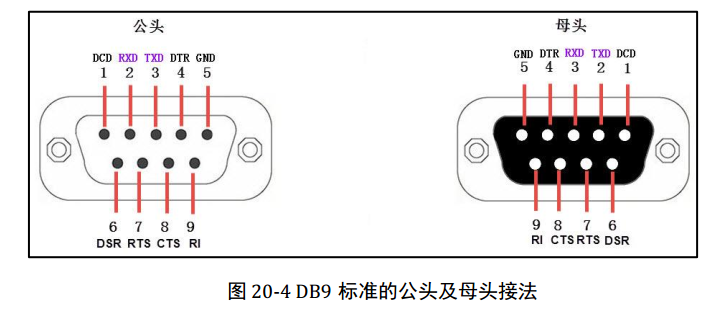

<h1 align="center">串口连接</h1>


### 1. 连接RS232，9针

- 一般来说，无论是 RS232、RS422 还是 RS485 串口，都包含一些基本引脚，其中 2 脚通常为 RXD（接收数据），3 脚通常为 TXD（发送数据），5 脚通常为 GND（接地）。

```
主板接口    2（红）   4   6   8
           1   3（橙）   5（黄）   7   9
           
串口线        6   7  8  9
           1  2（橙）   3（红）  4   5（黄）
           
主板5连接串口线5，主板3连接串口线2，主板2连接串口线3


主板也是串口线的话，使用下面方式，不过2 3反一下。
主板串口线    6   7  8  9
           1  2（红）   3（橙）  4   5（黄）
           
串口线        6   7  8  9
           1  2（橙）   3（红）  4   5（黄）
```


## 2. 还有一种UART是3针的

**UART 是 “处理数据转换的硬件核心”（相当于 “工厂”），RS232 是 “规定数据如何对外传输的物理标准”（相当于 “工厂的运输路线和货车规格”）**—— 没有 UART，RS232 就没有数据可传；没有 RS232，UART 的信号只能在短距离内以 TTL 电平传输，无法适配工业级、远距离的外部设备。

也就是说RS232其实封装了UART，功能比UART更强大。





