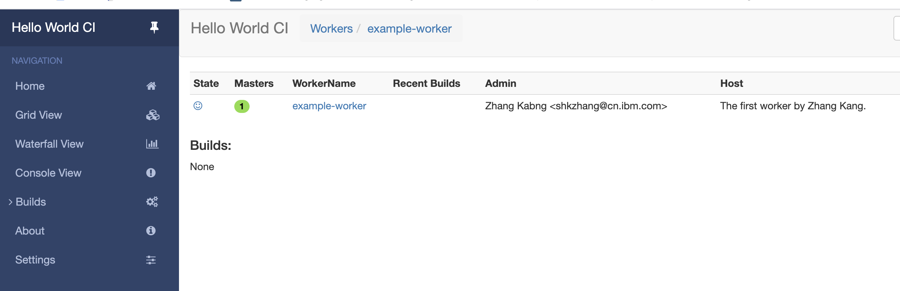

https://docs.buildbot.net/latest/tutorial/firstrun.html

```shell
mkdir -p ~/BuildBot/bb-master
cd ~/BuildBot/bb-master
```


```shell
sudo apt-get install python3-venv
python3 -m venv ~/BuildBot/sandbox


```


```shell
pip install --upgrade pip
pip install 'buildbot[bundle]'
```


### Error 1 

```
c/_cffi_backend.c:2:10: fatal error: Python.h: No such file or directory
       #include <Python.h>
                ^~~~~~~~~~
```


https://www.cnblogs.com/qq952693358/p/9170638.html

Based on you python version. The version of VM is `python3.6`

```shell
sudo apt-get install python3.6-dev
```


### Error 2

```
build/temp.linux-ppc64le-3.6/_openssl.c:546:10: fatal error: openssl/opensslv.h: No such file or directory
   #include <openssl/opensslv.h>
            ^~~~~~~~~~~~~~~~~~~~
```


```shell
sudo apt-get install libssl-dev
```


```shell
(sandbox) [bbadmin@khamsin1:~/BuildBot/sandbox]$ ls ~/BuildBot/sandbox/bin/
activate           buildbot-worker                  conch             migrate             pip3        python3    twistd
activate.csh       buildbot_windows_service         easy_install      migrate-repository  pip3.6      sqlformat  wamp
activate.fish      buildbot_worker_windows_service  easy_install-3.6  pasteurize          pyhtmlizer  tkconch
automat-visualize  cftp                             futurize          pbr                 pyjwt       trial
buildbot           ckeygen                          mailmail          pip                 python      twist
```


```
cd ~/BuildBot/bb-master
buildbot create-master master

```


Buildbot’s activity is controlled by a configuration file. Buildbot by default uses configuration from file at `master.cfg`. Buildbot comes with a sample configuration file named `master.cfg.sample`. We will use the sample configuration file unchanged:

```
mv master/master.cfg.sample master/master.cfg
```


```shell
(sandbox) [bbadmin@khamsin1:~/BuildBot/bb-master]$ buildbot start master
Following twistd.log until startup finished..
The buildmaster appears to have (re)started correctly.
```


#### Access the web

```shell
http://khamsin1.fyre.ibm.com:8010
```


#### Resolve the warning

```shell
93 #c['buildbotURL'] = "http://localhost:8010/"
94 c['buildbotURL'] = "http://khamsin1.fyre.ibm.com:8010/"
```


```shell
cd ~/BuildBot/bb-master
buildbot restart master
```


# Worker

```shell
mkdir -p ~/BuildBot/bb-worker
cd ~/BuildBot/bb-worker
```


```shell
pip install buildbot-worker
# required for `runtests` build
pip install setuptools-trial
```


Create the worker

```shell
[bbadmin@khamsin1:~/BuildBot/bb-worker]$ buildbot-worker create-worker worker localhost example-worker pass

mkdir /home/bbadmin/BuildBot/bb-worker/worker
mkdir /home/bbadmin/BuildBot/bb-worker/worker/info
Creating info/admin, you need to edit it appropriately.
Creating info/host, you need to edit it appropriately.
Not creating info/access_uri - add it if you wish
Please edit the files in /home/bbadmin/BuildBot/bb-worker/worker/info appropriately.
worker configured in /home/bbadmin/BuildBot/bb-worker/worker
```


If you decided to create this from another computer, you should replace `localhost` with the name of the computer where your master is running.

The username (`example-worker`), and password (`pass`) should be the same as those in `master/master.cfg`; verify this is the case by looking at the section for `c['workers']`:


In `master.cfg`， you can see:

```shell
15 # The 'workers' list defines the set of recognized workers. Each element is
16 # a Worker object, specifying a unique worker name and password.  The same
17 # worker name and password must be configured on the worker.
18 c['workers'] = [worker.Worker("example-worker", "pass")]
```


### Start the work

```shell
(sandbox) [bbadmin@khamsin1:~/BuildBot/bb-worker]$ buildbot-worker start worker
Following twistd.log until startup finished..
The buildbot-worker appears to have (re)started correctly.
```


```
(sandbox) [bbadmin@khamsin1:~/BuildBot/bb-worker]$ buildbot-worker stop worker
worker process 28571 is dead
```


Meanwhile, from the other terminal, in the master log (`twisted.log` in the master directory), you should see lines like these:

```
~/BuildBot/bb-worker/worker/twisted.log

2014-11-01 15:56:51+0100 [Broker,1,127.0.0.1] worker 'example-worker' attaching from
IPv4Address(TCP, '127.0.0.1', 54015)
2014-11-01 15:56:51+0100 [Broker,1,127.0.0.1] Got workerinfo from 'example-worker'
2014-11-01 15:56:51+0100 [-] bot attached
```


#### Access the web

```
http://khamsin1.fyre.ibm.com:8010/#/builders
```




