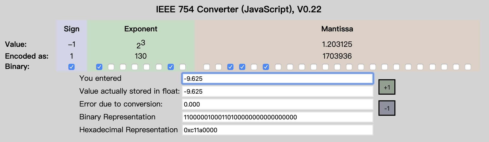

[浮点数的表示和精度](http://www.fmddlmyy.cn/text60.html) (This article)

[浮点数与IEEE 754](http://www.cnblogs.com/kingwolfofsky/archive/2011/07/21/2112299.html)

http://c.biancheng.net/view/314.html


Float Point: Binary <--> decimal

http://www.binaryconvert.com/convert_double.html

https://www.h-schmidt.net/FloatConverter/IEEE754.html


IEEE Calculate: http://weitz.de/ieee/

# 0. 浮点数的表示和精度

https://www.h-schmidt.net/FloatConverter/IEEE754.html


如果a>0，那么1+a一定大于1吗？在数学上，答案是肯定的。但在计算机上，答案就与a的大小和浮点数的精度有关了。在matalb上，可以作以下计算：
```shell
>> a=1/2^52
a =
    2.220446049250313e-016

>> 1+a>1
ans =
     1

>> a=1/2^53
a =
    1.110223024625157e-016

>> 1+a>1
ans =
     0
```


可见，当a等于1/2^53时，1+a>1是不成立的。

# 1. 浮点数
IEEE754定义了单精度浮点数和双精度数浮点数，即float和double。float有32bit，double有64bit。它们都包括符号位、指数和尾数。


图片来自： https://www.h-schmidt.net/FloatConverter/IEEE754.html

[-9.625 = 1 10000010 00110011111101111100111](http://c.biancheng.net/view/314.html)


3 = Exponent - 127 --> Exponent = 130

9.625 = 1001.101 = 1.001101×2^3 ==>  00110011111101111100111




```
	    符号位	   指数	      尾数
float	31(1)	30-23(8)	22-0(23)
double	63(1)	62-52(11)	51-0(52)
```
符号位有1bit，0表示正、1表示负。设一个数的指数是e，指数部分的值是bias+e。加上一个bias是为了表示负数。 float的bias是127，double的bias是1023。指数全0或全1有特殊含义，不算正常指数。
```
float的指数部分有8bit，可以取值1~254，减掉127，得到对应的指数范围-126~127。
double的指数部分有11位，可以取值1~2046，减掉1023，得到对应的指数范围-1022~1023。
```
这里的指数是以2为底的，同样尾数也是二进制的。IEEE754要求浮点数以规范形式存储，即小数点前有1位非零数字。 对于二进制数，非零数字只有1。所以IEEE754在存储时省略了这个小数点前面的1，只存储小数点后面的位。 


# 2. 精度
可以把机器精度定义为满足条件
```
fl(1+ε)>1
```
的最小浮点数`ε`。其中`fl(1+ε)`是`1+ε`的浮点表示。显然double的机器精度是`1/2^52`。float的机器精度是`1/2^23`。 matlab内部采用double，`1+1/2^53`对double来说就是1，所以`1+1/2^53`不会大于1。

对于规范数来说，因为小数点前默认有个1，所以float的有效数字是24bit，对应8位十进制有效数字； double的有效数字是53bit，对应16位十进制有效数字。

# 3. 特殊的浮点数
前面提到浮点数的指数全0或全1有特殊含义，让我们来看看这些特殊的浮点数：

除了 NaN 之外，IEEE 标准还定义了 ±0，±∞ 以及非规范化数（Denormalized Number）。

- ±0：指数和尾数都是全0表示0。根据符号位不同可以分为+0和-0。

- 非规范化数（Denormalized Number）：指数全0，尾数不为全0，这些数是非规范数，即尾数部分不假设前面存在小数点前的1。 或者说这些数太接近0了，因为指数已经不能再小，所以这些数不能写成规范形式。 例如：double数0000 0000 0000 0001的尾数是0 0000 0000 0001，即1/2^52，对应的数是1/(2^52)*2^-1022，即4.9406564584124654e-324。

- ±∞ ：指数全1，尾数全0表示无穷大，即inf。根据符号位不同可以分为+inf和-inf。

- NaN：指数全1，尾数不为全0表示NaN，即Not a Number，不是数。尾数最高位为1的NaN被称作QNaN（Quiet NaN）。 尾数最高位为0的NaN被称作SNaN（Signalling NaN）。通常用QNaN表示不确定的操作，用SNaN表示无效的操作。是一个范围。


非规范化数用于数值非常小的情况


在计算机内部，double就是一个64位数。从0x0000 0000 0000 0000~0xFFFF FFFF FFFF FFFF，每个64位数都对应一个浮点数或NaN。 我写了一个小程序，按照64位无符号整数的顺序打印出典型的浮点数。 表格的第一列是浮点数的内部表示。为了便于阅读，按大尾顺序输出。第二列是对应的浮点数。 第三列是注释，对于非规范数和规范数给出了由内部表示计算数值的matlab算式。 注意在C/C++中，2^52要写成pow(2.0,52.0)。

```
0000 0000 0000 0000	0.0000000000000000e+000	+0
0000 0000 0000 0001	4.9406564584124654e-324	1/(2^52)*2^-1022
000F FFFF FFFF FFFF	2.2250738585072009e-308	.5*(1-.5^52)/(1-.5)*2^-1022
0010 0000 0000 0000	2.2250738585072014e-308	1.0*2^-1022
0010 0000 0000 0001	2.2250738585072019e-308	(1+1/2^52)*2^(-1022)
001F FFFF FFFF FFFF	4.4501477170144023e-308	(1+.5*(1-.5^52)/(1-.5))*2^-1022
0020 0000 0000 0000	4.4501477170144028e-308	1.0*2^-1021
3FF0 0000 0000 0000	1.0000000000000000e+000	1.0
3FF0 0000 0000 0001	1.0000000000000002e+000	1.0+1/(2^52)
3FFF FFFF FFFF FFFF	1.9999999999999998e+000	1+.5*(1-.5^52)/(1-.5)
4000 0000 0000 0000	2.0000000000000000e+000	1.0*2^1
7FEF FFFF FFFF FFFF	1.7976931348623157e+308	(1+.5*(1-.5^52)/(1-.5))*2^1023
7FF0 0000 0000 0000	1.#INF000000000000e+000	+INF

7FF0 0000 0000 0001	1.#SNAN00000000000e+000	SNaN 
...
7FF7 FFFF FFFF FFFF	1.#SNAN00000000000e+000	SNaN

7FF8 0000 0000 0000	1.#QNAN00000000000e+000	QNaN 
...
7FFF FFFF FFFF FFFF	1.#QNAN00000000000e+000	QNaN

8000 0000 0000 0000	0.0000000000000000e+000	-0
8000 0000 0000 0001	-4.9406564584124654e-324	-(1/(2^52)*2^-1022)
800F FFFF FFFF FFFF	-2.2250738585072009e-308	-(.5*(1-.5^52)/(1-.5)*2^-1022)
8010 0000 0000 0000	-2.2250738585072014e-308	-(1.0*2^-1022)
8010 0000 0000 0001	-2.2250738585072019e-308	-((1+1/2^52)*2^(-1022))
801F FFFF FFFF FFFF	-4.4501477170144023e-308	-((1+.5*(1-.5^52)/(1-.5))*2^-1022)
8020 0000 0000 0000	-4.4501477170144028e-308	-(1.0*2^-1021)
BFF0 0000 0000 0000	-1.0000000000000000e+000	-1.0
BFFF FFFF FFFF FFFF	-1.9999999999999998e+000	-(1+.5*(1-.5^52)/(1-.5))
C000 0000 0000 0000	-2.0000000000000000e+000	-(1.0*2^1)
FFEF FFFF FFFF FFFF	-1.7976931348623157e+308	-((1+.5*(1-.5^52)/(1-.5))*2^1023)
FFF0 0000 0000 0000	-1.#INF000000000000e+000	-INF

FFF0 0000 0000 0001	-1.#SNAN00000000000e+000	SNaN
...
FFF7 FFFF FFFF FFFF	-1.#SNAN00000000000e+000	SNaN
FFF8 0000 0000 0000	-1.#IND000000000000e+000	QNaN
...
FFFF FFFF FFFF FFFF	-1.#QNAN00000000000e+000	QNaN
```
从表中可以看到，double内部表示的设计是很有规律的，按照对应64位数的顺序依次为 +0、正非规范数、正规范数、正无穷大、符号位为正的NaN、-0、负非规范数、负规范数、负无穷大、符号位为负的NaN。

double内部表示的设计保持了浮点数的有序性。即：如果正double数a<正double数b，则a对应的64位无符号整数<b对应的64位无符号整数。 负数因为差了个符号，所以浮点数与对应整数的顺序相反。 float也有类似的规律。


#### Graph

https://babbage.cs.qc.cuny.edu/IEEE-754.old/References.xhtml


# 4. Compare IEEE754

#### 2008

```
For each supported arithmetic format, an implementation shall provide the following predicate that defines
an ordering among all operands in a particular format: ― boolean totalOrder(source, source)
totalOrder(x, y) imposes a total ordering on canonical members of the format of x and y:
a) If x < y, totalOrder(x, y) is true.
b) If x > y, totalOrder(x, y) is false.
c) If x=y:
1) totalOrder(−0, +0) is true.
2) totalOrder(+0, −0) is false.
3) If x and y represent the same floating-point datum:
i) If x and y have negative sign,
totalOrder(x, y) is true if and only if the exponent of x ≥ the exponent of y
ii) otherwise
totalOrder(x, y) is true if and only if the exponent of x ≤ the exponent of y.
d) If x and y are unordered numerically because x or y is NaN:
1) totalOrder(−NaN, y) is true where −NaN represents a NaN with negative sign bit and y is a
floating-point number.
2) totalOrder(x, +NaN) is true where +NaN represents a NaN with positive sign bit and x is a floating-point number.
3) If x and y are both NaNs, then totalOrder reflects a total ordering based on:
i) negative sign orders below positive sign
ii) signaling orders below quiet for +NaN, reverse for −NaN
iii) lesser payload, when regarded as an integer, orders below greater payload for +NaN, reverse for −NaN.
Neither signaling NaNs nor quiet NaNs signal an exception. For canonical x and y, totalOrder(x, y) and totalOrder( y, x) are both true if x and y are bitwise identical.
NOTE— totalOrder does not impose a total ordering on all encodings in a format. In particular, it does not distinguish among different encodings of the same floating-point representation, as when one or both encodings are non-canonical.

```

#### 2019

```
For each supported arithmetic format, an implementation shall provide the following predicate that defines
an ordering among all operands in a particular format: ― boolean totalOrder(source, source)
totalOrder(x, y) imposes a total ordering on canonical members of the format of x and y:
a) If x < y, totalOrder(x, y) is true.
b) If x > y, totalOrder(x, y) is false.
c) Ifx=y:
1) totalOrder(−0, +0) is true.
2) totalOrder(+0, −0) is false.
3) If x and y represent the same floating-point datum:
i) If x and y have negative sign,
totalOrder(x, y) is true if and only if the exponent of x ≥ the exponent of y
ii) otherwise,
totalOrder(x, y) is true if and only if the exponent of x ≤ the exponent of y.
d) If
2) totalOrder(x, −NaN) is false where −NaN represents a NaN with negative sign bit and x is a floating-point number.
3) totalOrder(x, +NaN) is true where +NaN represents a NaN with positive sign bit and x is a floating-point number.
4) totalOrder(+NaN, y) is false where +NaN represents a NaN with positive sign bit and y is a floating-point number.
5) If x and y are both NaNs, then totalOrder reflects a total ordering based on:
i) negative sign orders below positive sign
ii) signaling orders below quiet for +NaN, reverse for −NaN
iii) otherwise, the order of NaNs is implementation-defined.
Neither signaling NaNs nor quiet NaNs signal an exception. For canonical x and y, totalOrder(x, y) and totalOrder( y, x) are both true if x and y are bitwise identical.
Unsigned NaNs, as may occur in non-interchange formats, should order like NaNs with positive sign bit.
NOTE—totalOrder does not impose a total ordering on all encodings in a format. In particular, it does not distinguish among different encodings of the same floating-point representation, as when one or both encodings are non-canonical.
```


```
 10000000 00000000 00000000 00000000 - 10000000 00000000
=11111111 11111111 10000000 00000000 
```


# 5.结束语

float和int都是32bit，但float的尾数只用了23bit。int的精度高于float，float的表示范围大于int。float牺牲精度换取了更大的表示范围。 double的尾数是52bit，高于32bit的int，所以用dobule表示int不会有精度损失。 double是科学计算的常用类型，了解double的内在和限制，有助于我们更好地使用它。