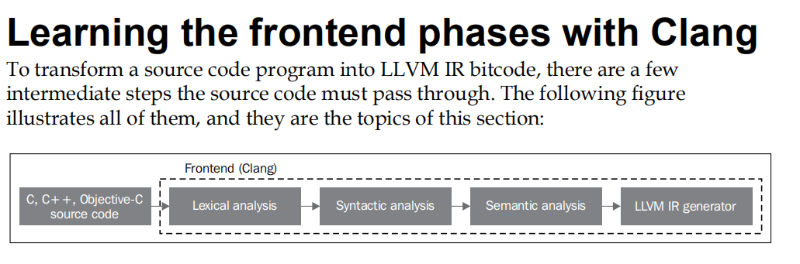
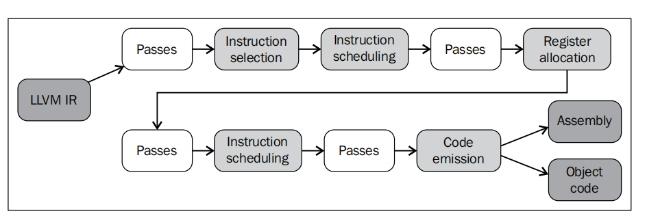
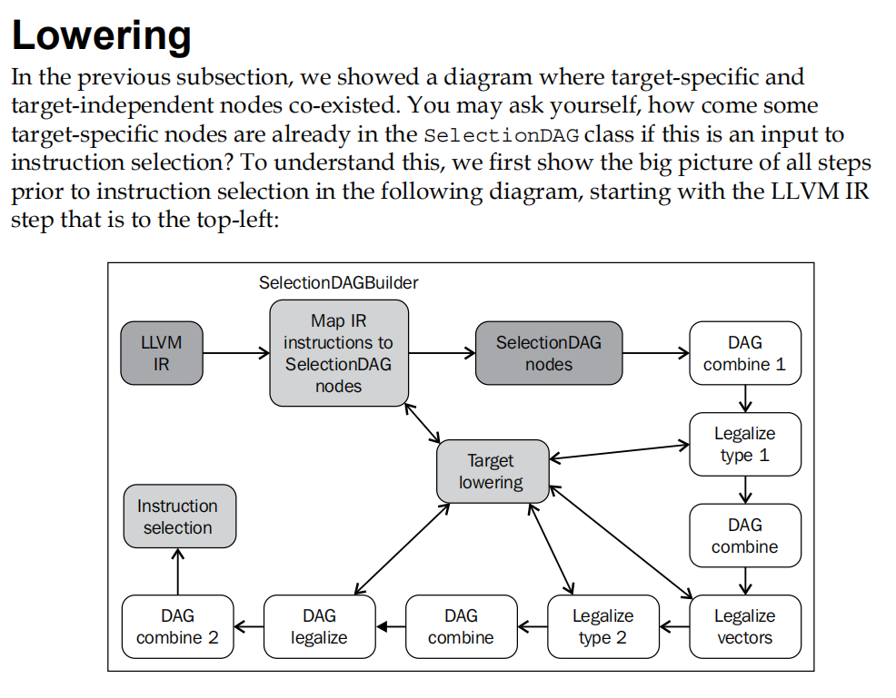

https://www.jianshu.com/p/96058bf1ecc2

https://www.jianshu.com/p/48496536d35d


# 代码编译的执行步骤拆解


#### 输出编译阶段

```c++
 clang -ccc-print-phases test.c
   
            +- 0: input, "test.c", c
         +- 1: preprocessor, {0}, cpp-output
      +- 2: compiler, {1}, ir
   +- 3: backend, {2}, assembler
+- 4: assembler, {3}, object
5: linker, {4}, image

```


#### 查看会使用哪些命令进行编译

#### `-###` option

```shell
clang test.c -### -o test
 
clang version 12.0.0 (https://github.com/llvm/llvm-project.git 154860af338f7b0c82cb04e91d6f199aa72cfdff)
Target: x86_64-unknown-linux-gnu
Thread model: posix
InstalledDir: /home/ken/workspace/llvm/build/bin
  "/home/ken/workspace/llvm/build/bin/clang-12" "-cc1" "-triple" "x86_64-unknown-linux-gnu" "-emit-obj" "-mrelax-all" "--mrelax-relocations" "-disable-free" "-main-file-name" "test.c" "-mrelocation-model" "static" "-mframe-pointer=all
" "-fmath-errno" "-fno-rounding-math" "-mconstructor-aliases" "-munwind-tables" "-target-cpu" "x86-64" "-tune-cpu" "generic" "-fno-split-dwarf-inlining" "-debugger-tuning=gdb" "-resource-dir" "/home/ken/workspace/llvm/build/lib/clang
/12.0.0" "-internal-isystem" "/usr/local/include" "-internal-isystem" "/home/ken/workspace/llvm/build/lib/clang/12.0.0/include" "-internal-externc-isystem" "/usr/include/x86_64-linux-gnu" "-internal-externc-isystem" "/include" "-inte
rnal-externc-isystem" "/usr/include" "-fdebug-compilation-dir" "/home/ken/test/int_compiler" "-ferror-limit" "19" "-fgnuc-version=4.2.1" "-fcolor-diagnostics" "-faddrsig" "-o" "/tmp/test-e6d456.o" "-x" "c" "test.c"
 "/usr/bin/ld" "-z" "relro" "--hash-style=gnu" "--eh-frame-hdr" "-m" "elf_x86_64" "-dynamic-linker" "/lib64/ld-linux-x86-64.so.2" "-o" "test" "/usr/lib/gcc/x86_64-linux-gnu/9/../../../x86_64-linux-gnu/crt1.o" "/usr/lib/gcc/x86_64-lin
ux-gnu/9/../../../x86_64-linux-gnu/crti.o" "/usr/lib/gcc/x86_64-linux-gnu/9/crtbegin.o" "-L/usr/lib/gcc/x86_64-linux-gnu/9" "-L/usr/lib/gcc/x86_64-linux-gnu/9/../../../x86_64-linux-gnu" "-L/usr/lib/gcc/x86_64-linux-gnu/9/../../../../
lib64" "-L/lib/x86_64-linux-gnu" "-L/lib/../lib64" "-L/usr/lib/x86_64-linux-gnu" "-L/usr/lib/../lib64" "-L/usr/lib/x86_64-linux-gnu/../../lib64" "-L/usr/lib/gcc/x86_64-linux-gnu/9/../../.." "-L/home/ken/workspace/llvm/build/bin/../li
b" "-L/lib" "-L/usr/lib" "/tmp/test-e6d456.o" "-lgcc" "--as-needed" "-lgcc_s" "--no-as-needed" "-lc" "-lgcc" "--as-needed" "-lgcc_s" "--no-as-needed" "/usr/lib/gcc/x86_64-linux-gnu/9/crtend.o" "/usr/lib/gcc/x86_64-linux-gnu/9/../../.
./x86_64-linux-gnu/crtn.o"

```


##### `-v`option

```shell
clang test.c -v

clang version 12.0.0 (https://github.com/llvm/llvm-project.git 154860af338f7b0c82cb04e91d6f199aa72cfdff)
Target: x86_64-unknown-linux-gnu
Thread model: posix
InstalledDir: /home/ken/workspace/llvm/build/bin
Found candidate GCC installation: /usr/lib/gcc/x86_64-linux-gnu/9
Selected GCC installation: /usr/lib/gcc/x86_64-linux-gnu/9
Candidate multilib: .;@m64
Selected multilib: .;@m64
 "/home/ken/workspace/llvm/build/bin/clang-12" -cc1 -triple x86_64-unknown-linux-gnu -emit-obj -mrelax-all --mrelax-relocations -disable-free -main-file-name test.c -mrelocation-model static -mframe-pointer=all -fmath-errno -fno-rounding-math -mconstructor-aliases -munwind-tables -target-cpu x86-64 -tune-cpu generic -fno-split-dwarf-inlining -debugger-tuning=gdb -v -resource-dir /home/ken/workspace/llvm/build/lib/clang/12.0.0 -internal-isystem /usr/local/include -internal-isystem /home/ken/workspace/llvm/build/lib/clang/12.0.0/include -internal-externc-isystem /usr/include/x86_64-linux-gnu -internal-externc-isystem /include -internal-externc-isystem /usr/include -fdebug-compilation-dir /home/ken/test/int_compiler/phases/opt -ferror-limit 19 -fgnuc-version=4.2.1 -fcolor-diagnostics -faddrsig -o /tmp/test-22fd8d.o -x c test.c
clang -cc1 version 12.0.0 based upon LLVM 12.0.0git default target x86_64-unknown-linux-gnu
ignoring nonexistent directory "/include"
#include "..." search starts here:
#include <...> search starts here:
 /usr/local/include
 /home/ken/workspace/llvm/build/lib/clang/12.0.0/include
 /usr/include/x86_64-linux-gnu
 /usr/include
End of search list.
 "/usr/bin/ld" -z relro --hash-style=gnu --eh-frame-hdr -m elf_x86_64 -dynamic-linker /lib64/ld-linux-x86-64.so.2 -o a.out /usr/lib/gcc/x86_64-linux-gnu/9/../../../x86_64-linux-gnu/crt1.o /usr/lib/gcc/x86_64-linux-gnu/9/../../../x86_64-linux-gnu/crti.o /usr/lib/gcc/x86_64-linux-gnu/9/crtbegin.o -L/usr/lib/gcc/x86_64-linux-gnu/9 -L/usr/lib/gcc/x86_64-linux-gnu/9/../../../x86_64-linux-gnu -L/usr/lib/gcc/x86_64-linux-gnu/9/../../../../lib64 -L/lib/x86_64-linux-gnu -L/lib/../lib64 -L/usr/lib/x86_64-linux-gnu -L/usr/lib/../lib64 -L/usr/lib/x86_64-linux-gnu/../../lib64 -L/usr/lib/gcc/x86_64-linux-gnu/9/../../.. -L/home/ken/workspace/llvm/build/bin/../lib -L/lib -L/usr/lib /tmp/test-22fd8d.o -lgcc --as-needed -lgcc_s --no-as-needed -lc -lgcc --as-needed -lgcc_s --no-as-needed /usr/lib/gcc/x86_64-linux-gnu/9/crtend.o /usr/lib/gcc/x86_64-linux-gnu/9/../../../x86_64-linux-gnu/crtn.o
/usr/bin/ld: /usr/lib/gcc/x86_64-linux-gnu/9/../../../x86_64-linux-gnu/crt1.o: in function `_start':
(.text+0x24): undefined reference to `main'
clang-12: error: linker command failed with exit code 1 (use -v to see invocation)

```


----

##  1 预处理

C预处理器是C语言、C++语言的预处理器。用于在编译器处理程序之前预扫描源代码，完成头文件的包含, 宏扩展, 条件编译, 行控制（line control）等操作。预处理之后，不会再有头文件依赖。不会进行语法检查等，只做简单的替换。

```c++
 clang -E test.c -o test.e
```

```c++
#include <stdio.h>

#define sum(x, y) (x + y)
int foo(int a, int b) {
  //  c = a + b;
  c = sum(a, b);
  printf("c = %s\n", c);
  return c;
}

```


```c++

int foo(int a, int b) {

  c = (a + b);
  printf("c = %s\n", c);
  return c;
}

```


## 2 编译过程（前端）



###  2.1词法分析

`clang/include/clang/Basic/TokenKinds.def`

预处理完成后就会进行词法分析，这里会把代码切成一个个 Token，比如大小括号，等于号还有字符串等。

词法分析阶段是编译过程的第一个阶段。这个阶段的任务是从左到右一个字符一个字符地读入源程序，即对构成源程序的字符流进行扫描然后根据构词规则识别单词(也称单词符号或符号)。词法分析程序实现这个任务。词法分析程序可以使用lex等工具自动生成。

```c++
clang -fmodules -fsyntax-only -Xclang -dump-tokens test.c


int 'int'        [StartOfLine]  Loc=<test.c:1:1>
identifier 'foo'         [LeadingSpace] Loc=<test.c:1:5>
l_paren '('             Loc=<test.c:1:8>
int 'int'               Loc=<test.c:1:9>
identifier 'a'   [LeadingSpace] Loc=<test.c:1:13>
comma ','               Loc=<test.c:1:14>
int 'int'        [LeadingSpace] Loc=<test.c:1:16>
identifier 'b'   [LeadingSpace] Loc=<test.c:1:20>
r_paren ')'             Loc=<test.c:1:21>
l_brace '{'      [LeadingSpace] Loc=<test.c:1:23>
return 'return'  [StartOfLine] [LeadingSpace]   Loc=<test.c:2:3>
identifier 'a'   [LeadingSpace] Loc=<test.c:2:10>
plus '+'         [LeadingSpace] Loc=<test.c:2:12>
identifier 'b'   [LeadingSpace] Loc=<test.c:2:14>
semi ';'                Loc=<test.c:2:15>
r_brace '}'      [StartOfLine]  Loc=<test.c:3:1>
eof ''          Loc=<test.c:3:2>
```


### 2.2 语法分析

然后是语法分析，验证语法是否正确，然后将所有节点组成抽象语法树 AST 。

（Syntax analysis或Parsing）和语法分析程序（Parser） 语法分析是编译过程的一个逻辑阶段。语法分析的任务是在词法分析的基础上将单词序列组合成各类语法短语，如“程序”，“语句”，“表达式”等等.语法分析程序判断源程序在结构上是否正确，源程序的结构由上下文无关文法描述。不能少分号，加法要有两个操作数等。

```shell
clang -fmodules -fsyntax-only  test.c

clang -fsyntax-only -Xclang -ast-view test.c

dotty ast.dot 直接打开dot文件
或
dot ast.dot -Tpng -o ast.png
```


### 2.3 语义分析

语义分析是编译过程的一个逻辑阶段. 语义分析的任务是对结构上正确的源程序进行上下文有关性质的审查, 进行类型审查.例如一个C程序片断:　　int arr[2],b;　　b = arr * 10; 　　源程序的结构是正确的. 　　语义分析将审查类型并报告错误:不能在表达式中使用一个数组变量,赋值语句的右端和左端的类型不匹配.

```shell
clang -fmodules -fsyntax-only -Xclang -ast-dump test.c

# cc1参数保证只运行编译器前端
# clang -cc1 -ast-dump main.m

TranslationUnitDecl 0x7fffbec09e68 <<invalid sloc>> <invalid sloc>
|-TypedefDecl 0x7fffbec0a720 <<invalid sloc>> <invalid sloc> implicit __int128_t '__int128'
| `-BuiltinType 0x7fffbec0a400 '__int128'
|-TypedefDecl 0x7fffbec0a790 <<invalid sloc>> <invalid sloc> implicit __uint128_t 'unsigned __int128'
| `-BuiltinType 0x7fffbec0a420 'unsigned __int128'
|-TypedefDecl 0x7fffbec0aaa8 <<invalid sloc>> <invalid sloc> implicit __NSConstantString 'struct __NSConstantString_tag'
| `-RecordType 0x7fffbec0a880 'struct __NSConstantString_tag'
|   `-Record 0x7fffbec0a7e8 '__NSConstantString_tag'
|-TypedefDecl 0x7fffbec0ab40 <<invalid sloc>> <invalid sloc> implicit __builtin_ms_va_list 'char *'
| `-PointerType 0x7fffbec0ab00 'char *'
|   `-BuiltinType 0x7fffbec09f00 'char'
|-TypedefDecl 0x7fffbec50690 <<invalid sloc>> <invalid sloc> implicit __builtin_va_list 'struct __va_list_tag [1]'
| `-ConstantArrayType 0x7fffbec0adf0 'struct __va_list_tag [1]' 1
|   `-RecordType 0x7fffbec0ac30 'struct __va_list_tag'
|     `-Record 0x7fffbec0ab98 '__va_list_tag'
`-FunctionDecl 0x7fffbec50890 <test.c:1:1, line:3:1> line:1:5 foo 'int (int, int)'
  |-ParmVarDecl 0x7fffbec50700 <col:9, col:13> col:13 used a 'int'
  |-ParmVarDecl 0x7fffbec50780 <col:16, col:20> col:20 used b 'int'
  `-CompoundStmt 0x7fffbec50a40 <col:23, line:3:1>
    `-ReturnStmt 0x7fffbec50a30 <line:2:3, col:14>
      `-BinaryOperator 0x7fffbec50a10 <col:10, col:14> 'int' '+'
        |-ImplicitCastExpr 0x7fffbec509e0 <col:10> 'int' <LValueToRValue>
        | `-DeclRefExpr 0x7fffbec509a0 <col:10> 'int' lvalue ParmVar 0x7fffbec50700 'a' 'int'
        `-ImplicitCastExpr 0x7fffbec509f8 <col:14> 'int' <LValueToRValue>
          `-DeclRefExpr 0x7fffbec509c0 <col:14> 'int' lvalue ParmVar 0x7fffbec50780 'b' 'int'
```


### 2.4 得到IR文件

完成这些步骤后就可以开始IR(intermediate representation)中间代码的生成了，CodeGen 会负责将语法树自顶向下遍历逐步翻译成 LLVM IR，IR 是编译过程的前端的输出后端的输入。

```shell
clang -S -emit-llvm test.c -o test.ll
```


## 3 编译过程（中端优化）

https://llvm.org/docs/Passes.html 各种优化pass

```shell
clang -Xclang -disable-O0-optnone -S -emit-llvm test.c -o test.ll
clang -Xclang -disable-O0-optnone -S -emit-llvm -o test_O3.ll test.c -O3
opt test.ll -S -mem2reg -o test_mem2reg.ll
```


#### 哪个pass更重要

以下命令行输出统计信息

```shell
clang -Xclang -print-stats -emit-llvm -S -O1 test.c -o test_O1.ll
```


f





生成汇编

```shell
clang -S -fobjc-arc test.c -o main.s
llc test.ll -o test.s
```


生成目标文件

```shell
clang -c teset.c -o main.o
```

生成可执行文件，这样就能够执行看到输出结果


### CallingConv && SSA

