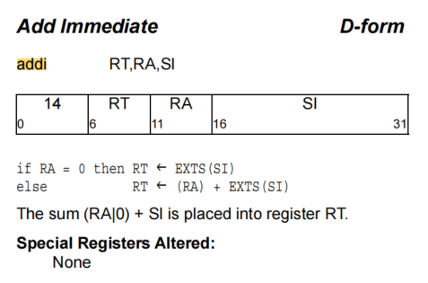

<h1 align="center">llvm asm</h1>
# Parser： asm -> MCInst

```
C/C++ --> MCInst --> (asm) --> binary(.o)

asm --> MCInst --> binary(.o)
```


将输入汇编的汇编文件转化成MCInst instructions 。会解析操作码和各种汇编文件的描述信息如对齐等。


```
add r1, r2, r3  
add r1, r2(32)
```


基类：`MCParser`

Target相关类：`class PPCAsmParser : public MCTargetAsmParser {};`

`~/workspace/llvm/llvm/lib/Target/PowerPC/AsmParser`

```c++
对汇编指令进行解析，将一条指令拆分成操作码和操作数
/// ParseInstruction - Parse one assembly instruction.
  ///
  /// The parser is positioned following the instruction name. The target
  /// specific instruction parser should parse the entire instruction and
  /// construct the appropriate MCInst, or emit an error. On success, the entire
  /// line should be parsed up to and including the end-of-statement token. On
  /// failure, the parser is not required to read to the end of the line.
  //
  /// \param Name - The instruction name.
  /// \param NameLoc - The source location of the name.
  /// \param Operands [out] - The list of parsed operands, this returns
  ///        ownership of them to the caller.
  /// \return True on failure.
  virtual bool ParseInstruction(ParseInstructionInfo &Info, StringRef Name,
                                SMLoc NameLoc, OperandVector &Operands) = 0;
  virtual bool ParseInstruction(ParseInstructionInfo &Info, StringRef Name,
                                AsmToken Token, OperandVector &Operands) {
    return ParseInstruction(Info, Name, Token.getLoc(), Operands);
  }


  /// MatchAndEmitInstruction - Recognize a series of operands of a parsed
  /// instruction as an actual MCInst and emit it to the specified MCStreamer.
  /// This returns false on success and returns true on failure to match.
  ///
  /// On failure, the target parser is responsible for emitting a diagnostic
  /// explaining the match failure.
  virtual bool MatchAndEmitInstruction(SMLoc IDLoc, unsigned &Opcode,
                                       OperandVector &Operands, MCStreamer &Out,
                                       uint64_t &ErrorInfo,
                                       bool MatchingInlineAsm) = 0;
```


# TD files

### 1. Instruction



```shell
2460 def ADDI   : DForm_2<14, (outs gprc:$rD), (ins gprc_nor0:$rA, s16imm:$imm),
2461                      "addi $rD, $rA, $imm", IIC_IntSimple,
2462                      [(set i32:$rD, (add i32:$rA, imm32SExt16:$imm))]>;

```


```shell
class DForm_2<bits<6> opcode, dag OOL, dag IOL, string asmstr,
              InstrItinClass itin, list<dag> pattern>
  : DForm_base<opcode, OOL, IOL, asmstr, itin, pattern> {

  // Even though ADDIC_rec does not really have an RC bit, provide
  // the declaration of one here so that isRecordForm has something to set.
  bit RC = 0;
}
```


```shell
// 1.7.4 D-Form
class DForm_base<bits<6> opcode, dag OOL, dag IOL, string asmstr,
                 InstrItinClass itin, list<dag> pattern> 
  : I<opcode, OOL, IOL, asmstr, itin> {
  bits<5>  A;
  bits<5>  B;
  bits<16> C;

  let Pattern = pattern;
  
  let Inst{6-10}  = A;
  let Inst{11-15} = B;
  let Inst{16-31} = C;
}
```


Opcode占四位

```shell
class I<bits<6> opcode, dag OOL, dag IOL, string asmstr, InstrItinClass itin>
        : Instruction {
  field bits<32> Inst;
  field bits<32> SoftFail = 0;
  let Size = 4;

  bit PPC64 = 0;  // Default value, override with isPPC64

  let Namespace = "PPC";
  let Inst{0-5} = opcode;
  let OutOperandList = OOL;
  let InOperandList = IOL;
  let AsmString = asmstr;
  let Itinerary = itin;

  bits<1> PPC970_First = 0;
  bits<1> PPC970_Single = 0;
  bits<1> PPC970_Cracked = 0;
  bits<3> PPC970_Unit = 0;

  /// These fields correspond to the fields in PPCInstrInfo.h.  Any changes to
  /// these must be reflected there!  See comments there for what these are.
  let TSFlags{0}   = PPC970_First;
  let TSFlags{1}   = PPC970_Single;
  let TSFlags{2}   = PPC970_Cracked;
  let TSFlags{5-3} = PPC970_Unit;

  // Indicate that this instruction is of type X-Form Load or Store
  bits<1> XFormMemOp = 0;
  let TSFlags{6}  = XFormMemOp;

  // Indicate that this instruction is prefixed.
  bits<1> Prefixed = 0;
  let TSFlags{7}  = Prefixed;

  // Fields used for relation models.
  string BaseName = "";

  // For cases where multiple instruction definitions really represent the
  // same underlying instruction but with one definition for 64-bit arguments
  // and one for 32-bit arguments, this bit breaks the degeneracy between
  // the two forms and allows TableGen to generate mapping tables.
  bit Interpretation64Bit = 0;
}
```


### 2. Operand

```shell
 768 def s16imm  : Operand<i32> {
 769   let PrintMethod = "printS16ImmOperand";
 770   let EncoderMethod = "getImm16Encoding";
 771   let ParserMatchClass = PPCS16ImmAsmOperand;
 772   let DecoderMethod = "decodeSImmOperand<16>";
 773 }

```


### 3. Print

输出指令

```c++
void PPCInstPrinter::printS16ImmOperand(const MCInst *MI, unsigned OpNo,
                                        raw_ostream &O) {
  if (MI->getOperand(OpNo).isImm())
    O << (short)MI->getOperand(OpNo).getImm();
  else
    printOperand(MI, OpNo, O);

```


Print类

```c++
class PPCInstPrinter : public MCInstPrinter {
  Triple TT;
private:
  bool showRegistersWithPercentPrefix(const char *RegName) const;
  bool showRegistersWithPrefix() const;
  const char *getVerboseConditionRegName(unsigned RegNum,
                                         unsigned RegEncoding) const;

public:
  PPCInstPrinter(const MCAsmInfo &MAI, const MCInstrInfo &MII,
                 const MCRegisterInfo &MRI, Triple T)
    : MCInstPrinter(MAI, MII, MRI), TT(T) {}

  void printRegName(raw_ostream &OS, unsigned RegNo) const override;
  void printInst(const MCInst *MI, uint64_t Address, StringRef Annot,
                 const MCSubtargetInfo &STI, raw_ostream &O) override;

  // Autogenerated by tblgen.
  void printInstruction(const MCInst *MI, uint64_t Address, raw_ostream &O);
  static const char *getRegisterName(unsigned RegNo);

  bool printAliasInstr(const MCInst *MI, uint64_t Address, raw_ostream &OS);
  void printCustomAliasOperand(const MCInst *MI, uint64_t Address,
                               unsigned OpIdx, unsigned PrintMethodIdx,
                               raw_ostream &OS);

  void printOperand(const MCInst *MI, unsigned OpNo, raw_ostream &O);
```

