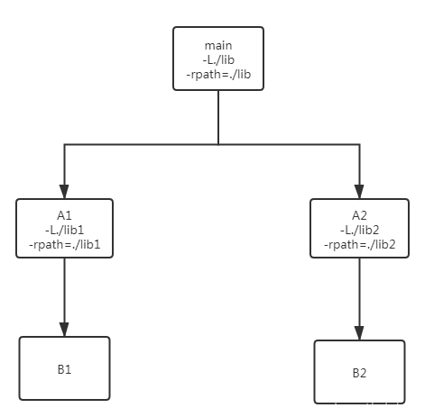

### https://blog.csdn.net/sdghchj/article/details/107282085


# linux gcc链接参数-L -rpath -rpath-link区别

#### 测试源代码 world.c：

```c++
// world.c
void world() {

}
```


#### 测试源代码 hello.c：

```c++
//hello.c

void world();

void hello(){
    world();
}
```


####  测试源代码 main.c：

```c++
//main.c

void hello();

int main(){
    hello();
    return 0;
}
```


 main是主程序，hello和world是动态库，main直接依赖hello, hello依赖world，即main间接依赖world。

写个简单makefile:

```makefile
#makefile

main: main.c
        gcc -o $@ $<

hello: hello.c
        gcc -fPIC -shared -o lib$@.so $<

world: world.c
        gcc -fPIC -shared -o lib$@.so $<
```


先看看目录内容：


接下来一步一步地尝试，先编译hello试试：

```shell
root@ubuntu:~/test$ make hello
gcc -fPIC -shared -o libhello.so hello.c
root@ubuntu:~/test$ ls -l
总用量 40
drwxrwxr-x  2 root  root   4096 7月  11 12:34 ./
drwxr-xr-x 21 root  root   4096 7月  11 12:32 ../
-rw-rw-r--  1 root  root     56 7月  11 10:26 hello.c
-rwxrwxr-x  1 root  root  15872 7月  11 12:32 libhello.so*
-rw-rw-r--  1 root  root     50 7月  11 10:27 main.c
-rw-rw-r--  1 root  root    129 7月  11 12:31 makefile
-rw-rw-r--  1 root  root     26 7月  11 10:23 world.c
```


居然成功生成动态库libhello.so，都没加-l -L这些参数，说明`生成动态库的时候不是一定要去链接它的依赖库`，即可以没有链接阶段。

再看看libhello.so的信息：

```shell
root@ubuntu:~/test$ ldd libhello.so 
	statically linked                                           #没有依赖，显示是静态链接的
root@ubuntu:~/test$ nm libhello.so 
0000000000004028 b completed.8059
                 w __cxa_finalize
0000000000001060 t deregister_tm_clones  
00000000000010d0 t __do_global_dtors_aux
0000000000003e58 d __do_global_dtors_aux_fini_array_entry
0000000000004020 d __dso_handle
0000000000003e60 d _DYNAMIC
0000000000001130 t _fini
0000000000001110 t frame_dummy
0000000000003e50 d __frame_dummy_init_array_entry
00000000000020c0 r __FRAME_END__
0000000000004000 d _GLOBAL_OFFSET_TABLE_
                 w __gmon_start__
0000000000002000 r __GNU_EH_FRAME_HDR
0000000000001119 T hello
0000000000001000 t _init
                 w _ITM_deregisterTMCloneTable
                 w _ITM_registerTMCloneTable
0000000000001090 t register_tm_clones
0000000000004028 d __TMC_END__
                 U world                                      #有一个undined的符号world
```


显然，它留了一个未定义的符号world等待去外部链接，跟静态库一样。把没有依赖的so认为是静态库，也行。

再编译world，这个没什么依赖，肯定成功：

```shell
root@ubuntu:~/test$ make world
gcc -fPIC -shared -o libworld.so world.c
最后编译主程序main：

root@ubuntu:~/test$ make main
gcc -o main main.c
/usr/bin/ld: /tmp/ccfAC3eh.o: in function `main':
main.c:(.text+0xe): undefined reference to `hello'
collect2: error: ld returned 1 exit status
make: *** [makefile:3：main] 错误 1
```

看出，编译可执行二进制程序的时候，必然有链接阶段，有符号hello找不到，链接失败。

 

好了，修改makefile，增加对hello的链接：

```shell
#makefile

main: main.c
        gcc -o $@ $< -lhello -L.    # -l指定依赖库名，-L指定依赖库首先搜索的目录

hello: hello.c
        gcc -fPIC -shared -o lib$@.so $<

world: world.c
        gcc -fPIC -shared -o lib$@.so $<

```

再次编译主程序main：

```shell
root@ubuntu:~/test$ make main
gcc -o main main.c -lhello -L.
/usr/bin/ld: ./libhello.so: undefined reference to `world'
collect2: error: ld returned 1 exit status
make: *** [makefile:3：main] 错误 1
```


这次提示找不到符号world了，意思是还得加-lworld：

```shell
#makefile

main: main.c
        gcc -o $@ $< -lhello -lworld -L. 

hello: hello.c
        gcc -fPIC -shared -o lib$@.so $<

world: world.c
        gcc -fPIC -shared -o lib$@.so $<
```


第3次编译主程序main:

```shell
root@ubuntu:~/test$ make main
gcc -o main main.c -lhello -lworld -L.
root@ubuntu:~/test$ ll
drwxrwxr-x  2 root  root   4096 7月  11 13:07 ./
drwxr-xr-x 21 root  root   4096 7月  11 13:07 ../
-rw-rw-r--  1 root  root     41 7月  11 12:47 hello.c
-rwxrwxr-x  1 root  root  15864 7月  11 12:48 libhello.so*
-rwxrwxr-x  1 root  root  15632 7月  11 12:53 libworld.so*
-rwxrwxr-x  1 root  root  16672 7月  11 13:07 main*
-rw-rw-r--  1 root  root     40 7月  11 12:48 main.c
-rw-rw-r--  1 root  root    149 7月  11 13:07 makefile
-rw-rw-r--  1 root  root     21 7月  11 12:47 world.c
root@ubuntu:~/test$ readelf -d main | grep NEEDED             #查看直接依赖库
 0x0000000000000001 (NEEDED)             共享库：[libhello.so]
 0x0000000000000001 (NEEDED)             共享库：[libworld.so]
 0x0000000000000001 (NEEDED)             共享库：[libc.so.6]
```


上图可以看到，main直接依赖hello和world库。

成功生成main，执行一下：

```shell
root@ubuntu:~/test$ ./main
./main: error while loading shared libraries: libhello.so: cannot open shared object file: No such file or directory
```

报错：找不到动态库libhello.so。libhello.so明明就在当前目录。

用ldd命令查看一下main的依赖，发现同时依赖hello和world，但都not found。

```shell
root@ubuntu:~/test$  ldd ./main
	linux-vdso.so.1 (0x00007ffec81da000)
	libhello.so => not found
	libworld.so => not found
	libc.so.6 => /lib/x86_64-linux-gnu/libc.so.6 (0x00007fcfb68ef000)
	/lib64/ld-linux-x86-64.so.2 (0x00007fcfb6af9000)
```

这里就提一下linux中可执行程序加载动态库时搜索动态库的目录优先顺序，网上总结也很多：


1. 二进制程序被链接时由参数-rpath指定的运行时目录，多个则以冒号分隔。这个是被硬编码进二进制程序的，包括可执行程序和动态库，都可以有这个-rpath.

2.环境变量LD_LIBRARY_PATH指定的目录，多个则以冒号分隔。

3.系统里/etc/ld.so.conf文件里指定的目录。

4.系统里动态库加载器ld-linux.so（ldd命令实际调用的还是这个）默认的搜索目录/lib,usr/lib或者/lib64,/usr/lib64。

 

于是，可以通过设置环境变量的命令export LD_LIBRARY_PATH=.指定当前目录后再运行main，也可以把hello和world库拷贝到系统的库目录下再运行main。但这些方法不是此次测试的目标。此次要用第1种-rpath的方式。

修改makefile:

```makefile
#makefile

main: main.c
        gcc -o $@ $< -lhello -lworld -L. -Wl,-rpath=.

hello: hello.c
        gcc -fPIC -shared -o lib$@.so $<

world: world.c
        gcc -fPIC -shared -o lib$@.so $<
```

删除之前生成的main文件，重新编译生成并运行：

```shell
root@ubuntu:~/test$ make main
gcc -o main main.c -lhello -lworld -L. -Wl,-rpath=.
root@ubuntu:~/test$ readelf -d main | grep runpath
 0x000000000000001d (RUNPATH)            Library runpath: [.]  #可见rpath被编码进二进制了
root@ubuntu:~/test$ ldd ./main
	linux-vdso.so.1 (0x00007ffd464dc000)
	libhello.so => ./libhello.so (0x00007f71df4d2000)
	libworld.so => ./libworld.so (0x00007f71df4cd000)
	libc.so.6 => /lib/x86_64-linux-gnu/libc.so.6 (0x00007f71df2ca000)
	/lib64/ld-linux-x86-64.so.2 (0x00007f71df4de000)
root@ubuntu:~/test$ ./main
root@ubuntu:~/test$
```

没再报错，运行时能够在当前目录找到那两个库。

以上是在编译链接主程序的时候同时链接所有依赖库，包括从代码层面上说的直接依赖和间接依赖，实际上从链接层面上说两个库都成了直接依赖。

 

下面继续测试链接时的间接依赖，修改makefile，在编译hello的时候去链接world，编译main的时候不再显示链接world，看行不行：

```makefile
#makefile

main: main.c
        gcc -o $@ $< -lhello -L. -Wl,-rpath=.

hello: hello.c
        gcc -fPIC -shared -o lib$@.so $< -lworld -L.

world: world.c
        gcc -fPIC -shared -o lib$@.so $<

clean:
        rm -f main libhello.so libworld.so
root@ubuntu:~/test$ make clean
rm -f main libhello.so libworld.so
root@ubuntu:~/test$ make world 
gcc -fPIC -shared -o libworld.so world.c
root@ubuntu:~/test$ make hello
gcc -fPIC -shared -o libhello.so hello.c -lworld -L.
root@ubuntu:~/test$ readelf -d libhello.so | grep NEEDED        #查看直接依赖库
 0x0000000000000001 (NEEDED)             共享库：[libworld.so]
root@ubuntu:~/test$ ldd libhello.so                             #寻找运行时所有依赖库
	linux-vdso.so.1 (0x00007ffe22ddb000)
	libworld.so => not found
```

以上可以看出，编译链接成功，hello库直接依赖world库，但是用ldd命令看出，运行时hello库找不到world库，这个还是可以指定-rpath解决，但先不管，直接编译主程序main，看main的rpath能不能连带找到world库。

```makefile
root@ubuntu:~/test$ make main
gcc -o main main.c -lhello -L. -Wl,-rpath=.
root@ubuntu:~/test$ readelf -d main | grep NEEDED    #查看直接依赖库，不再直接依赖world
 0x0000000000000001 (NEEDED)             共享库：[libhello.so]
 0x0000000000000001 (NEEDED)             共享库：[libc.so.6]
 
root@ubuntu:~/test$ ldd main                         #寻找运行时所有依赖库，包括间接依赖
	linux-vdso.so.1 (0x00007ffd54b89000)
	libhello.so => ./libhello.so (0x00007f04b77c5000)
	libc.so.6 => /lib/x86_64-linux-gnu/libc.so.6 (0x00007f04b75c2000)
	/lib64/ld-linux-x86-64.so.2 (0x00007f04b77d1000)
	libworld.so => not found
root@ubuntu:~/test$ ./main
```

./main: error while loading shared libraries: libworld.so: cannot open shared object file: No such file or directory
很遗憾，main运行时找不到world库。

那再试试在链接main的时候加上-lworld:

```makefile
#makefile

main: main.c
        gcc -o $@ $< -lhello -lworld -L. -Wl,-rpath=.

hello: hello.c
        gcc -fPIC -shared -o lib$@.so $< -lworld -L.

world: world.c
        gcc -fPIC -shared -o lib$@.so $<

clean:
        rm -f main libhello.so libworld.so
```


```shell
root@ubuntu:~/test$ rm main
root@ubuntu:~/test$ make main
gcc -o main main.c -lhello -lworld -L. -Wl,-rpath=.
root@ubuntu:~/test$ readelf -d main | grep NEEDED    #查看直接依赖库，依然不直接依赖world
 0x0000000000000001 (NEEDED)             共享库：[libhello.so]
 0x0000000000000001 (NEEDED)             共享库：[libc.so.6]
root@ubuntu:~/test$ ldd main                        #寻找运行时所有依赖库，包括间接依赖
	linux-vdso.so.1 (0x00007ffd54b89000)
	libhello.so => ./libhello.so (0x00007f04b77c5000)
	libc.so.6 => /lib/x86_64-linux-gnu/libc.so.6 (0x00007f04b75c2000)
	/lib64/ld-linux-x86-64.so.2 (0x00007f04b77d1000)
	libworld.so => not found
root@ubuntu:~/test$ ./main
./main: error while loading shared libraries: libworld.so: cannot open shared object file: No such file or directory
```


依然很遗憾，结局一样。说明在链接主程序时通过-l加上间接依赖库并不会将之改变成直接依赖库，除非main本就有亲自调用到world库的代码，有直接依赖关系。

显然，直接依赖world库的是hello库，而main只是间接依赖world库，所以在运行阶段main的rpath对world库不起作用，不能连带找到world库。也就是说，在运行阶段，rpath只对直接依赖库有作用，对间接依赖库没作用。要想通过rpath方式在运行时找到world库，只能hello库自己解决。

继续修改makefile，让hello库去解决world库的运行时目录:

```makefile
#makefile

main: main.c
        gcc -o $@ $< -lhello -L. -Wl,-rpath=.

hello: hello.c
        gcc -fPIC -shared -o lib$@.so $< -lworld -L. -Wl,-rpath=.

world: world.c
        gcc -fPIC -shared -o lib$@.so $<

clean:
        rm -f main libhello.so libworld.so

```


```c++
root@ubuntu:~/test$ rm main libhello.so
root@ubuntu:~/test$ make hello
gcc -fPIC -shared -o lib$@.so $< -lworld -L. -Wl,-rpath=.
root@ubuntu:~/test$ readelf -d libhello.so | grep NEEDED   #查看hello库的直接依赖库
 0x0000000000000001 (NEEDED)             共享库：[libworld.so]
root@ubuntu:~/test$ readelf -d libhello.so | grep runpath  #查看hello库rapth
 0x000000000000001d (RUNPATH)            Library runpath: [.]
root@ubuntu:~/test$ ldd libhello.so                        #hello库运行时寻找所有依赖库
	linux-vdso.so.1 (0x00007ffc820be000)
	libworld.so => ./libworld.so (0x00007f8dcfe9b000)
root@ubuntu:~/test$
root@ubuntu:~/test$ make main
gcc -o main main.c -lhello -L. -Wl,-rpath=.
root@ubuntu:~/test$ readelf -d main | grep NEEDED    #查看main的直接依赖库，不直接依赖world
 0x0000000000000001 (NEEDED)             共享库：[libhello.so]
 0x0000000000000001 (NEEDED)             共享库：[libc.so.6]
root@ubuntu:~/test$ ldd main                         #寻找运行时所有依赖库，包括间接依赖
	linux-vdso.so.1 (0x00007ffd54b89000)
	libhello.so => ./libhello.so (0x00007f04b77c5000)
	libc.so.6 => /lib/x86_64-linux-gnu/libc.so.6 (0x00007f04b75c2000)
	libworld.so => ./libworld.so (0x00007f31d1b6d000)
	/lib64/ld-linux-x86-64.so.2 (0x00007f04b77d1000)
root@ubuntu:~/test$ ./main                            #运行成功
root@ubuntu:~/test$
```


更加证明，`rpath只对直接依赖库有作用，主程序并不会在自己的rpath目录里去寻找间接依赖库`。

 

以上说的基本是运行时对直接和间接依赖库的处理。那我又好奇，链接阶段是怎么处理间接依赖库的呢？删除间接依赖库后主程序main还能不能链接成功？下面继续测试：

```shell
root@ubuntu:~/test$ rm main libworld.so  #删除main和world库，保留hello库
root@ubuntu:~/test$ make main            #重新编译main
gcc -o main main.c -lhello -L. -Wl,-rpath=.
/usr/bin/ld: warning: libworld.so, needed by ./libhello.so, not found (try using -rpath or -rpath-link)
/usr/bin/ld: ./libhello.so: undefined reference to `world'
collect2: error: ld returned 1 exit status
make: *** [makefile:3：main] 错误 1
```

失败了，找不到间接依赖的world库了。这里至少可以得出一个结论：链接阶段也必须要找到间接依赖库才行。那到底是怎么找的呢？

 这里也顺便提一下链接器寻找依赖库的目录顺序：

1. 首先是在编译链接时-L等参数显示指定的目录里找，为什么说“-L等”，那说明不止-L，还有其它，上图已经提示了用rpath或者rpath-link，后面再讨论。
2. 系统环境变量 LIBRARY_PATH指定的目录。
3. 编译器安装时自身配置的搜索目录，可用命令gcc --print-search-dir | grep libraries 查看，链接时会以-L参数形式隐式地传递给链接器ld。

4. 链接器ld安装时自身配置的搜索目录，可用命令ld -verbose | grep SEARCH_DIR 可查看。

 

当然，上面后三种指定目录不在此讨论之列，这里只讨论第一种编译链接时显示指定的链接目录。

 

回到上面链接时找不到world库的问题，上面已经说过，-l -L并不能改变间接依赖库成为直接依赖库，所以在主程序main链接时找不到间接依赖库world自然就不会是-l -L这两参数的原因。

修改makefile, 将world库生成在./lib目录下:

```makefile
#makefile

main: main.c
        gcc -o $@ $< -lhello -L. -Wl,-rpath=.

hello: hello.c
        gcc -fPIC -shared -o lib$@.so $< -lworld -L./lib -Wl,-rpath=.

world: world.c
        mkdir -p ./lib
        gcc -fPIC -shared -o ./lib/lib$@.so $^

clean:
        rm -f main libhello.so libworld.so ./lib/libworld.so
```

先删除之前生成的主程序和所有库文件：

```shell
root@ubuntu:~/test$ make clean
rm -f main libhello.so libworld.so ./lib/libworld.so
root@ubuntu:~/test$ ll
总用量 24
drwxrwxr-x  2 root  root  4096 7月  11 16:07 ./
drwxr-xr-x 21 root  root  4096 7月  11 16:07 ../
-rw-rw-r--  1 root  root    41 7月  11 12:47 hello.c
-rw-rw-r--  1 root  root    40 7月  11 12:48 main.c
-rw-rw-r--  1 root  root   265 7月  11 16:07 makefile
-rw-rw-r--  1 root  root    21 7月  11 12:47 world.c
```

再重新编译：

```shell
root@ubuntu:~/test$ make world 
mkdir -p ./lib
gcc -fPIC -shared -o ./lib/libworld.so world.c
root@ubuntu:~/test$
root@ubuntu:~/test$ make hello
gcc -fPIC -shared -o libhello.so hello.c -lworld -L./lib -Wl,-rpath=.
root@ubuntu:~/test$
root@ubuntu:~/test$ make main
gcc -o main main.c -lhello -L. -Wl,-rpath=.
/usr/bin/ld: warning: libworld.so, needed by ./libhello.so, not found (try using -rpath or -rpath-link)
/usr/bin/ld: ./libhello.so: undefined reference to `world'
collect2: error: ld returned 1 exit status
make: *** [makefile:3：main] 错误 1
```

world库生成在./lib目录，hello库通过-L./lib找到world库链接成功并生成在当前目录，而主程序main通过-L.在当前目录里找到hello

库进行链接却报找不到world库。提示很清楚，尝试用-rpath或者-rpath-link。

先尝试在main的链接时rpath增加一个目录./lib:

```makefile
#makefile

main: main.c
        gcc -o $@ $< -lhello -L. -Wl,-rpath=.:./lib

hello: hello.c
        gcc -fPIC -shared -o lib$@.so $< -lworld -L./lib -Wl,-rpath=.

world: world.c
        mkdir -p ./lib
        gcc -fPIC -shared -o ./lib/lib$@.so $^

clean:
        rm -f main libhello.so libworld.so ./lib/libworld.so
```

再重新编译main：

```shell
root@ubuntu:~/test$ rm main
root@ubuntu:~/test$ make main
gcc -o main main.c -lhello -L. -Wl,-rpath=.:./lib
root@ubuntu:~/test$ readelf -d main | grep runpath
 0x000000000000001d (RUNPATH)            Library runpath: [.:./lib]
root@ubuntu:~/test$ ./main
./main: error while loading shared libraries: libworld.so: cannot open shared object file: No such file or directory
root@ubuntu:~/test$
```

上图看出，链接成功了，说明在链接时，链接器会到rapth指定的目录里寻找间接依赖库。

但是运行失败，找不到world库，之前说过，运行时只在rpath里搜索直接依赖库而不搜索间接依赖库。world库的运行时搜索目录由hello库的rpath指定。

 

再尝试在main的链接时rpath-link指定为./lib:

```makefile
#makefile

main: main.c
        gcc -o $@ $< -lhello -L. -Wl,-rpath=.,-rpath-link=./lib

hello: hello.c
        gcc -fPIC -shared -o lib$@.so $< -lworld -L./lib -Wl,-rpath=.

world: world.c
        mkdir -p ./lib
        gcc -fPIC -shared -o ./lib/lib$@.so $^

clean:
        rm -f main libhello.so libworld.so ./lib/libworld.so
```

重新编译main:

```shell
root@ubuntu:~/test$ make main
gcc -o main main.c -lhello -L. -Wl,-rpath=.,-rpath-link=./lib
root@ubuntu:~/test$ readelf -d main | grep runpath
 0x000000000000001d (RUNPATH)            Library runpath: [.]   #这里没有rpath-link指定的目录
root@ubuntu:~/test$ ./main
./main: error while loading shared libraries: libworld.so: cannot open shared object file: No such file or directory
root@ubuntu:~/test$
```

然后是链接成功，运行时失败，主程序的runpath里也没有./lib。

可见，rpath-link和rpath都可以用于指定间接依赖库的搜索目录，但rpath还指定了运行时直接依赖库的搜索目录。显然rpath的作用包含了rpath-link的作用，rpath目录在链接阶段是间接依赖库的搜索目录，在运行阶段是直接依赖库的搜索目录。

那么，rpath-link和rpath在链接阶段还能指定直接依赖库的搜索目录吗？下面把main链接参数改一下，去掉-L.，在rpath和rpath-link里都指定当前目录：

```makefile
#makefile

main: main.c
        gcc -o $@ $< -lhello -Wl,-rpath=.,-rpath-link=.:./lib

hello: hello.c
        gcc -fPIC -shared -o lib$@.so $< -lworld -L./lib -Wl,-rpath=.

world: world.c
        mkdir -p ./lib
        gcc -fPIC -shared -o ./lib/lib$@.so $^

clean:
        rm -f main libhello.so libworld.so ./lib/libworld.so
```

重新编译main:

```shell
root@ubuntu:~/test$ rm main
root@ubuntu:~/test$ make main
gcc -o main main.c -lhello -Wl,-rpath=.,-rpath-link=.:./lib
/usr/bin/ld: 找不到 -lhello
collect2: error: ld returned 1 exit status
make: *** [makefile:3：main] 错误 1
```

遗憾，虽然hello库在当前目录，链接器还是找不到hello库，说明rpath-link和rpath在链接阶段确实不能用来搜索直接依赖库。

 

验证最后一个问题，直接依赖库的rapth的另一个作用。

修改makefile，main的rpath改为当前目录，把hello库的rpath改成./lib，再重新编译hello和main，最后运行main:

```makefile
#makefile

main: main.c
        gcc -o $@ $< -lhello -L. -Wl,-rpath=.

hello: hello.c
        gcc -fPIC -shared -o lib$@.so $< -lworld -L./lib -Wl,-rpath=./lib

world: world.c
        mkdir -p ./lib
        gcc -fPIC -shared -o ./lib/lib$@.so $^

clean:
        rm -f main libhello.so libworld.so ./lib/libworld.so
```


```shell
root@ubuntu:~/test$ rm main libhello.so
root@ubuntu:~/test$ make hello
gcc -fPIC -shared -o libhello.so hello.c -lworld -L./lib -Wl,-rpath=./lib
root@ubuntu:~/test$ make main 
root@ubuntu:~/test$ ./main
root@ubuntu:~/test$
```


上图可见main的链接和运行都成功了，显然，由于world库是在./lib目录下，在主程序main链接阶段，通过主程序的rpath是找不到world库，唯一的可能性就是通过直接依赖库hello的rpath指定的目录找到了间接依赖库world。也就是说，直接依赖库的rpath目录也被用来搜索间接依赖库了。

 

#### 综上，进行总结：

1.  编译生成动态库A时，并不是一定要去链接它的代码层面上的依赖库B，它们可以一起成其它使用者比如main的直接依赖库，这个时候A、B库在依赖关系树上是同层次的；当然也可以在在编译动态库A先链接好B，形成A依赖B的关系，而其它使用者比如main使用它们时，只须链接动态库A，形成main直接依赖A，A直接依赖B，main间接依赖B。这里就有了直接依赖和间接依赖的概念。注：main不一定是一个有main函数的可执行程序，也可以是一个动态库。

2. 链接器ld（gcc\g++在链接阶段调用ld）的-L指定的是链接阶段时的直接依赖库的搜索目录。

3. rpath-link指定了链接阶段所有间接依赖库的搜索目录，由于它没有被硬编码写进生成目标，所以只临时用于当前编译链接目标。比如main->A->B->C，其中->表示依赖关系，在编译链接A时，指定了rpath-link目录，而后编译链接main时，编译链接A时指定的rpath-link不复存在。

4. rpath指定了链接阶段间接依赖库的搜索目录，也指定了运行阶段直接依赖库的搜索目录。rpath被硬编码进了当前生成目标文件中，在依赖关系树上一直存在。当前生成目标main的直接依赖库A里的rapth也是A的直接依赖库B的链接阶段和运行阶段时的索目录之一。

5. 在依赖关系树上，如果各个库的rpath设置得不一样，或者没有设置，在链接阶段还好，通过rpath或者rpath-link统一指定就行，但运行阶段就麻烦了，要想最后整体打包发布，最好就是靠环境变量LD_LIBRARY_PATH或者/etc/ld.so.conf配置的方式了。

 

最后画个图再说一下rpath:



图中箭头表示依赖关系。

在编译链接A1时，直接依赖库B1只能放在A1的-L指定的./lib1目录中；在编译链接A2时，直接依赖库B2只能放在A2的-L指定的./lib2目录中。

在编译链接main时，直接依赖库A1和A2只能放在main的-L指定的./lib目录中；而间接依赖库B1既可以放在A1的rpath指定的./lib1中，也可以放在main的rpath指定的./lib中；同理，B2既可以在./lib2中，也可以在./lib中。当然了，B1放./lib2或者B2放./lib1中是找不到的。

 

在main运行时，直接依赖库A1和A2只能放在main的rpath指定的./lib目录中，间接依赖库B1只能放在A1的rpath指定的./lib1目录中，同理B2只能放在./lib2中。
————————————————
版权声明：本文为CSDN博主「sdghchj」的原创文章，遵循CC 4.0 BY-SA版权协议，转载请附上原文出处链接及本声明。
原文链接：https://blog.csdn.net/sdghchj/article/details/107282085