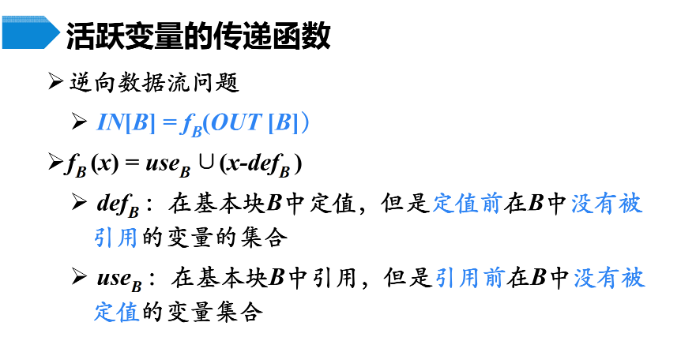
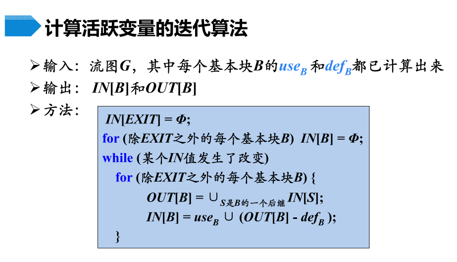
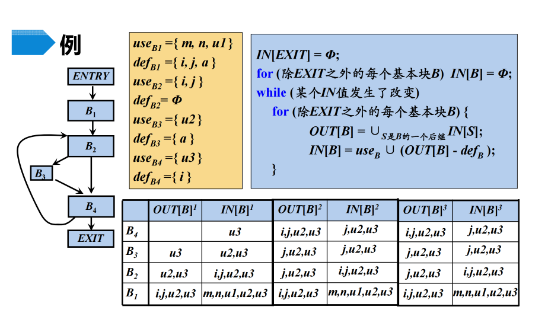
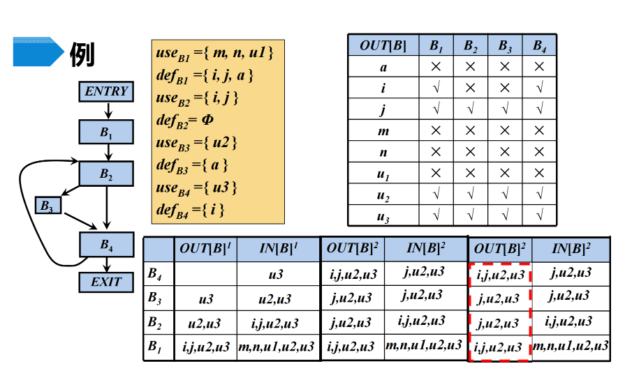

https://www.jianshu.com/p/ebc1c72b881c

以下截图来自以下pdf文件

https://github.com/zhangkangcool/CS-courses-notes-/blob/master/Compilers_%E7%BC%96%E8%AF%91%E5%8E%9F%E7%90%86/src/slides/%E7%AC%AC18%E8%AE%B2%20%E4%BB%A3%E7%A0%81%E4%BC%98%E5%8C%96_3.pdf

# 活跃变量分析

对于变量x和程序点p，如果在流图中沿着从p开始的某条路径会引用变量x在p点的值，则称变量x在点p是活跃(live)的，否则称变量x在点p不活跃(dead)。

#### 活跃变量的传递函数

下图中由于循环，所以进行了三次迭代才最终停止。迭代到IN不发生变化才能停。第三次的上标写错了。

