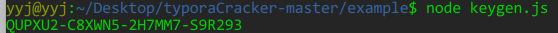
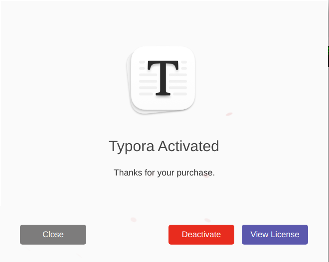

https://www.cnblogs.com/youngyajun/p/16661980.html


# [Linux下激活Typora教程](https://www.cnblogs.com/youngyajun/p/16661980.html)

在Linux平台下经测试，对typora_1.0.3版本激活有效。


目录

- [1.下载Typora](https://www.cnblogs.com/youngyajun/p/16661980.html#1下载typora)
- [2.安装Typora](https://www.cnblogs.com/youngyajun/p/16661980.html#2安装typora)
- [3.激活环境准备](https://www.cnblogs.com/youngyajun/p/16661980.html#3激活环境准备)
- [4.解包替换文件](https://www.cnblogs.com/youngyajun/p/16661980.html#4解包替换文件)
- [5.激活Typora](https://www.cnblogs.com/youngyajun/p/16661980.html#5激活typora)


# 1.下载Typora

下载`typora_1.0.3_amd64.deb`安装包，下载地址：https://typora.io/releases/all （可能需要梯子下载）；或者网盘下载：[typora_1.0.3_amd64.deb网盘下载](https://www.aliyundrive.com/s/v3bivFhhxaQ)

# 2.安装Typora

```shell
sudo dpkg -i typora_1.0.3_amd64.deb
```

# 3.激活环境准备

- 安装Python3、python3-pip

```shell
sudo apt install python3 python3-pip
```

- 安装 nodejs

```shell
sudo apt-get install nodejs
```

- 克隆typoraCracker项目

```shell
git clone https://github.com/Mas0nShi/typoraCracker.git
# 注意：typoraCracker项目已被github屏蔽，请在gitee上查找typoraCracker项目
```

- 安装typoraCracker项目python依赖

克隆typoraCracker项目后，切换到**typoraCracker项目的根路径**下执行：

```shell
pip3 install -r requirements.txt
```

查看帮助

```shell
python3 typora.py --help
```

# 4.解包替换文件

以下操作都是切换到**typoraCracker项目根目录下**执行

- 解包app.asar

安装Typora后，原生`app.asar文件`默认路径是`/usr/share/typora/resources/app.asar`；解包原生`app.asar文件`：

```shell
python3 typora.py /usr/share/typora/resources/app.asar ~/Desktop/  
# 解包后，在桌面会有一个`dec_app`目录
```

- 修改License.js

修改`dec_app`目录中的License.js；在typoraCracker项目下，提供有修改好的License.js，所以直接替换即可：

```shell
cp example/patch/License.js ~/Desktop/dec_app/
```

- 生成app.asar

```shell
python3 typora.py -u ~/Desktop/dec_app ~/Desktop
# 在~/Desktop路径下，会生成新的的app.asar文件
```

- 替换app.asar

将Typora原生的的app.asar文件替换：

```shell
# 备份原生app.asar文件
sudo cp /usr/share/typora/resources/app.asar /usr/share/typora/resources/app.asar.bak    
# 用新生成的app.asar文件替换typora自带的app.asar文件
sudo cp ~/Desktop/app.asar /usr/share/typora/resources/app.asar         
```

# 5.激活Typora

在**typoraCracker项目根路径下**，执行keygen.js脚本：

```shell
# 生成激活码
node example/keygen.js
```



得到激活码后，打开Typora软件 --> Typora帮助 --> 我的许可证 --> 输入你的激活信息

