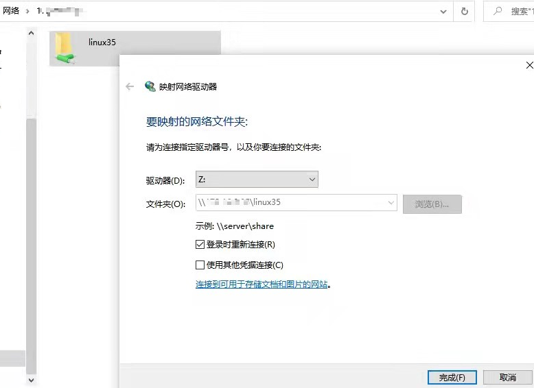

<h1 align="center">samba</h1>


https://zhuanlan.zhihu.com/p/462724410


## 1、安装 samba 服务器

```shell
sudo apt update
sudo apt install samba smbclient
```

通过如下命令可以看到已经安装成功

```shell
$ whereis samba

output:
samba: /usr/sbin/samba /usr/lib/x86_64-linux-gnu/samba /etc/samba /usr/share/samba /usr/share/man/man7/samba.7.gz /usr/share/man/man8/samba.8.gz
```

## 2、**配置 samba 服务器文件**

现在选择一个目录 Samba 共享目录，比如 `/home/ubuntu` 。

使用 vim 打开 smb.conf 文件

```shell
sudo vim /etc/samba/smb.conf
```

在文件末尾添加如下几行：

```shell
[linux35]
  Comment = my share directory
  path = /home/ubuntu
  browseable = yes
  writable = yes
  guest ok = yes
```


这里我使用的下面的配置

```shell
[ken]
  path = /home/ken
  browseable = yes
  writeable = yes
  guest ok = yes
  force user = ken
  create mask = 644
  directory mask = 755
```


`linux35` 表示共享目录的别名，`path` 指定你想共享的目录， `browseable` 和 `writable` 为对该目录的操作权限。

为了避免后续使用过程中遇到的读写权限问题，通过下面这个命令，对 linux 共享路径下面的所有子目录开通权限。

```shell
chmod 777 -R /home/ubuntu
```

全部设置完成后，重启 Samba 服务器使设置生效。

```shell
sudo /etc/init.d/smbd restart
```


```shell
smb://172.18.8.108
```


## 3、windows映射到本地磁盘

服务器上的设置完成了，接下来进行 Windows 上的设置。

在windows下 `win + R` 组合键打开运行窗口，输入 `\\ubuntu_ip`，并按回车。

你会看到设置名字的文件夹，这就是 Linux 下的共享目录。

你也可以将远程目录映射为本地的磁盘，右键文件夹，选择 `映射网络驱动器`，

如下图所示，点击完成：

 


### 4. linux映射到本地磁盘

```shell
smb://172.1.8.8.108  映射根目录/,  或者  smb://172.1.8.8.108/ken 映射ken目录
```

