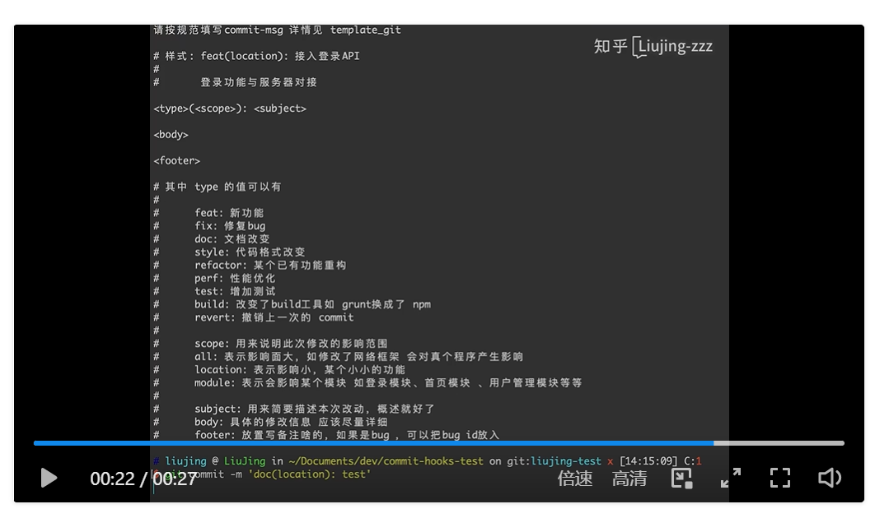

https://www.atlassian.com/zh/git/tutorials/git-hooks

https://zhuanlan.zhihu.com/p/521707440


#  1. 设置git模板(不推荐)

这里是输入`git commit`时的输出信息，不会强制进行check

git config --global commit.template gitcommit_template.txt

```
cat gitcommit_template.txt

type(模板)：标题

JIRA-ID: ABC000
soulution:
rootcause:


git commit 格式:
type(模块):标题                           ------必填       （常用  feat: 新特性 fix: 修改问题 refactor: 代码重构docs: 文档修改 style: 代码格式修改 test: 测试用例修改 chore: 其他修改， 比如构建流程， 依赖管理revert: 用于撤销以前的 commit ）
JIRA-ID:ABC-XXXX                       ------必填      （需求JIRA ID 或 问题单JIRA ID，无JIRA，可默认ABC-0000） 超链接跳转到对应JIRA  
[rootcause]:[rootcause描述]         -------可选
[solution]:[solution描述]               -------可选

推荐使用方式，配置gitcommit_template：
```


# 2. 使用hook(推荐方式)

强制check

https://zhuanlan.zhihu.com/p/467698693


明确commit message 规范能大大提高代码维护的效率，提高可读性，避免风格迥异。应注重代码和流程的规范性，永远不要在质量上将就。本文简单介绍在客户端通过 git commit hooks 拦截。

**效果如下：**



**脚本：**

```shell
#!/bin/sh

regex='^(feat|fix|doc|style|refactor|perf|test|build)\(\s*(location|module|all|.+)\):\s*[^\s]+'

result=$(grep -E $regex $1)

# current branch name
current_branch=$(git branch | grep \* | cut -d ' ' -f2)

# if [[ $result ]]
if [[ $result || $current_branch != "dev" ]]
then
  echo $result
else
  echo '请按规范填写commit-msg 详情见 template_git\n'
  cat ./template_git  # 该文件放在项目home目录，如workspace/llvm，与.git同级的目录
  exit 1
fi
```

将commit-msg文件放于`.git/hooks/commit-msg`目录下即可自动调用，这里该文件需要有可执行权限。

commit-msg只要是可执行文件，用python nodejs等写也都是可以的。不过最好是用`sh`写，因为Python环境，机器不一定有装。


