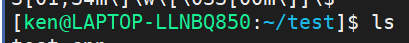

# 1. if statement

```
XLFPATH="${XLF_PATH:-/gsa/tlbgsa/projects/x/xlcmpbld/run/xlf/dev_lite/linux_leppc/daily/${XLF_DRIVER:-latest}/bin}"
```
If `XLF_PATH` exist, `XLFPATH=$(XLF_PATH)` 
else if `XLF_DRIVER` exist, `XLFPATH=/gsa/tlbgsa/projects/x/xlcmpbld/run/xlf/dev_lite/linux_leppc/daily/${XLF_DRIVER}/bin`
else 
`XLFPATH=/gsa/tlbgsa/projects/x/xlcmpbld/run/xlf/dev_lite/linux_leppc/daily/latest/bin`

# 2. replace every string

replace a space ( ) with a dot (.) in a string in bash
```
foo="  "

# replace first blank only
bar=${foo/ /.}

# replace all blanks
bar=${foo// /.}
```

For example
```
NOBINPATH=/opt/ibm:/opt:/usr/bin
BINPATH=${NOBINPATH//:/:/bin}
```

# 3. set the color

https://blog.csdn.net/zhangym199312/article/details/77600375

https://blog.csdn.net/jinbusi_blog/article/details/69371078

```shell
在PS1中设置字符颜色的格式为：[\e[F;Bm]，其中“F“为字体颜色，编号为30-37，“B”为背景颜色，编号为40-47。颜色表如下：

[\e[F;Bm]需要改变颜色的部分[\e[0m]

开始颜色输入：[\e[F;Bm]

结束颜色输入：[\e[0m]

　　　　F　B 
　　　　 
　　　　30 40 黑色

　　　　31 41 红色

　　　　32 42 绿色

　　　　33 43 黄色

　　　　34 44 蓝色

　　　　35 45 紫红色

　　　　36 46 青蓝色

　　　　37 47 白色 
　　　　 
设置特殊显示　 
　　　　 0 OFF，关闭颜色 
　　　　 1 高亮显示 
　　　　 4 显示下划线 
　　　　 5 闪烁显示 
　　　　 7 反白显示 
　　　　 8 颜色不可见 
特殊显示可在结束颜色输入里面设置：[\e[ 特殊颜色编号 m] 
　　　　 
根据颜色表，套用入字符颜色设置格式中，就可以对linux终端命令行颜色进行个性化设置了。比如要设置命令行的格式为黄字黑底，显示当前用户的账号名称、主机的第一个名字、完整的当前工作目录名称、24小时格式时间，就可以使用如下的命令：PS1=”[\e[32;40m][\u@\h \w \T]$[\e[0m]”

我目前使用: export PS1='[\u@\h:\w]\$ '
export PS1='[\[\033[01;32m\]\u@\h\[\033[00m\]:\[\033[01;34m\]\w\[\033[00m\]]\$ '
```


##### 我所使用的

```
export PS1='[\[\033[01;32m\]\u@\h\[\033[00m\]:\[\033[01;34m\]\w\[\033[00m\]]\$ '
```




# 4 change the default shell

https://www.jianshu.com/p/1661b8c03edd

```shell
echo $SHELL

$ chsh
Password:
Changing the login shell for shkzhang
Enter the new value, or press ENTER for the default
	Login Shell [/bin/sh]: /bin/bash
```