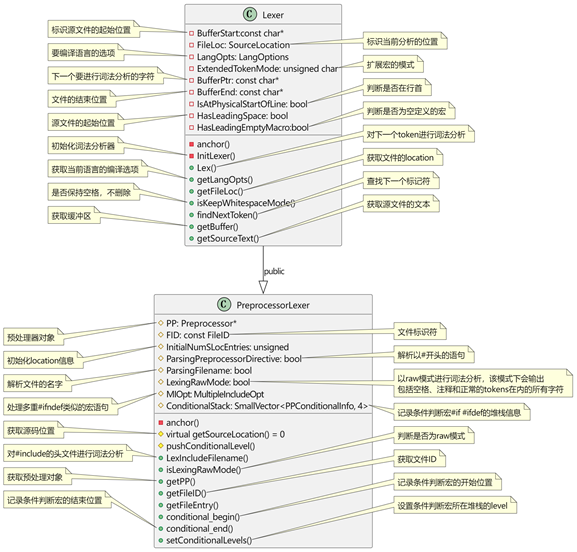

<h1 align="center">词法分析</h1>





词法分析依赖Lexer类，其核心成员及相关功能如图 所示：

Lexer的三种特殊模式:

- raw mode: 该模式主要用于处理#if 0的代码块，在该模式下lexer会停止扫描符号，不处理任何事情，直到#if 0 代码块结束。

- parsingFilename mode: 该模式主要用于处理#include的头文件，能够正确识别<符号。

- ParsingPreprocessorDirective mode: 该模式主要用于处理#开头的语句。

词法分析发生在函数PreProcesser::Lex，最终调用到Lexer::Lex，Lexer::LexTokenInternal，对具体的字符进行分析，当处理到一些特殊字符如#，编译器会预取后面的字符判断是否是在include第三方文件，若是在include，会更新SouceLocation, SourceManager等信息，并进入新的文件从头开始解析，重复最开始的Lex操作。

解析关键字时是通过查找IdentifierTable的内容进行匹配的，关键字的定义通过文件TokenKinds.def来维护要编译语言的关键字，比如以下代码：

```c++
KEYWORD(extern            , KEYALL)

KEYWORD(float            , KEYALL)

KEYWORD(for             , KEYALL)

KEYWORD(goto             , KEYALL)

KEYWORD(if              , KEYALL)

KEYWORD(inline            , KEYC99|KEYCXX|KEYGNU)

KEYWORD(int             , KEYALL)

KEYWORD(long             , KEYALL)

 

```

要匹配一个完整的token，词法解析器会从开始的字符读到空格或者括号前的字符，并用FormTokenWithChars方法来更新整个token的长度，类型。