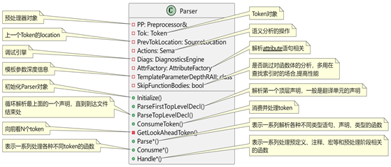

语法分析通过调用Parser的成员函数来实现，会完成了一个TopLevelDecl的词法分析后会进行调用，根据要分析语句的特征有一系列的解析函数，如：

```c++
ParseDeclarationOrFunctionDefinition

ParseExternalDeclaration

ParseLexedAttribute

ParseCXXInlineMethodDef
```


语法分析主要函数的调用过程如下图所示：


```c++
ASTFrontendAction::Execute() -> ParseAST() -> 循环调用ParseFirstTopLevelDecl() -> ParseTopLevelDecl() -> Parse*系列解析函数
```


 

通过名字可以较为容易的知道其调用的场景，如解析声明、成员变量、内联方法等。

语法分析所使用的Parser类其核心成员如下图所示：


