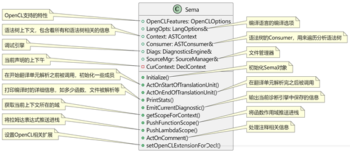
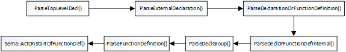

<h1 align="center">语义分析</h1>
语义分析依赖Sema类来完成，其核心成员函数如图 所示。




常规的编译器语义分析是在完成所有的语法分析之后再进行分析，clang的做法不同，在生成AST节点的同时执行类型检查。语义分析的操作通过Parser类中的Actions成员提供的回调函数进行，这里Actions的类型是Sema，Sema提供了各种回调函数，在Parser类中的调用方式是Actions.*，如Actions. ActOnStartOfFunctionDef()。在每一个语句完成语法分析后会根据语句的类型执行对应的action来进行语义分析。




```c++
Parse::ParseTopLevelDecl() ->
Parse::ParseExternalDeclaration() ->
Parser::ParseDeclarationOrFunctionDefinition() ->
Parse::ParseDeclOrFunctionDefInternal() ->
Parser::ParseDeclGroup() ->
Parser::ParseFunctionDefinition()
Sema::ActOnStartOfFunctionDef()
```

