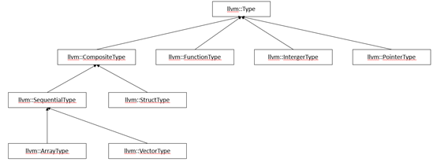
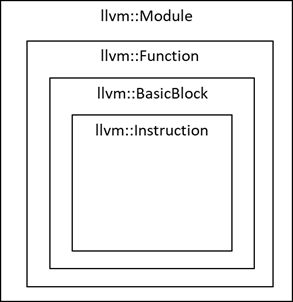

LLVM IR是LLVM项目使用的一种低级的机器无关的字节码形式的中间表示形式。它的设计便于对程序进行分析和优化。LLVM IR采用静态单赋值形式的设计（SSA），程序中的每个变量都只定义一次并赋予一个唯一的名字。LLVM IR还拥有丰富的指令和类型，它的实现高度灵活且模块化。

### 1.  llvm::Type

LLVM类型系统式LLVM IR最重要的特性之一，是llvm IR和一般三地址码的重要区别，是一系列的基于LLVM IR的优化的基础。相当于在三地址码中增加了操作数的类型修饰。

类型系统通过llvm::Type类实现，Type类型一但实例化不可修改，特定类型的实例仅创建一次，且一旦分配了Type类，不会进行释放。

Type的所有类型由枚举类型TypeID定义，其中PrimitiveTypes是没有子类的类型。

##### 1.2 类图



图 32 llvm:Type类图

##### 1.3  llvm::Type

为所有Type类型的父类，由于构造函数被声明为protected，所以不能被直接实例化。

##### 1.4 llvm::IntegerType

表示任意位宽的integer类型。位宽的范围为

[IntegerType::MIN_INT_BITS (1) ,IntegerType::MAX_INT_BITS]。

##### 1.5 llvm::FunctionType

表示函数类型的类，包含了1个返回值类型和1个参数类型列表。语法：

<returntype> (<parameter list>)

示例：

| i32 (i32)            | 传入1个i32, 返回i32                                          |
| -------------------- | ------------------------------------------------------------ |
| float (i16, i32 *) * | 函数指针类型，传入1个i16和1个i32的指针, 返回float.           |
| i32 (i8*, ...)       | 变长函数，至少传入1个i8 的指针, 放回i32，既llvm中printf的函数签名。 |
| {i32, i32} (i32)     | 传入1个i32, 返回1个由2个i32组成的结构体                      |

 

##### 1.6  llvm::PointerType

表示指针，即Memory Location。PointerType有1个可选的address space属性，默认为0，非0的address space的语义是实现自定义的(target-specific)的。语法：<type> * ptr，示例：

| [4 x i32]*        | 长度为4的i32数组指针             |
| ----------------- | -------------------------------- |
| i32 (i32*) *      | 函数指针，传入1个i32*, 返回i32.  |
| i32 addrspace(5)* | address space 5中的指向i32的指针 |
| ptr               | 不透明指针.                      |
| ptr addrspace(5)  | address space 5中的不透明指针    |

##### 1.7  llvm::StructureType

内存中数据成员的集合，数据成员必须是有size属性的Type。内存中的Structure访问：通过"getelementptr"指令获取数据成员指针，再对指针使用load和store指令。寄存器中的Structure访问：使用extractvalue和insertvalue指令Structure可以是"packed" Structure，按照1byte对齐；也可以是"no-packed" Structure，数据成员间的padding由module中的DataLayout字符串决定。Structure可以是"literal"的，既使用inline的形式定义，例如：{i32, i32}*；也可以是"identified"的，既使用名字进行定义，例如：

```c++
%T1 = type { <type list> }   ; 定义no-packed identified structure T1

%T2 = type <{ <type list> }>  ; 定义packed identified structure T2

Structure也可以是不透明的，通常用于前置声明，语法如下：

%X = type opaque  ; 定义有名字的不透明 structure X

%52 = type opaque ; 定义没有名字的不透明structure 52

```


 

##### 1.8  llvm::ArrayType

ArrayType是1种将元素在内存中顺序排列的类型，有2个属性：size和元素类型。语法：

[<# elements> x <elementtype>]

其中elementtype是任意有size属性的Type。示例：

| [40 x i32]            | 长度为40的32位整数Array |
| --------------------- | ----------------------- |
| [41 x i32]            | 长度为41的32位整数Array |
| [4 x i8]              | 长度为4的8位整数Array   |
| [3 x [4 x i32]]       | 3x4的32位整数Array      |
| [12 x [10 x float]]   | 12x10的单精度浮点Array  |
| [2 x [3 x [4 x i16]]] | 2x3x4的16位整数Array    |

##### 1.9  llvm::VectorType

VectorType表示元素的矢量，用于SIMD（单指令多数据），有3个属性：size，元素类型（必须是primitive类型），是否可扩展(scalable)。如果VectorType是可扩展的，则Vector的实际长度 = N * size。

当VectorType的长度以byte为单位时，VectorType在内存中的排布和ArrayType相同。当VectorType的长度不以byte为单位时，需要使用bitcase指令完成VectorType到IntegerType的相互转换，示例如下（大端）：

```python
%val = bitcast <4 x i4> <i4 1, i4 2, i4 3, i4 5> to i16

; Bitcasting from a vector to an integral type can be seen as

; concatenating the values:

;  %val now has the hexadecimal value 0x1235.

 

store i16 %val, i16* %ptr

 

; In memory the content will be (8-bit addressing):

;

;   [%ptr + 0]: 00010010  (0x12)

;   [%ptr + 1]: 00110101  (0x35)

 

```


语法：

```python
< <# elements> x <elementtype> >      ; Fixed-length vector

< vscale x <# elements> x <elementtype> >  ; Scalable vector
```


 

其中elementtype只能是整数，浮点数，指针。

示例：

| <4 x i32>          | 长度为4的32位整数Vector         |
| ------------------ | ------------------------------- |
| <8 x float>        | 长度为8的32位单精度浮点数Vector |
| <2 x i64>          | 长度为2的64位整数Vector         |
| <4 x i64*>         | 长度为2的64位整数指针Vector     |
| <vscale x 4 x i32> | 长度为4的整数倍的32位整数Vector |

 

### 2.  llvm::Value

LLVM IR中所有可能作为操作数参与计算的值的基类，包括指令和函数。其继承树如下。


所有的Value都拥有Type，可以通过getType()方法获取，Type不是Value的子类。

Value可以有名字，有些Value拥有名字且从属于Module，设置此类Value的名字将自动更新对应Module的符号表。

##### 2.1  定义-使用 链

一个具体的值，在IR中可能会在多处被引用，比如函数的参数可能被函数中的多条指令引用。

每个Value都有一个使用列表“UseList”，用于追踪所有引用该Value的其他Value(即User)，有助于IR分析时构筑定义-使用链（def-use-chain）来分析某个值的生命期。

一个Value可用于任意数量的ValueHandle对象（类似于指向Value的智能指针），监听RAUW（replace all uses with，在IR变换中，替换某一Value时需要修改所有引用者）与销毁事件。比如一条指令的结果恒为常数，那么就可以用常数替换这条指令。同时还需要修改引用这个Value的Users，这时就可以使用replaceAllUsesWith（Value* V）替换所有使用到该值（Value)的地方为新的常量(Value)。

##### 2.2  ValueHandle


ValueHandle的继承树如上图所示，有三个子类，WeakVH，WeakTrackingVH，CallBackVH。

WeakVH引用Value，在引用的Value被delete或RAUW后，设置为null；

WeakTrackingVH引用Value，当引用的Value被delete后，会被置为null；

CallbackVH引用Value，当引用的Value被delete后，会调用deleted方法，当引用的Value被RAUW后会调用allUsesReplacedWith方法，deleted和allUsesReplacedWith是虚函数，CallbackVH通常被用作用户自定义拓展类的基类。

### 3  llvm::User


图 35 llvm:User类图

User类是LLVM IR中所用引用Value类的结点的基类。User类继承自Value类，可被其他User类引用。被引用的Value称为Operands，即操作数，由于LLVM IR是静态单赋值（SSA）形式的，所以User的操作数直接指向Value的定义处，对Operand可以使用索引或迭代器进行遍历。

### 4  llvm::Use

在LLVM IR中，指令与值之间由引用-定义链连接，一个引用表示一条指令或一个值依赖于另一个值（的定义），可以理解为数据流图中的边。llvm::Use类用于表示指令的操作数或其他引用Value的User实例，保持被引用的Value的“使用链”处于最新状态，用于跟踪Module中的指令与值之间的依赖关系，并提供查询和修改User的方法。

Use类实质上是一个双向链表结点，支持对特定值所有引用的遍历，也支持直接从User的操作数找打被引用的值，以及从值得引用找到User。

如图 所示，一个Value可以有多个Use，每个Use对应一个User，既def-use chain。一个User可以有多个Use，每个Use对应一个Value，既use-def chain。Use类的核心就是如何让Value和User高效地双向关联。


##### 4.1  遍历Value的User

遍历Value的Use进而通过Use找到User。Value类中有一个UseList，而Use类本质上是一个双向链表节点，因此使用Value的Use会被挂接到Value的UseList。Value类中定义了users迭代器用于遍历UseList。

##### 4.2  遍历User使用的Value

llvm允许User采用2种方式管理Use：1）侵入式（IntrusiveOperands）；2）挂接式（HungOffOperands）。

可使用operands()迭代器遍历所有Use，根据Use的类型进行dyn_cast后作相应的处理。

### 5. llvm::Module

用于存储LLVM module的所有相关信息。module是其他LLVM IR对象（如函数，基本块等）的顶层容器，是源程序的一个编译单元，即LLVM以module为单元进行语言的翻译，多个module可由LLVM linker进行链接。module中包含全局变量列表，函数列表，本模块所依赖的库列表（或其他模块），一个符号表，以及关于目标特性的各种数据。




module会维护一个GlobalList对象，该对象用于保存module中全局变量所有的常量引用。GlobalList中对应全局变量v的条目清空后才能销毁相应的全局变量v。

### 5.1  成员

```c++
private:

 LLVMContext &Context;      ///LLVM线程上下文，类型与常量由此分配

 GlobalListType GlobalList;    ///module中的全局变量链表

 FunctionListType FunctionList;  /// module中的函数链表

 AliasListType AliasList;     ///module中的别名链表

 IFuncListType IFuncList;     ///间接函数链表

 NamedMDListType NamedMDList;   ///命名的metadata链表

 std::string GlobalScopeAsm;   ///全局作用域下的内联的汇编码

 std::unique_ptr<ValueSymbolTable> ValSymTab; ///Value的符号表

 ComdatSymTabType ComdatSymTab;  ///Comdat的符号表

 std::unique_ptr<MemoryBuffer>

 OwnedMemoryBuffer;        ///module直接拥有的mem buffer，仅限legacy用户使用

 std::unique_ptr<GVMaterializer>

 Materializer;          ///用于将全局变量实质化(materialize)，module的加载器

 std::string ModuleID;      ///代表该module的可读的标识符（字符串）

 std::string SourceFileName;   ///对应module的原始的源文件名字，记录在bitcode中.

 std::string TargetTriple;    ///目标平台，格式(arch)(sub)-(vendor)-(sys0-(abi)

 NamedMDSymTabType NamedMDSymTab;  ///NamedMDNode与名字的符号表

 DataLayout DL;          ///与module关联的数据布局，以字符串形式描述

 StringMap<unsigned>

   CurrentIntrinsicIds; ///< Keep track of the current unique id count for

              ///< the specified intrinsic basename.

 DenseMap<std::pair<Intrinsic::ID, const FunctionType *>, unsigned>

   UniquedIntrinsicNames; ///< Keep track of uniqued names of intrinsics

               ///< based on unnamed types. The combination of

               ///< ID and FunctionType maps to the extension that

               ///< is used to make the intrinsic name unique.

 

 friend class Constant;

```


 

### 6  llvm:: LLVMContext 

在线程中使用LLVM时的重要类，拥有并管理LLVM核心框架的全局数据（不透明），包括类型和常量的唯一列表，该类不提供锁，使用时应保证一个线程中只有一个LLVMContext。

在LLVM编译器的前端、优化器和后端中，都需要使用上下文对象来表示LLVM IR中的各种实体。

每个llvm::Module都包含一个独立的上下文对象，用于管理该模块中定义的类型、常量和指令等信息。不同模块中的类型、常量和指令不能互相引用，因为它们具有不同的上下文对象。

llvm::LLVMContext提供了一些方法来操作和查询上下文对象，例如获取或创建类型、创建常量、发出错误信息以及全局初始化等等。以下是几个常见的方法：

getTypeByName(const char* Name)：根据名称获取类型对象。

getInt32Ty()：获取32位整数类型对象。

getConstantInt(const APInt& V)：根据APInt对象创建整数常量对象。

emitError(const Twine& Msg)：发出错误信息。 

enableGlobalValueMaterialization()：启用全局值材料化（global value materialization）。

除了这些基本方法外，llvm::LLVMContext还提供了许多其他方法和属性，用于管理LLVM IR中的各种实体。例如，llvm::LLVMContext还提供了一些静态方法来创建特定类型的常量或指令对象，例如llvm::ConstantInt::get()和llvm::BinaryOperator::Create()等。

### 7  llvm::GlobalVariable

: public GlobalObject, public ilist_node<GlobalVariable>

全局变量对象，保存LLVM IR中的一个全局变量的信息。全局变量指在函数外定义且具有全局作用域的变量。在程序的任意位置都能访问全局变量。

llvm::GlobalVariable类提供方法用于创建、查询和修改全局变量，也可设置变量类型，初值以及其他属性，例如是否为常量、是否为外部（external）、是否thread-local（每个线程维护一个独立的该变量的复本）。

##### 7.1  成员

```c++
 AttributeSet Attrs;

 bool isConstantGlobal : 1;          // 是否为全局常量

 bool isExternallyInitializedConstant : 1;  //该全局变量初值能在初始化执行之前改变？
```


### 8  llvm::Funciton

继承自: public GlobalObject, public ilist_node<Function>

llvm::Funciton类表示LLVM IR中的函数/过程，函数是执行特定任务的代码块，并且可从程序的其他部分调用。llvm::Funciton包含一列基本块，一列参数和一个符号表。

llvm::Funciton继承自GlobalObject，是一个全局独立对象，其次，Function继承ilist_node<Function>，主要的作用是：通过当前节点（Function）可遍历链表上其他节点（遍历Module中的Function）。

llvm::Funciton提供了创建、操作和查询函数的方法。并能指定函数名称、返回类型、参数类型、参数数量以及可见性、链接与调用约定等其他属性。

例如，可以使用 getReturnType() 获取函数的返回类型，arg_size() 获取参数数量，以及使用 getEntryBlock() 获取函数的入口块（即函数中的第一个基本块）。您还可以使用 getParent() 获取包含函数的模块。

##### 8.1  成员

```c++
private:

 BasicBlockListType BasicBlocks;     ///函数中的基本块链表，基本块构成CFG

 mutable Argument *Arguments = nullptr;  ///函数的形参“formal arg”，不表示实际的值，表示类型、参数编号以及参数的attributes

 size_t NumArgs;             ///函数的参数个数

 std::unique_ptr<ValueSymbolTable>

   SymTab;               ///参数args或指令instruction的符号表

 AttributeList AttributeSets;       ///存储函数、返回值、参数的属性信息

 

 /*

  * Value::SubclassData

  *

  * bit 0    : HasLazyArguments

  * bit 1    : HasPrefixData

  * bit 2    : HasPrologueData

  * bit 3    : HasPersonalityFn

  * bits 4-13 : CallingConvention

  * bits 14   : HasGC

  * bits 15 : [reserved]

  */

 /// Bits from GlobalObject::GlobalObjectSubclassData.

 enum {

  /// Whether this function is materializable.

  IsMaterializableBit = 0,

 };

```


#####8.2  llvm::Argument

llvm::Argument类用于表示LLVM IR中的函数形参。对于函数申明中的每个参数都会相应地构造一个Argument对象来表示，对象中包含参数的名字、类型和在参数列表中的位置信息。

llvm::Argument类提供方法来访问和修改其属性，还能获取它在函数体中对应的值。

### 9  llvm:: BasicBlock

**继承自****:** public Value, public ilist_node_with_parent<BasicBlock, Function>

表示LLVM IR中的基本块。是指令序列的容器，有一个入口点和一个出口点。基本块是控制流图（control flow graph）的基本单位，用于表示程序的执行路径。

基本块可被跳转分支指令引用，故继承Value对象，基本块的类型为Type::LabelTy，表示其为跳转的目标（即BasicBlock会被例如branch等跳转指令Use）。终结指令（Terminator Instruction）不可出现在基本块中间。基本块由非终结指令序列加一个终结指令尾部。但该类中，特殊情况下允许终结指令临时出现在中间，在中间阶段临时使用这种形式便于构建或修改目标程序。而verifier则会严格执行检查，确保基本块中间没有终结指令以保证基本块的良构。

BasicBlock继承ilist_node_with_parent<BasicBlock, Function>，可通过当前结点（例，BasicBlock1）获取父节点（例，Func1），也可通过BasicBlock1遍历其他节点BasicBlock234。

llvm::BasicBlock提供了许多方法来操作基本块，包括向基本块调价指令、删除指令、清空指令列表、获取后继基本块、获取前驱基本块等等。

##### 9.1  成员

```c++
 friend class BlockAddress;

 friend class SymbolTableListTraits<BasicBlock>;

 

 InstListType InstList;    ///拥有指令序列

 Function *Parent;      ///从属于Function对象

```


 

### 10  llvm::Instruction

**继承自****:** public User, public ilist_node_with_parent<Instruction, BasicBlock>

llvm::Instruction类是LLVM框架中所有IR指令的基类，LLVM IR中的每一条指令都由一个llvm::Instruction对象来表示。

llvm::Instruction继承自User，大部分时候指令会引用操作数，故自然是User。

llvm::Instruction提供了许多方法，可查询和操作指令，包括获取指令的操作数、查询指令的副作用、获取指令的父函数以及将指令转换为字符串等等。还提供了许多虚函数，被派生类覆盖来实现特殊类型的指令。

##### 10.1  成员

 BasicBlock *Parent;            //所属基本块

 DebugLoc DbgLoc;              //调试信息元数据

 

 ///在父基本块中的相对位置. 用于在指令见做0（1）局部支配性检查dominance checks

 mutable unsigned Order = 0;

 

##### 10.2  继承

llvm::Instruction的继承树如下所示


##### 10.3  llvm::Instruction

有许多子类，每个子类对应一种不同类型的指令。

##### 10.4  llvm::UnaryOperators

表示一元运算指令，有一个操作数，常见的一元运算符如取负和取非等运算符；

##### 10.5  llvm::BinaryOperators

表示二元运算指令，有两个操作数，常见的二元运算有加减乘除等；

##### 10.6  llvm::CmpInst

表示比较运算指令，用于比较操作数并将结果存储为布尔值；

##### 10.7  llvm::BranchInst

表示分支指令，用于跳转至函数内部的另一基本块；

##### 10.8  llvm::CallBase

所有调用型指令（InvokeInst 与 CallInst）的基类，包含函数调用相关的信息，包括被调用函数、参数列表、输出操作数bundle、子类控制的操作数等。

##### 10.9  llvm::CallInst

是CallBase的子类，表示普通函数调用指令，用于调用函数或代码库的中的函数，除了基类提供的属性外，提供了一些可选属性，可是遏制调用指令能否内联展开，设置调用约定（calling convention）等。

##### 10.10  llvm::InvokeInst

是CallBase的子类，表示异常处理调用指令，不同于普通函数调用指令，异常处理调用指令在调用函数时还需要指定异常处理基本块和正常执行基本块。如果在调用过程中出现异常，则程序会跳转到异常处理基本块继续运行；否则，程序会跳转至正常执行基本块。因此， llvm::InvokeInst提供了额外的方法来设置和查询异常处理基本块与正常处理基本块。

还有很多其他类型的指令包括ReturnInst、ExtractElementInst、SwitchInst、TruncInst、CastInst等，不一一介绍。

### 11  llvm::Constant

llvm::Constant是LLVM IR中表示常量的基类类，它派生出了许多不同类型的常量对象，例如整型常量、浮点常量、指针常量等等。常量在LLVM IR中一般用于初始化全局变量、函数参数等。

llvm::Constant类继承自llvm::User，因为llvm::Constant会引用其他llvm::Value，也会被其他Value引用。

llvm::Constant提供了一些通用方法来操作和查询常量，例如获取常量的类型、获取常量的值、获取常量是否为空（null）等等。下面是一些常见的方法：

getType()：获取常量的类型。

isNullValue()：返回常量是否为零值或空指针。

getUniqueInteger()：获取整数常量的值。

getSplatValue()：获取向量常量的所有元素的相同值。

##### 11.1  继承


图 39 llvm:Constant类继承树

llvm::Constant的继承树如上图所示，其中，ConstantData用于表示简单常量，如int，float等；ConstantAggregate用于表示复合常量，如struct，array等；BlockAddress用于表示BasicBlock的地址，ConstantExpr用于表示常量表达式，GlobalValue用于表示全局常量。

##### 11.2  llvm::ConstantData

llvm::ConstantData类用于表示LLVM IR中的简单常量数据，是所有简单常量类的基类，继承树如下：


图 40 llvm:ConstantData类继承树

这些ConstantData（子）类直接表示常量的值本身，用户通过这些类来创建和操作LLVM IR中的各种常量，这些常量对象在需要的时候创建，具有全局可见性，可以在不相关的Module之间共享，且不会销毁。

##### 11.3  llvm::GlobalValue

llvm::GlobalValue用于表示LLVM IR中的全局值，派生有函数类，全局变量类和全局别名类。llvm::GlobalValue的定义位于Module层级，它对于Module中的所有函数都是可见的。

llvm::GlobalValue提供的方法包括访问和修改自身名字、链接类型、可见性以及对齐配置（alignment）、获取值的类型、获取其初始化、获取其定义等

### 12  llvm::GlobalAlias

**继承自**: public GlobalValue, public ilist_node<GlobalAlias>

用于表示一个指向全局值（全局函数或变量等）的别名，不创建新数据，只是原有对象的新符号与metadata。允许有多个别名指向同一个底层对象。

llvm::GlobalAlias提供创建、操作和查询别名的方法，此外还能指定别名的目标全局对象、名称和其他属性（可见性、链接、是外部或内部符号）。

##### 12.1  成员

friend class SymbolTableListTraits<GlobalAlias>;

### 13  llvm::GlobalVariable

**继承自**:public GlobalObject, public ilist_node<GlobalVariable>

llvm::GlobalVariable 是用于表示LLVM IR中全局变量的类。全局变量是指在程序的任何地方都可以访问的变量。llvm::GlobalVariable中保存有变量定义和声明，并可用于在代码优化和转换期间分析和修改变量。

该类提供了多个方法来获取和设置有关变量的信息，例如变量名称、类型、初始值等。除此之外，它还提供了一些实用方法，如检查变量是否为常量以及获取变量的地址等。

### 14  llvm::GlobalFunction

**继承自**:public GlobalObject, public ilist_node<GlobalIFunc>

llvm::GlobalFunction类表示全局函数。它可以用于在 LLVM IR 中表示函数定义和声明，并可用于在代码优化和转换期间分析和修改函数。该类提供了许多方法来获取和设置有关函数的信息，例如函数名称、参数、返回类型等。此外，它还提供了一些实用程序方法，例如检查函数是否是内联函数以及获取函数的入口块等。

 

### 15  llvm::GlobalIFunc

**继承自****:** public GlobalObject, public ilist_node<GlobalIFunc>

llvm::GlobalIFunc用于表示LLVM IR中的间接函数符号（ifunc）。间接函数符号使用ELF符号类型拓展来标记某个声明的地址应在运行时通过解析函数进行解析。

llvm::GlobalIFunc继承GlobalObject，是全局独立对象，并可通过getResolverFunction()方法获取其对应的解析函数。

##### 15.1  成员

friend class SymbolTableListTraits<GlobalIFunc>;

### 16  llvm::NamedMDNode

**继承自****:** public ilist_node<NamedMDNode>

由Medadata结点MDNode的链表构成的处在module层级的命名对象

##### 16.1  成员

```c++
friend class LLVMContextImpl;

friend class Module;

std::string Name;

  Module *Parent = nullptr;

void *Operands; // SmallVector<TrackingMDRef, 4>
```


 

### 17  llvm::Comdat

拥有名字的SelectionKind pair，保证每个Comdat拥有不同的SelectionKind。

##### 17.1  成员

```c++
private:

 friend class Module;

 friend class GlobalObject;


 Comdat();

 void addUser(GlobalObject *GO);

 void removeUser(GlobalObject *GO);


 // Points to the map in Module.

 StringMapEntry<Comdat> *Name = nullptr;

 SelectionKind SK = Any;

 // Globals using this comdat.

 SmallPtrSet<GlobalObject *, 2> Users;

```


 

### 18  llvm::ValueSymbolTable

符号表，保存成对的名字与Value对象，封装了访问和操作的接口，并且保证表内词条的唯一性

##### 18.1  成员

```c++
ValueMap vmap;          ///实际符号表数据，string与llvm::Value的map
int MaxNameSize;         ///名字的最大尺寸，超出会被cap
mutable uint32_t LastUnique = 0; ///唯一名字的计数器
```


### 19  llvm:: MemoryBuffer

接口，提供一块内存的只读访问，提供简单的方法完成文件读取并导入内存buffer。可访问读入文件的每个char，并保证可以超过EOF，读到最后的‘\0’字符。有利于用户感知文件结束，（读到\0便结束，优于反复检查当前位置）。

##### 19.1  成员

```c++
 const char *BufferStart; // buffer起点

const char *BufferEnd;  // buffer终点

```


 

### 20  llvm:: GVMaterializer

抽象接口，用于（从文件）加载一个llvm module。该接口可进行递增的或随机访问的函数加载。多用于JIT编译器或过程间优化器，它们不需要将整个程序都放在内存中处理