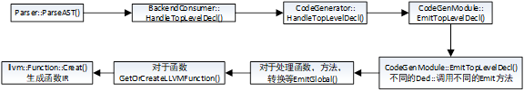

在进行组合的解析和语义分析之后，ParseAST函数调用HandleTranslationUnit方法，这个回调函数由ASTConsumer来进行最终实现。在本项目中前端action为CodeGenAction::ExecuteAction()。

ParseAST函数中的ASTConsumer(通过S.getASTConsumer()得到)是BackendConsumer，BackendConsumer将遍历AST，同时生成LLVM IR代码，该代码能实现与AST树中所表示的代码完全相同的行为，具体的代码生成发生在CodeGenModule::EmitTopLevelDecl函数中，该函数为每个语法树节点生成中间代码。




```c++
clang::ParseAST() ->
BackendConsumer::HandleTopLevelDecl() ->
CodeGenerator::HandleTopLevelDecl() ->
CodeGenModule::EmitTopLevelDecl() ->
遍历调用CodeGenModule::EmitTopLevelDecl根据不同的Decl::调用不同的Emit方法
EmitGlobal()处理函数，方法，转换等 ->
GetOrCreateLLVMFunction()对于函数 ->
llvm::Function::Creat()生成函数IR 
```

