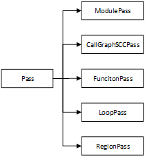
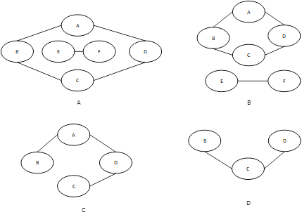
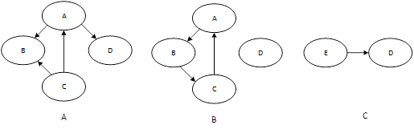
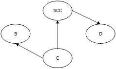

### 1. Pass分类

LLVM提供的pass分为三类: Analysis pass、Transform pass和Utility pass。

- Analysis pass：计算相关IR单元的高层信息，但不对其进行修改。这些信息可以被其他pass使用，或用于调试和程序可视化。简言之，Analysis pass提供其它pass需要查询的信息并提供查询接口。例如，basic-aa pass是基本别名分析（Basic Alias Analysis）pass，得到的别名分析结果可以用于后续的其它优化pass。Analysis pass不仅从IR中得到有用信息，还可以通过调用其它Analysis pass得到信息，并将这些信息结合起来，得到关于IR更有价值的信息。这些分析结果可以被缓存下来，直到分析的IR被修改，原有的分析结果当然也就失效了。
- Transform pass：该pass会检视IR，查询Analysis pass得到IR的高层信息，然后以某种方式改变和优化IR，并保证改变后的IR仍然合法有效。例如，adce pass是激进的死代码消除（Aggressive Dead Code Elimination）pass，会将死代码从原来的模块中删除。
- Utility pass：该pass是一些功能性的实用程序，既不属于Analysis pass，也不属于Transform pass。例如，extract-blocks pass将basic block从模块中提取出来供bugpoint使用，这个utility pass既不属于Analysis pass，也不属于Transform pass。当调用RegisterPass()注册自定义pass时，会要求指定是否为Analysis pass。通过RegisterPass()注册自定义pass后，就可以使用LLVM opt工具对IR调用自定义pass功能。


### 2. Pass class

LLVM Pass的基础模块是Pass类，这是所有pass的基类。自定义的pass类都要从预定义子类中继承，并根据自定义pass的具体功能要求覆写虚函数或增加新的功能函数。预定义子类包括ModulePass、CallGraphSCCPass、FunctionPass、LoopPass和RegionPass类等等。不同的子类有不同的约束条件，这些约束条件在调度pass时会用到。设计自定义pass时的首要任务就是确定自定义pass的基类。在为pass选择基类时，应在满足要求的前提下，尽可能选择最相关的类。这些类会为LLVM Pass基础结构提供优化运行所必需的信息，避免生成的编译器因为选择的基类不合适而导致运行速度变慢。




**MoudulePass**

ModulePass类用于实现非结构化的过程间优化和分析，几乎可以对程序执行任何操作。因此，ModulePass类可能是所有Pass类中最常用的类。由ModulePass派生的自定义pass将整个程序作为一个处理单元，可以对其中任何函数体做删改。

**CallGraphSCCPass**

CallGraphSCCPass用于在调用图（call graph）上从下至上的遍历程序。为了理解CallGraphSCCPass，首先要了解两个概念：调用图和SCC。

调用图表示程序方法间的关系，其中的节点表示程序方法，其中的边表示从调用方法和被调方法的调用关系。调用图中是否有环，取决于代码中是否存在直接或间接递归调用。如果程序中有递归调用，那么定向调用图中也就包含环。实际上，LLVM中没有模块表示调用图，pass通过分析call指令来计算调用图，从IR中的call指令推断出调用图。

SCC全称strongly connected component, 即强连接分量。要理解SCC，需要从理解什么是连通。如果从图中的节点a到节点b之间存在一条路径，则称a和b是连通的。如果无向图中任意两个节点均连通，则该图称为连通图。对于非连通图，其中可能仍然有部分子图属于连通图，这种连通子图称为连通分量。连通分量的顶点数达到极大，意味着新增加任何顶点都可能使原连通分量不再连通。另外，连通分量的边数达到极大，意味着与子图中所有顶点相连的边都应包含在连通分量中。例如，下图 25-A中的图是非连通图，但仍可分解为图 25-B所示的两个连通分量。图 25-C不能被称为连通分量，因为其中缺少顶点B和C之间的边。图 25-D更不能被称为连通分量，因为其中缺少顶点A及其关联的边。



图 25 连通图示例

连通分量针对的是无向图，对于有向图则可分为强连通和弱连通两类。在有向图中，如果两个顶点间至少存在一条双向路径，则称两个顶点强连通（strongly connected）。如果有向图的任意两个顶点都强连通，称该图为强连通图。即，从图内任意一个顶点出发，存在通向图内任意一点的的一条路径。非强连通有向图的极大强连通子图，称为强连通分量。例如下图A是一个非强连通有向图，可以分解为图B所示的两个强连通分量。图B中的A、B、C组成一个强连通图，其中的任意两个顶点都存在一条双向路径。但如果加上顶点D，就不再是一个强连通图。顶点D是一个单独的强连通分量。将非强连通有向图分解为强连通分量的目的是由于强连通分量内部的节点性质相同，因此可以将一个强连通分量内的顶点简化为一个点，即消除了环。例如，图 26-A中顶点A、B、C构成的强连通分量可简化为顶点E。如此一来，原图 26-A就变成了图 26-C所示的有向无环图(directed acyclic graph，DAG)。



图 26 有向图示例

强连通分量调用图（SCC call graph）是调用图的强连通分量图，在LLVM中称为CallGraphSCC。强连通分量调用图的某个顶点可以仅包含一个方法，也可以包含调用图中的多个顶点。通过将调用图的有环子图分解为强连通分量，强连通分量调用图将变为无环图，也就是变为有向无环图。

CallGraphSCCPass构成了LLVM的过程间优化的重要组成部分。CallGraphSCCPass派生类在调用图的强连通分量上运行，并且提供了用于构建和遍历调用图的机制（即以后序方式遍历图），所以可以有效地对程序中的所有调用边进行成对的过程间优化，同时逐步细化并改善这些成对优化。

自定义SCC pass只能检查和修改当前SCC中的函数，以及直接调用当前SCC的函数和直接被当前SCC调用的函数。以图 27为例，自定义SCC pass不能修改和检查顶点B中的函数，除此之外的函数都可以检查和修改。所以，自定义SCC pass并不只属于SCC，而是属于所有SCC可能调用的方法，以及这些方法可能调用的所有方法。自定义SCC pass还属于可能调用SCC中的方法的所有方法。自定义SCC pass还需要保留当前的CallGraph对象，如果程序有任何修改，自定义SCC pass都应负责对CallGraph对象进行更新。自定义SCC pass可能会修改当前SCC的内容，但不允许在当前模块中添加或删除SCC。



图 27 SCC示例

**FunctionPass**

与ModulePass子类相反，FunctionPass子类具有系统可以预期的局部行为。所有FunctionPass在程序中的每个方法上执行，独立于程序中的所有其它方法。 FunctionPass子类不需要以特定顺序执行，并且不会修改外部方法。明确地说，FunctionPass子类不允许检查或修改当前正在处理的方法以外的其它方法，也不允许添加或删除当前模块的方法和全局变量。AMDGPU后端中的AMDGPUPromoteAllocaToVector pass就是一个function pass。这个pass通过将Alloc指令转换为向量消除Alloc指令：

```c++
class AMDGPUPromoteAllocaToVector : public FunctionPass {

……

 bool runOnFunction(Function &F) override;
……
  bool handleAlloca(AllocaInst &I);

  void getAnalysisUsage(AnalysisUsage &AU) const override {

  AU.setPreservesCFG();

  FunctionPass::getAnalysisUsage(AU);
}

};

```


 

**LoopPass**

所有LoopPass在函数中的每个循环上执行，与函数中的所有其它循环无关。 LoopPass以循环嵌套顺序处理循环，最外层循环最后处理。LoopPass不仅仅是作用在IR中的某个loop结构，而是有可能（有时是必须）修改包含loop结构的外层结构（如包含该loop的函数），或将loop内部的指令移到loop外。类似的修改可能影响相邻的其它模块，从这个意义上说，LoopPass有点像FunctionPass。

LoopPass子类可以使用LPPassManager接口更新循环嵌套。LoopPass子类需要重写三个虚函数来完成其工作。如果这些方法修改了程序，则应返回true；否则，应返回false。作为主循环pass一部分运行的LoopPass子类，需要保存其它loop pass在pipeline中所需的所有函数分析pass（function analyses）。为了简化操作，LoopUtils.h提供了getLoopAnalysisUsage()函数。可以在LoopPass子类重写的getAnalysisUsage()函数中调用getLoopAnalysisUsage()函数，以获取正确的分析结果。INITIALIZE_PASS_DEPENDENCY(LoopPass)将初始化这组函数分析pass（function analyses）。

**RegionPass**

RegionPass较少使用，其用法与LoopPass有相似之处，不过是在函数中的每个单入口单出口region执行。 RegionPass由RGPassManager管理，以嵌套顺序处理region，最外层region放在最后处理。RegionPass子类可以通过使用RGPassManager接口更新region树。编译器开发者可以重写RegionPass的三个虚函数来实现自定义RegionPass。如果方法修改了程序，则返回true；否则，返回false。