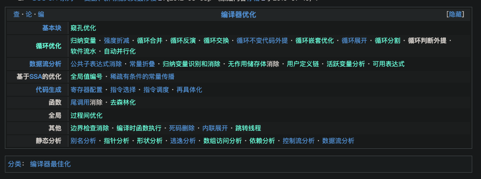

https://zh.wikipedia.org/zh-cn/%E8%BF%B4%E5%9C%88%E5%88%A4%E6%96%B7%E5%A4%96%E6%8F%90

|       [编译器优化](https://zh.wikipedia.org/wiki/优化编译器) |                                                              |
| -----------------------------------------------------------: | ------------------------------------------------------------ |
|                                                              |                                                              |
|               [基本块](https://zh.wikipedia.org/wiki/基本塊) | [窥孔优化](https://zh.wikipedia.org/w/index.php?title=窥孔优化&action=edit&redlink=1) |
|                                                              |                                                              |
| [循环优化](https://zh.wikipedia.org/w/index.php?title=循环优化&action=edit&redlink=1) | [归纳变量](https://zh.wikipedia.org/w/index.php?title=归纳变量&action=edit&redlink=1)[强度折减](https://zh.wikipedia.org/wiki/強度折減)[循环合并](https://zh.wikipedia.org/w/index.php?title=循环合并&action=edit&redlink=1)[循环反演](https://zh.wikipedia.org/w/index.php?title=循环反演&action=edit&redlink=1)[循环交换](https://zh.wikipedia.org/w/index.php?title=循环交换&action=edit&redlink=1)[循环不变代码外提](https://zh.wikipedia.org/wiki/循环不变代码外提)[循环嵌套优化](https://zh.wikipedia.org/w/index.php?title=循环嵌套优化&action=edit&redlink=1)[循环展开](https://zh.wikipedia.org/wiki/循环展开)[循环分割](https://zh.wikipedia.org/w/index.php?title=循环分割&action=edit&redlink=1)循环判断外提[软件流水](https://zh.wikipedia.org/w/index.php?title=软件流水&action=edit&redlink=1)[自动并行化](https://zh.wikipedia.org/w/index.php?title=自动并行化&action=edit&redlink=1) |
|                                                              |                                                              |
|       [数据流分析](https://zh.wikipedia.org/wiki/数据流分析) | [公共子表达式消除](https://zh.wikipedia.org/wiki/公共子表达式消除)[常量折叠](https://zh.wikipedia.org/wiki/常數折疊)[归纳变量识别和消除](https://zh.wikipedia.org/w/index.php?title=归纳变量识别和消除&action=edit&redlink=1)[无作用储存体](https://zh.wikipedia.org/w/index.php?title=无作用储存体&action=edit&redlink=1)消除[用户定义链](https://zh.wikipedia.org/w/index.php?title=用户定义链&action=edit&redlink=1)[活跃变量分析](https://zh.wikipedia.org/w/index.php?title=活跃变量分析&action=edit&redlink=1)[可用表达式](https://zh.wikipedia.org/w/index.php?title=可用表达式&action=edit&redlink=1) |
|                                                              |                                                              |
| 基于[SSA](https://zh.wikipedia.org/wiki/静态单赋值形式)的优化 | [全局值编号](https://zh.wikipedia.org/w/index.php?title=全局值编号&action=edit&redlink=1)[稀疏有条件的常量传播](https://zh.wikipedia.org/wiki/稀疏有條件的常數傳播) |
|                                                              |                                                              |
|           [代码生成](https://zh.wikipedia.org/wiki/代码生成) | [寄存器配置](https://zh.wikipedia.org/wiki/暫存器配置)[指令选择](https://zh.wikipedia.org/wiki/指令选择)[指令调度](https://zh.wikipedia.org/wiki/指令调度)[再具体化](https://zh.wikipedia.org/wiki/再具体化) |
|                                                              |                                                              |
|                                                         函数 | [尾调用](https://zh.wikipedia.org/wiki/尾调用)消除[去森林化](https://zh.wikipedia.org/w/index.php?title=去森林化_(计算机科学)&action=edit&redlink=1) |
|                                                              |                                                              |
|                                                         全局 | [过程间优化](https://zh.wikipedia.org/w/index.php?title=过程间优化&action=edit&redlink=1) |
|                                                              |                                                              |
|                                                         其他 | [边界检查消除](https://zh.wikipedia.org/w/index.php?title=边界检查消除&action=edit&redlink=1)[编译时函数执行](https://zh.wikipedia.org/w/index.php?title=编译时函数执行&action=edit&redlink=1)[死码删除](https://zh.wikipedia.org/wiki/死碼刪除)[内联展开](https://zh.wikipedia.org/wiki/内联展开)[跳转线程](https://zh.wikipedia.org/w/index.php?title=跳转线程&action=edit&redlink=1) |
|                                                              |                                                              |
|                                                     静态分析 | [别名分析](https://zh.wikipedia.org/wiki/别名分析)[指针分析](https://zh.wikipedia.org/w/index.php?title=指针分析&action=edit&redlink=1)[形状分析](https://zh.wikipedia.org/w/index.php?title=形状分析_(程序分析)&action=edit&redlink=1)[逃逸分析](https://zh.wikipedia.org/wiki/逃逸分析)[数组访问分析](https://zh.wikipedia.org/w/index.php?title=数组访问分析&action=edit&redlink=1)[依赖分析](https://zh.wikipedia.org/w/index.php?title=依赖分析&action=edit&redlink=1)[控制流分析](https://zh.wikipedia.org/wiki/控制流分析)[数据流分析](https://zh.wikipedia.org/wiki/数据流分析) |

