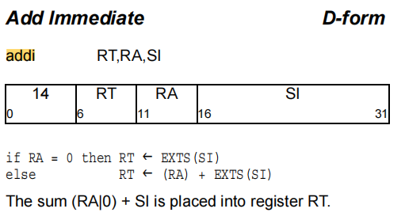

### 大小端

```
unsigned int value = 0x1234 5678


Big-Endian: 低地址存放高位，如下：
大端模式，是指数据的高字节保存在内存的低地址中
低地址
---------------
buf[0] (0x12) -- 高位字节
buf[1] (0x34)
buf[2] (0x56)
buf[3] (0x78) -- 低位字节
---------------
高地址


Little-Endian: 低地址存放低位，如下：
小端模式，是指数据的高字节保存在内存的高地址中
低地址
---------------
buf[0] (0x78) -- 低位字节
buf[1] (0x56)
buf[2] (0x34)
buf[3] (0x12) -- 高位字节
高地址
```


# 1.addi



```C++
 33 # CHECK-BE: addi 1, 2, 0                    # encoding: [0x38,0x22,0x00,0x00]
 34 # CHECK-LE: addi 1, 2, 0                    # encoding: [0x00,0x00,0x22,0x38]
 35             addi 1, 2, 0

 addi r1, r2, 0
   001110 00001 00010 0000 0000 0000 0000
   0011 1000     0010 0010    0000 0000     0000 0000
 0x38 22 00 00（大端）
 
 
 00 01000 0  0000 0000 
  0001 0000  0000 0000
```


#### InstrInfo.td

```c++
let PPC970_Unit = 1 in {  // FXU Operations.
def ADDI   : DForm_2<14, (outs gprc:$rD), (ins gprc_nor0:$rA, s16imm:$imm),
                     "addi $rD, $rA, $imm", IIC_IntSimple,
                     [(set i32:$rD, (add i32:$rA, imm32SExt16:$imm))]>;

```


#### InstrFormat.td

```c++
class I<bits<6> opcode, dag OOL, dag IOL, string asmstr, InstrItinClass itin>
        : Instruction {
  field bits<32> Inst;
  field bits<32> SoftFail = 0;
  let Size = 4;

  bit PPC64 = 0;  // Default value, override with isPPC64

  let Namespace = "PPC";
  let Inst{0-5} = opcode;
  let OutOperandList = OOL;
  let InOperandList = IOL;
  let AsmString = asmstr;
  let Itinerary = itin;

  bits<1> PPC970_First = 0;
  bits<1> PPC970_Single = 0;
  bits<1> PPC970_Cracked = 0;
  bits<3> PPC970_Unit = 0;

  /// These fields correspond to the fields in PPCInstrInfo.h.  Any changes to
  /// these must be reflected there!  See comments there for what these are.
  let TSFlags{0}   = PPC970_First;
  let TSFlags{1}   = PPC970_Single;
  let TSFlags{2}   = PPC970_Cracked;
  let TSFlags{5-3} = PPC970_Unit;
  // Indicate that this instruction is of type X-Form Load or Store
  bits<1> XFormMemOp = 0;
  let TSFlags{6}  = XFormMemOp;

  // Indicate that this instruction is prefixed.
  bits<1> Prefixed = 0;
  let TSFlags{7}  = Prefixed;

  // Fields used for relation models.
  string BaseName = "";

  // For cases where multiple instruction definitions really represent the
  // same underlying instruction but with one definition for 64-bit arguments
  // and one for 32-bit arguments, this bit breaks the degeneracy between
  // the two forms and allows TableGen to generate mapping tables.
  bit Interpretation64Bit = 0;
}


按截图中的顺序定义
// 1.7.4 D-Form
class DForm_base<bits<6> opcode, dag OOL, dag IOL, string asmstr,
                 InstrItinClass itin, list<dag> pattern>
  : I<opcode, OOL, IOL, asmstr, itin> {
  bits<5>  A;
  bits<5>  B;
  bits<16> C;

  let Pattern = pattern;

  let Inst{6-10}  = A;
  let Inst{11-15} = B;
  let Inst{16-31} = C;
}


class DForm_2<bits<6> opcode, dag OOL, dag IOL, string asmstr,
              InstrItinClass itin, list<dag> pattern>
  : DForm_base<opcode, OOL, IOL, asmstr, itin, pattern> {

  // Even though ADDIC_rec does not really have an RC bit, provide
  // the declaration of one here so that isRecordForm has something to set.
  bit RC = 0;
}

```


### `PPCGenMCCodeEmitter.inc`

`PPCGenMCCodeEmitter.inc`文件中会将相应的操作数放到合适的位置。

```c++
  const unsigned opcode = MI.getOpcode();
  uint64_t Value = InstBits[opcode];
  uint64_t op = 0;
  (void)op;  // suppress warning
  switch (opcode) {
    下面的移位与大端保持一致
    case PPC::ADDI:
    case PPC::ADDI8:
    case PPC::ADDIC:
    case PPC::ADDIC8:
    case PPC::ADDIC_rec:
    case PPC::ADDIS:
    case PPC::ADDIS8:
    case PPC::LA:
    case PPC::MULLI:
    case PPC::MULLI8:
    case PPC::SUBFIC:
    case PPC::SUBFIC8:
    case PPC::TDI:
    case PPC::TWI: {
      // op: A
      op = getMachineOpValue(MI, MI.getOperand(0), Fixups, STI);
      op &= UINT64_C(31);   // 只取5位
      op <<= 21;            // 左移21位
      Value |= op;
      // op: B
      op = getMachineOpValue(MI, MI.getOperand(1), Fixups, STI);
      op &= UINT64_C(31);   // 只取5位
      op <<= 16;            // 左移16位
      Value |= op;
      // op: C
      op = getImm16Encoding(MI, 2, Fixups, STI);
      op &= UINT64_C(65535);
      Value |= op;
      break;
    }

```


