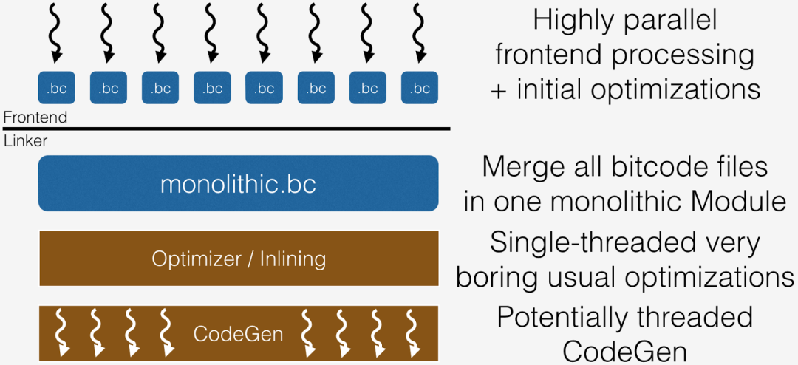
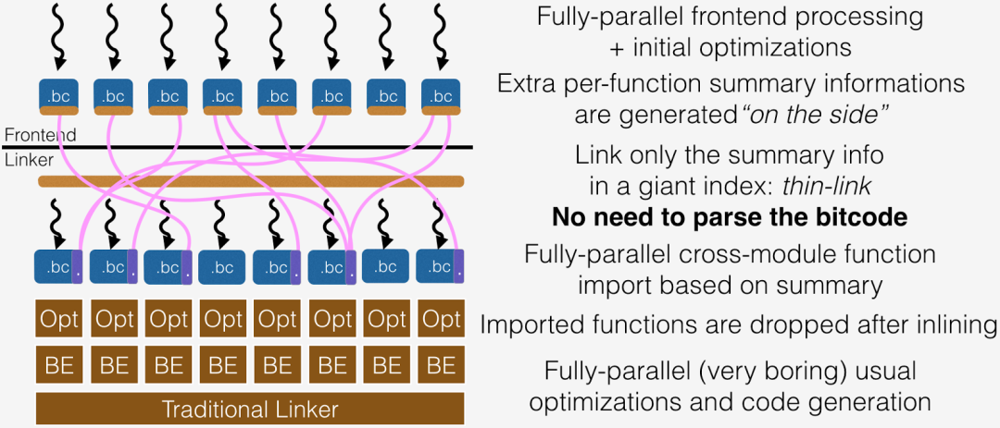

## **1. 背景**

Code Size 优化技术，又叫做代码缩减优化技术，指在代码功能不改变的前提下，对其做变换以达到减少代码体积的目的。在计算机诞生之初，内存是非常昂贵的计算资源，其容量通常十分有限，程序员为了使程序有效地加载并且运行，会严格控制代码大小并且使用大量的代码优化手段。随着计算机硬件技术的发展，CPU 效率飞速提升，存储的容量不断提升同时成本不断下降，代码体积在软件工程领域不是首要关注的问题。近些年来，随着网络技术的迅猛发展，嵌入式设备的广泛应用，代码体积又成为了业界和学术界关注的重要问题。

在嵌入式领域，产品受到硬件资源的限制，对能效、功耗以及面效非常敏感。Code Size 优化技术能够有效地应对硬件资源的限制，对产品的竞争力的提升至关重要。对当代产品而言，Code Size 优化可以为产品放入更多特性，增强竞争力；对下一代产品而言，Code Size 优化能够带来产品功耗和成本的竞争力提升。

## **2. 通用优化选项**

### 2.1 Os

类似于 `-O2` 选项的优化增加额外的代码缩减优化，详细描述可以参考：https://clang.llvm.org/docs/CommandGuide/clang.html。

### 2.2 Oz

相比于 `-Os` 选项，该选项会应用更加激进的代码缩减优化技术，通常会获得更好的代码体积优化效果，但同时会使得程序性能有大幅度下降，详细描述同样可以参考：https://clang.llvm.org/docs/CommandGuide/clang.html。

### 2.3 -Wl,--strip-all

针对输出文件，消除 symbol 信息。禁用 `-g` 选项也可以达到类似目的， `-g` 选项会导致编译器生成大量用于调试的信息存放在 section 中，从而使得输出文件体积增大。禁用 `-g` 选项是从来源上不生成调试的信息，从而达到消除symbol信息的目的。`-Wl,--strip-all` 可在链接过程中忽略输出文件的符号信息。

### 2.4 -Wl,--gc-sections

在链接阶段收集所有未引用的代码和数据，并且执行死代码消除，从而降低代码体积。该选项需要和 `-ffunction-sections` 或者 `-fdata-sections` 编译选项配合使用方可生效。

### 2.5 -fX-function-sections

`-ffunction-sections` 选项为源文件中的每一个函数生成单独的代码段（ELF section）。

`-fno-function-sections` 选项禁止为源文件中的每一个函数生成单独的代码段。

由于硬件架构有代码段对齐要求，如果使用选项 `-ffunction-sections` 对每一个函数单独生成代码段，每个代码段会增加 padding，从而使得整体代码段体积增加。分两个场景来看这个问题：

1. 代码中未被调用的函数比较多，可以通过 `-ffunction-sections` 和 `-Wl,-gc-section` 配合，消除未被调用的函数从而达到削减代码体积的目的。
2. 代码中未被调用的函数比较少，`-ffunction-sections` 和 `-Wl,-gc-section` 配合收益较小，代码段由于段对齐增加 padding，最终使得总代码体积膨胀。针对这种场景需要禁止对函数单独生成代码段能有效地控制代码体积。

### 2.6 -fX-data-sections

`-fdata-sections` 选项为源文件中的每一个全局变量生成单独的数据段（ELF section）。

`-fno-data-sections` 禁止为源文件中的每一个全局变量生成单独的数据段。

由于硬件架构有代码段对齐要求，如果使用选项 `-fdata-sections` 对每一个全局变量单独生成数据段，每个数据段会增加 padding，从而使得整体数据段体积增加。分两个场景来看这个问题：

1. 代码中未被引用的全局变量比较多，可以通过 `-fdata-sections` 和 `-Wl,-gc-section` 配合，消除未被引用的全局变量从而达到削减代码体积的目的。
2. 代码中未被引用的全局变量比较少，`-fdata-sections` 和 `-Wl,-gc-section `配合收益较小，数据段由于段对齐增加 padding，最终使得总代码体积膨胀。针对这种场景需要禁止对全局变量单独生成数据段能有效地控制代码体积。

### 2.7 -s

```
-s 会删除所有的symbol，相当于使用strip
clang test.cpp -s -o a.out
等价于
strip a.out
```


## **3. 编译优化技术**

### 3.1 链接时优化

由于编译器一次只编译优化一个编译单元，所以只是在做局部优化，而利用链接时优化（Link-Time Optimization, LTO）是利用链接时的全局视角进行操作，从而得到能够进行更加极致的优化。LTO 就是对整个程序代码进行的一种优化，是LLVM里在链接时进行跨模块间的优化。LTO 聚焦分析整个程序代码，能够大范围地应用过程间优化，从而取得比较好的优化效果。

LLVM 编译框架支持两种模式的 LTO，分别是 FullLTO 和 ThinLTO。

**FullLTO 模式**



FullLTO 模式对二进制进行链接时优化，合并所有的可执行代码到一个单元，并且执行更加激进的编译器优化。

FullLTO 的实现是把所有的输入合并到一个模块，并没有考虑时间和内存的问题，而且还阻碍了增量编译的执行。这意味着 FullLTO 经常需要大量的内存，而且很慢。加上 `-g` 带来的调试信息，IR 的大小和内存需要都会非常大。即使没有调试信息，对于大型软件而言是难以执行的，或者在一台内存受限的机器上也是。同时它会导致增量编译变得低效，因为当源码改变时，FullLTO 的所有步骤都需要被重新执行。

**ThinLTO 模式**



ThinLTO 模式可以对二进制执行部分的链接时优化，在编译单元之间进行内联，并行地在每个单元里执行更激进的编译器优化。这个模式可以允许更快的增量编译，以及使用更少的内存。

ThinLTO 使用紧凑的描述来代表每个模块来进行全局的分析，包含有之后进行跨模块引入的函数位置的索引信息。ThinLTO 全局分析的一个关键转换是函数引入，只有那些可能被内联的函数才会被引入到模块之中。这种方式最小化了内存的开销，同时最大化了跨模块优化的机会。过程间程序变换因此会在每个使用了函数引入的扩展模块中执行。函数引入和其他的过程间程序变换会在模块在并行优化时再执行。

ThinLTO 被分成了三个步骤:

1. 编译：生成完全 LTO 模式的 IR，但是扩展以模块描述。
2. 链接：thin 链接器插件层合并这些描述并执行全局分析。
3. 后端：并行基于描述信息的引入和优化。

从优化能力上看，FullLTO 框架要比 ThinLTO 获得更好的优化效果，同时编译时长也会变得更长。

LTO 使得 DCE、DAE、SCCP 这三种传统的过程间优化，能够跨编译单元，取得更加好的 Code Size 优化效果。以下将简单介绍三种优化的原理。

#### 3.1.1 Dead Code Elimination (DCE)

Dead Code Elimination (DCE) 是一种编译器优化技术，通过删除程序中不会被执行的代码，以减少程序的大小和运行时间。在编译器中，DCE 通常是在代码生成之前的一个阶段，它通过分析程序的控制流图和数据流图来确定哪些代码是“死代码”，即不会被执行的代码。

DCE 的实现方法有很多种，其中一种常见的方法是基于静态分析。静态分析是指在不运行程序的情况下，通过分析程序的源代码或中间代码来确定程序的行为。基于静态分析的 DCE 可以通过以下步骤来实现：

1. 识别程序中的所有全局变量和函数，并建立它们之间的依赖关系。
2. 通过控制流图和数据流图来确定哪些代码是“死代码”，即不会被执行的代码。
3. 删除死代码，并更新程序的依赖关系。

DCE 的优点是可以减少程序的大小和运行时间，从而提高程序的性能。然而，它也有一些限制，例如无法处理动态生成的代码和反射等高级程序语言特性。因此，在实际应用中，需要根据具体情况来选择是否使用 DCE。

#### 3.1.2 Dead Argument Elimination (DAE)

Dead Argument Elimination (DAE) 是一种编译器优化技术，目的是消除未使用的函数参数。当函数调用的参数超过了它所需要的参数时，编译器可以消除未使用的参数。此优化可以通过减少函数之间需要传递的数据量来减少生成代码的大小，并提高性能。

DAE 优化的工作原理是分析代码以确定函数实际使用了哪些参数。如果未使用参数，则可以安全地从函数签名和对函数的任何调用中删除它。这种优化对于经常调用或具有许多参数的函数特别有效。下面有一个简单的例子来展示 DAE 的优化效果。

优化前：

```
struct S0 {
    int f0;
    long long  f1;
    int  f2;
};
volatile struct S0 g = {0,0,0};
__attribute__((noinline)) struct S0 func_1(int a, int b) {
    g.f0 = a;
    return g;
}
__attribute__((used)) void func_0(int a) {
    func_1(a,20);
}
```

优化后：

```
struct S0 {
    int f0;
    long long  f1;
    int  f2;
};
volatile struct S0 g = {0,0,0};
__attribute__((noinline)) struct S0 func_1(int a) {
    g.f0 = a;
    return g;
}
__attribute__((used)) void func_0(int a) {
    func_1(a);
}
```

DAE 的一个潜在缺点是，它可能会使代码的可读性降低，因为函数签名可能不再与传递给函数的实际参数匹配。但是，可以通过使用描述性变量名和注释来缓解这种情况，以使代码更容易理解。DAE 还有一个使用限制是不可以对外部接口实现进行优化，该方法改变了调用约定，会使接口调用出错。

总体而言，死参数消除是一种有用的优化技术，它可以通过消除未使用的函数参数来提高代码性能并减少代码大小。

#### 3.1.3 Sparse Conditional Constant Propagation (SCCP)

Sparse Conditional Constant Propagation (SCCP) 是一种静态分析技术，用于在程序中确定变量的常量值。它通过分析程序的控制流图和数据流图，来确定哪些变量在程序执行过程中可以被替换为常量值。

SCCP 可以处理复杂的控制流结构，例如循环和条件语句。它使用一个值集合来跟踪每个变量的可能值，并在程序执行过程中更新这些值。如果一个变量的值在程序执行过程中始终保持不变，那么它就可以被替换为常量值。下面有一个简单的例子展示了 SCCP 的优化效果。

优化前：

```
int g;
extern int g1,g2;
__attribute__((noinline)) int func_1(int x) {
    if (x > 0) {
        g = g1;
    } else {
        g = g2;
    }
    return g;
}
__attribute__((used)) int func_0() {
    return func_1(100);
}
```

优化后：

```
int g;
extern int g1,g2;
__attribute__((noinline)) int func_1() {
    g = g1;
    return g;
}
__attribute__((used)) int func_0() {
    return func_1();
}
```

SCCP 的优点是它可以减少程序中的运行时计算，从而提高程序的性能。它还可以帮助发现程序中的错误，例如未初始化的变量和不可达代码。然而，SCCP 也有一些限制。它只能处理程序中的局部变量，而不能处理全局变量。此外，它也不能处理动态分配的内存和函数调用。

### 3.2 函数内联的模型调优

函数内联优化技术的核心思想是在函数调用点展开被调用函数的函数体。该优化能够减少函数调用传参和返回值处理的开销，有效地提升程序的执行效率。如果不去精细地调优内联模型，该方法会导致代码体积膨胀，通常被认为是用空间换时间的优化技术。单次被调用函数的内联能够同时缩减代码体积并且提升程序运行效率。

在调用点直接展开单次被调用的函数能够有效地减少参数传递和返回值处理的开销。该方法对函数的调用图进行全局分析，识别单次被调用的函数，然后进行内联。单次被调用保证不会生成多份的展开代码，并且更有利于后续的优化，从而缩减代码体积。该方法和 LTO 相结合会取得更好的效果。

### 3.3 冷热分区优化

冷热分区（Hot Cold Splitting）是一种编译器优化技术，以提高指令的局部性。热冷分区优化遍是识别执行频度较低的基本块为冷基本块，并将它们移动到单独的函数中。链接器可以将新创建的冷函数放到不同的代码段，以区分剩余部分的热代码。

对冷函数编译器可以做更为激进的代码体积优化，同时确保性能损失可控。结合冷热分区的代码体积优化是能够较好地兼顾性能的。

冷热块的识别通常有以下两种方式：

1. 静态标注

2. - 对函数增加 `__attribute__((cold))` 指示冷函数。
   - 使用 `__builtin_expect intrinsic` 标识分支的执行概率，分支预测提示 `likely()/unlikely()` 是对 `__builtin_expect intrinsic` 的宏封装。

3. 动态采集

4. - 基于插桩的 PGO。PGO 是编译器对程序编译，对程序插入特殊的代码片段。然后运行被插桩的程序，插桩的代码片段运行时生成 profile 信息。编译器再以 profile 作为输入对程序进行优化。
   - 基于采样的 AutoFDO。AutoFDO 系统需要硬件支持，硬件能够反馈程序执行过程中所触发的事件形成采样。将采样信息结合程序 Dwarf 信息进行分析，生成可以指导编译优化的 profile 信息，从而对程序进行优化。

## **4. 代码优化技术**

### 4.1 代码重构

尽量将函数的实现放在 .c/.cpp 文件中，减少相似或重复代码。如果将函数实现放入头文件中，通常需要加 static 关键字以避免全局符号冲突，这些函数会导致在不同的编译单元里出现多次，从而存在冗余函数实现。

### 4.2 源代码注解指导编译优化（Annotation）

#### 4.2.1 函数属性

利用函数属性控制单个函数优化。

例如，可以用 `__attribute__((noinline))` 精确控制单个函数不做内联。

```
__attribute__((noinline))
int foo(int i) {
    return i;
}
```

#### 4.2.2 Pragma

使用 `pragma clang attribute` 控制优化作用于多个函数。

例如，可以用 `pragma clang attribute push(__attribute__((noinline)), apply_to = function)` 控制一系列函数不做内联。

```
#pragma clang attribute push (__attribute__((noinline)), apply_to = function)
void function1();
void function2 (void);
void function3(void);
#pragma clang attribute pop
```

## **5. 总结**

本文从编译选项、编译器优化技术、代码优化技术三个维度介绍代码体积优化。链接时优化和冷热分区这类通用技术能够辅助具体的代码体积优化技术取得更加好的结果。在接下来的工作中，如果能够考虑到硬件特性，进行软硬件协同的代码体积优化将会产生更多的好方法。